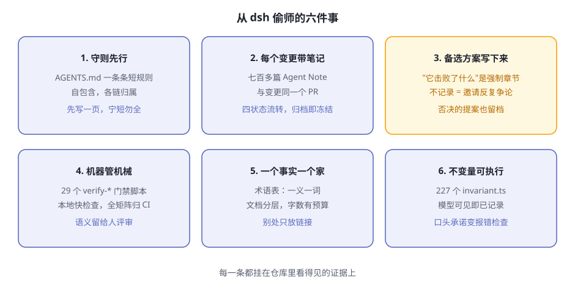

# 后记 能从 dsh 偷师什么

> **阅读提示**
> 全书收官，不教新知识。我们换一个视角：不看 dsh 是什么产品，而看它是**怎么被造出来的**——这个仓库是 DeepSeek 团队用 AI agent 开发 AI agent harness 的现场，档案完整保留。盘点值得偷师的六件事、它诚实的局限，以及你继续走的路标。

## 一个不寻常的目录

前十二章你看的都是"产品"：插件、轮次、沙箱、配置树。现在把视线移到仓库根目录，有几样东西不属于任何运行时：

- 一份 `AGENTS.md`——不是给人看的开发文档，而是写给 AI agent 的工作守则；
- 一个 `.agents/` 目录——里面是几百篇设计笔记和十几份"技能说明书"；
- `scripts/` 里一百多个脚本，其中 29 个以 `verify-` 开头、充当门禁（外加 12 个同名的伴随测试）。

把这些拼起来，会得出一个这一代软件项目里还很罕见的结论：**dsh 是团队用 AI agent 开发出来的，而整个开发过程留下了可供审查的档案**。设计决策为什么这么定、否决过什么、哪些规矩由机器执行——全都白纸黑字。这一章就是去翻这些档案。

**表后记-1 仓库里的"agent 向"设施**

| 设施 | 是什么 | 给谁用 |
|---|---|---|
| [`AGENTS.md`](https://github.com/deepseek-ai/deepseek-harness/blob/master/AGENTS.md) | 仓库工作守则：一条条自包含的短规则，每条链接到它的详细归属 | 每个进仓库干活的 agent（和人） |
| `.agents/notes/` | 设计笔记库：决策、提案、否决与归档 | 事后想知道"为什么这么设计"的任何人 |
| `.agents/skills/` | 11 份技能说明书，如代码评审、合并堆叠的 PR、文档翻译、归档笔记 | 执行特定流程的 agent |
| [`docs/AGENTS.md`](https://github.com/deepseek-ai/deepseek-harness/blob/master/docs/AGENTS.md) | 文档标准：分层、预算、写作规则 | 写文档的 agent |

一个细节：根目录、`packages/`、`examples/` 下各有一个同名快捷文件，都只是指向 `AGENTS.md` 的符号链接——守则只有一份，别处全是引用。这本身就是后面要讲的一条纪律。

## Agent Notes：一个决策的一生

`.agents/notes/` 是整个档案的核心。dsh 团队给设计笔记定了一个名字：**Agent Note**。它记录的是代码和文档无法承载的东西——**为什么这么决定，以及放弃了什么**。

每篇笔记的路径就编码了它的状态和类别：`{生命周期}/{类别}/yyyy-mm-dd-主题.md`。生命周期有四个，一篇笔记在文件夹之间移动，就是状态在流转：

**表后记-2 Agent Note 的四种状态（截至本书写作的数量）**

| 状态 | 含义 | 数量 |
|---|---|---|
| `proposed` | 提案，实施前评审用；尚未构建或部分构建 | 26 |
| `implemented` | 决策已交付；笔记与实际交付保持同步 | 559 |
| `rejected` | 提案被否决；仅当它仍能避免一种诱人的大错时保留 | 11 |
| `archived` | 已实施的决策完成使命后冻结归档 | 143 |

七百多篇笔记，覆盖了六个类别：新功能、缺陷修复、简化、架构、流程、测试。随便挑一篇带 `.zh` 后缀的[已实施笔记](https://github.com/deepseek-ai/deepseek-harness/tree/master/.agents/notes/implemented)读一读，你会发现它们长得出奇一致。这不是自觉，是格式：

**表后记-3 一篇 implemented 笔记的解剖**

| 部分 | 写什么 | 规矩 |
|---|---|---|
| 头部 | `Status:` 一行，必须与所在文件夹一致 | 拒绝是唯一带内容的状态：原因写在状态行上 |
| `## Problem` | 动机，不依赖解决方案也能独立读懂 | 每篇的起点 |
| `## Decision` | 已交付的现实，现在时 | 代码搬家、改名时，笔记同一变更内同步 |
| `## Alternatives considered` | 每个真实备选方案及其落选原因 | **强制**——无法还原时才允许留一条豁免注释 |
| `## Consequences` | 权衡的代价**与**收益 | 不只写成本 |

为什么"备选方案"是强制的？[统一格式的笔记](https://github.com/deepseek-ai/deepseek-harness/blob/master/.agents/notes/implemented/process/2026-07-05-uniform-agent-note-format.zh.md)里有一句话值得抄走：**记录决策时不记录它击败了什么，就是在邀请反复争论**。三个月后有人问"当初为什么不直接加一层缓存"，答案不在任何人的脑子里，在那篇笔记里。

值得偷师的不只是格式，还有配套的几条硬规矩：

- **每个非平凡变更必须在同一个 PR 里带一篇笔记**。纯机械的小改动豁免，其余没有例外。
- **笔记跟着代码走**。代码移动文件、重命名包，笔记在同一变更里更新——不是重写决策，是更新事实。
- **归档即冻结**。归档的笔记禁止编辑、翻译、移动，由脚本核对内容清单，一字不许动。要改？写新笔记，链接旧的。
- **没有中央索引**。目录树本身就是工作清单——加一份手工索引，就是加一份会过时的副本。

拿[按会话组装 preset 的那篇笔记](https://github.com/deepseek-ai/deepseek-harness/blob/master/.agents/notes/implemented/architecture/2026-08-03-per-session-agent-presets.zh.md)当例子——第 12 章的 preset 机制，决策全过程都在里面：问题是"一个进程只能有一种组装，想并存精简版和完整版得开两个进程"；决策是"preset 挂进 agent 的作用域，不动任何注册表"；还记了实测数字（一份十二行组装约 3 毫秒、约 600KB，所以每会话各挂一份比共享更划算），以及被否决的备选——给作用域注册表新增一层、把每个 preset 跑成子进程。读完这一篇，你会明白第 12 章那些"奇怪规矩"（空白才可切、preset 文件不回写）每一条背后都站着一个被排除的方案。

## 机器管机械：verify 门禁体系

笔记解决了"决策有人记"，但规矩不能靠自觉。dsh 的答案是把能机器检查的部分全部交给机器。

仓库 `scripts/` 目录下有一百多个工程脚本，其中 **29 个以 `verify-` 开头的门禁脚本**（另有 12 个是它们的伴随测试）。命名即职责，挑几个看名字就懂：

**表后记-4 门禁脚本选看**

| 脚本 | 管什么 |
|---|---|
| `verify-agent-note-format` | 笔记的头部、章节骨架、状态与文件夹一致 |
| `verify-archived-agent-notes` | 归档冻结：内容清单、伴随记录哈希 |
| `verify-doc-budgets` | 每篇文档的字数上限，超了红 |
| `verify-md-wrap` | 每段一个物理行 |
| `verify-export-jsdoc` | 每个导出都有文档注释 |
| `verify-translation-pairing` | 中英双语文档成对更新 |
| `verify-cordis-config` | 配置里引用的插件必须出现在清单依赖里 |

门禁不只在 CI 里。本地提交时，[lefthook.yml](https://github.com/deepseek-ai/deepseek-harness/blob/master/lefthook.yml) 挂了一排快速检查点：翻译配对、归档完整性、暂存文件的 lint、空白符、vendor 清单守卫；推送前再跑一遍类型检查。文件开头那句注释是整套体系的自我定位：**让本地检查点保持快，全仓库的门禁矩阵归 CI**。

这套分工可以概括成一句话：**机器管机械，人评审语义**。门禁只回答"格式对不对、链接活不活、配对齐不齐"这类有唯一答案的问题；一个设计好不好、该不该做，交给笔记和评审。`AGENTS.md` 里还有一条规则把这种文化写成了义务：**把可机械检查的不变量接进真正执行的顶层门禁，并证明每条被改动的验收路径都会拒绝非法输入**。写规则而不接线，等于没写。

连"跑基准"这件看似与代码无关的事也透着同一股气质。仓库根目录的 [BENCHMARK.md](https://github.com/deepseek-ai/deepseek-harness/blob/master/BENCHMARK.md) 只有几行：按 Python SDK 指南装好，跑 `jsonrpc-agent` 的精简变体，每个基准任务用独立的工作区和会话。翻译一下：**用 dsh 跑基准，走的是 dsh 自己的产品路径**——agent 产品用 agent 产品来测量，连评测都不另开小灶。

## 术语表纪律与不变量文化

再看两处容易被忽略、其实最见功力的地方。

第一处是[官方术语表](https://github.com/deepseek-ai/deepseek-harness/blob/master/docs/glossary.zh.md)。开头一句话就是全书读者最熟悉的："DeepSeek Harness 的领域词汇为每个概念规定一个规范术语。"术语通过标准锚点链接，实现细节不在术语表里——留给各包 README 和 Agent Note。一个概念只有一个名字，一义一词；写这本书时我们几乎不需要在多个叫法之间做选择，这在技术文档里是罕见的待遇。

与术语纪律配套的是"归属纪律"。文档标准里写着：**每个事实只有一个家**——在负责它的那一层写全，别处一律放链接。连文档长度都有预算：根目录 `AGENTS.md` 不超过 1600 词，架构文档不超过 1800 词，超了门禁会红——逼作者把内容搬回它该去的层，而不是在原地膨胀。

第二处是**不变量文化**。全书反复出现的那条铁律——**模型可见即已记录**——在架构文档里的完整表述是：抵达模型请求的一切都必须能从日志重建，**并由一项运行时不变量断言这一点**。铁律不是口号，是一段会报错的代码。

这不是孤例。`packages/` 下有 227 个叫 `invariant.ts` 的文件，几乎每个包一个。守则对它们的写法也有要求：不变量断言的是"被拥有的关系"——去查权威的事件流和可变数据，而不是查某个服务在不在、某个插件挂没挂。再加一条：**配置错误要响亮地失败**——能自己说明白的错误就在加载时炸，绝不静默跳过。

把这些放在一起看，你会认出一条文化线索：**凡是能用机器表达的承诺，都不留在口头**。三种纪律各管一段（表后记-5）：

**表后记-5 三种纪律**

| 纪律 | 工具 | 效果 |
|---|---|---|
| 管住嘴 | 术语表：一个概念一个规范叫法 | 讨论和文档不会一义多词 |
| 管住手 | 门禁与文档预算 | 格式、链接、长度越界即红 |
| 管住运行时 | 227 个 `invariant.ts` | 口头承诺变成会报错的检查 |

## 六件可以带走的事

**图后记-1 六件偷师清单**

把这一章的证据压成一张清单。无论你以后维护什么项目——哪怕完全不涉及 AI——这六件都值得照抄（表后记-6）：

**表后记-6 偷师清单与最小行动**

| # | 偷什么 | dsh 里的证据 | 你的最小行动 |
|---|---|---|---|
| 1 | 行为守则先行 | `AGENTS.md`：短规则、每条自包含、链接归属 | 写一页守则，宁短勿全 |
| 2 | 每个变更带一篇笔记 | 七百多篇 Agent Note，与变更同 PR | 从模板抄四节标题开始 |
| 3 | 备选方案也写下来 | "曾考虑的替代方案"是强制章节 | 每篇至少写一个真实的落选项 |
| 4 | 机器管机械 | 29 个 `verify-*` 门禁 + lefthook 检查点 | 给最常被违反的一条规矩写脚本 |
| 5 | 一个事实一个家 | 术语表 + 文档预算 + 分层归属 | 先给核心概念定唯一叫法 |
| 6 | 不变量要可执行 | 227 个 `invariant.ts`；模型可见即已记录 | 把一条口头承诺改成会报错的检查 |

这六件有一个共同点：**都不贵**。写一页守则、一篇笔记、一个脚本，都是小时级的工作；贵的是没有它们之后，每一次"当初为什么这么定"的考古和争论。

## 诚实的局限

偷师归偷师，dsh 当下的短板也要看清（表后记-7）：

**表后记-7 dsh 的局限（以本书写作时为准）**

| 局限 | 说明 |
|---|---|
| 开发者预览 | 官方 README 明说"会有破坏性变更"；守则里甚至有一节"预发布立场"，注明第一个正式版本发布后就删掉 |
| 沙箱以文件效果为界 | 沙箱执行的是文件效果策略；网络与进程可见性不在它的词汇内 |
| 没有花费闸门 | 自备 key 按量计费，官方没有预算拦截机制，花超之前没人拦你 |
| 生态还年轻 | 树外插件质量参差，安装之前自己看一眼它的清单和代码 |

这些局限恰好呼应本章主题：一个敢把决策档案全部公开的项目，也敢把"还在预览期"写在最显眼的地方。

## 继续走的路标

官方材料都在 [deepseek-ai/deepseek-harness](https://github.com/deepseek-ai/deepseek-harness) 仓库里：

- [架构文档](https://github.com/deepseek-ai/deepseek-harness/blob/master/docs/architecture.zh.md)——动手前的必读总览
- [cordis 教程](https://github.com/deepseek-ai/deepseek-harness/tree/master/docs/cordis-tutorial)——插件框架的系统课程
- [cookbook](https://github.com/deepseek-ai/deepseek-harness/tree/master/docs/cookbook)——动手菜谱
- [术语表](https://github.com/deepseek-ai/deepseek-harness/blob/master/docs/glossary.zh.md)——概念拿不准时查它

社区入口：

- GitHub 话题 [`dsh-plugin`](https://github.com/topics/dsh-plugin)——发现别人写的插件
- 仓库的 Discussions——反馈与讨论的官方渠道

## 最后一句话

回到第 1 章那个比喻：大模型是被关在黑屋子里的大脑，harness 是给它装上的身体。

这本书带你把这副身体从外到内拆了一遍，最后又看了它的产房。现在你知道了：所谓 AI agent 的魔法，拆开看全是朴素的工程——**记账、关卡、回滚、外存、叠层**；而造出这些工程的过程，同样没有魔法——**守则、笔记、门禁、术语、不变量**。魔法不在模型里，在模型之外的一切里；也不在 agent 里，在围着 agent 建立纪律的人那里。

祝你拼出自己的那辆车。🚗

## 🧪 本章实验

> **实验 13-1 ★｜数一数门禁**
> 目标：对"机器管机械"有体感。
> 步骤：打开 [scripts 目录](https://github.com/deepseek-ai/deepseek-harness/tree/master/scripts)，数以 `verify-` 开头的门禁脚本（不含 `.spec.` 后缀的伴随测试），任选三个，只凭名字猜它们管什么，再去 `AGENTS.md` 里印证。
> 验收：数出 29 个门禁脚本；三个猜测里至少两个被印证。

> **实验 13-2 ★★｜解剖一篇笔记**
> 目标：亲手摸一次决策档案。
> 步骤：读 [按会话组装 preset 的笔记](https://github.com/deepseek-ai/deepseek-harness/blob/master/.agents/notes/implemented/architecture/2026-08-03-per-session-agent-presets.zh.md)，回答：问题是什么？决策是什么？哪个备选方案被否决了，为什么？
> 验收：三问都能答，且答案与第 12 章的机制对得上。

> **实验 13-3 ★★｜给你自己的项目写一篇**
> 目标：把格式变成习惯。
> 步骤：挑一个你项目里"只有你知道为什么"的决策，按 Problem / Decision / Alternatives considered / Consequences 四节写一篇笔记。
> 验收：备选方案一节里至少有一个你**真的考虑过**的方案，并写清它落选的原因。

## 🤔 思考题

1. ★★ 六件偷师清单里，哪一件搬到你的项目上最难？难在哪，缺什么前提？
2. ★★ dsh 把被否决的提案也留在仓库里，还要"仅当它能避免一种诱人的大错时才保留"。这条保留标准本身，想防的是什么？
3. ★★★ 你准备在自己的项目里引入 AI agent 协作。守则、第一篇笔记、第一个门禁——你会先做哪个？为什么？

## 📝 小结

- **dsh 是 agent 开发的现场**——守则、笔记、技能、门禁，档案全在仓库里
- **Agent Notes 四状态流转**——proposed → implemented → rejected / archived；备选方案强制记录
- **机器管机械，人评审语义**——29 个 `verify-*` 门禁管形状，笔记和评审管判断
- **术语与归属纪律**——一义一词、一个事实一个家、文档有预算
- **不变量文化**——模型可见即已记录，口头承诺都变成会报错的检查
- **诚实的局限**——预览期、沙箱边界、无花费闸门、生态年轻

全书完。⬅️ 上一章 [第15章 规则自进化实战](ch15.md)，或回 [首页](index.md) 从 [第1章 什么是 Agent Harness](ch01.md) 重读一遍。
