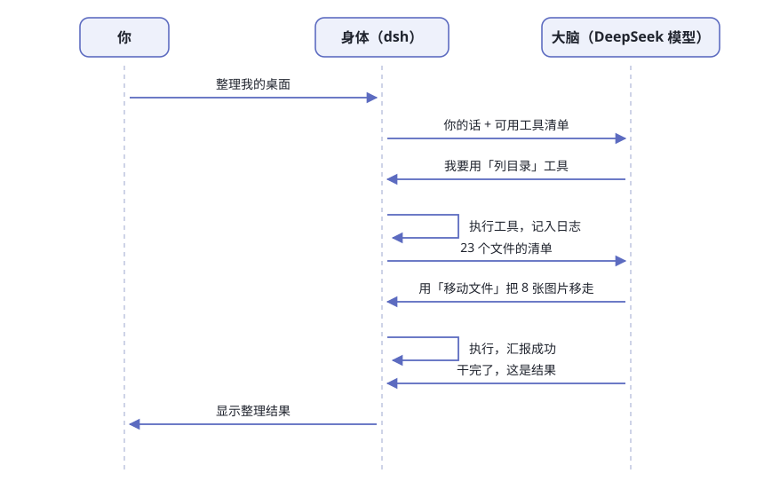

# 第1章 什么是 Agent Harness

> **阅读提示**
> 本章回答三个问题：大模型为什么干不了活？harness 是什么？dsh 特别在哪？约 12 分钟。

## 大脑只会一件事

对一个纯聊天大模型说："把我桌面上散落的文件按类型归归类。"

你得到的会是一份《整理桌面指南》——第一步建文件夹、第二步按后缀分类、第三步拖进去。写得很贴心，但桌面一个字没动。

这不是模型笨，是它的处境像被关在黑屋子里：

**表1-1 大模型的"三不能"**

| 三不能 | 含义 | 你的体感 |
|---|---|---|
| 👁️ 看不见 | 你的文件、桌面、日历，它一概不知道 | 你问"这目录里有啥"，它只能瞎猜 |
| 🤚 动不了 | 建文件夹、移动文件、发邮件，一个动作都做不了 | 它只能输出"请你手动执行以下命令" |
| 🧠 记不住 | 关掉对话窗口，刚才聊的一切清零 | 明天再问，它当你是陌生人 |

它唯一会做的事：**读一段文字，写一段文字**。

但注意，这件事它强得离谱——写指南、读报告、做判断、翻译、改代码，全都落在"读字写字"里。所以问题从来不是大脑不够聪明，而是大脑没有身体。

## Harness：给大脑装的身体

harness（读作"哈尼斯"）直译是"挽具"——套在马身上让它能拉车的那套装备。

大模型是力气很大的马，光有马只能站着喘气；套上挽具、接上车，才叫运力。harness 这个词被软件行业借走，指的就是**让大模型能干活的那一整套配套**。

**图1-1 大脑与身体的分工**

一副完整的身体有五样器官，一样都不能少：

**表1-2 身体的五个器官**

| 器官 | 干什么 | 生活类比 |
|---|---|---|
| 👁️ 眼睛 | 读文件、看屏幕、查日历 | 感知输入 |
| 🤚 手 | 执行命令、改文件、发消息 | 动作输出 |
| 🧠 外挂记忆 | 把发生的事逐笔记账 | 会议纪要员 |
| 📏 规矩 | 哪些直接干、哪些先问你 | 公司审批流 |
| 🔁 循环 | 干一步→看结果→定下一步 | 项目经理盯进度 |

于是有了一个等式：

**Agent = 大脑 + 身体。**

市面上所有 AI agent 产品——无论叫助手、智能体还是 copilot——都是这个等式的不同组合。差别只在：身体是谁造的、造得多结实、让不让你拆开看。

## 一次完整往返长什么样

你说"整理我的桌面"，幕后发生的事如图1-2。先看个大概，不用记细节：

**图1-2 一次"整理桌面"的完整往返**

整张图里最值得记住的是分工：大脑从头到尾只发了三类话——"我要用什么工具""这是工具结果之后的下一步""干完了"。真正碰到你硬盘的，一次都不是它。

记住两件事，后面章节会反复用：

- **大脑从不碰你的硬盘**——它只"申请用工具"，真正动手的永远是身体（第 6 章细讲这条流水线）
- **每次往返都记入日志**——dsh 有条铁律：模型看到的每句话，都必须能在日志里找到出处（第 5 章揭晓为什么）

**表1-3 这次往返里谁干了什么**

| 角色 | 干了什么 | 没干什么 |
|---|---|---|
| 你 | 提需求、看结果 | 不用写代码、不用开终端 |
| 大脑 | 决定用哪个工具、怎么用、何时收工 | 没碰文件系统 |
| 身体 | 执行工具、记日志、汇报结果 | 不做决策 |

## 那 dsh 到底是什么

一句话版本：

**dsh 就是 DeepSeek 官方造的那副身体，而且把图纸全部公开。**

dsh 是 DeepSeek Harness 的缩写。打开它的 [GitHub 仓库](https://github.com/deepseek-ai/deepseek-harness)，第一行自我介绍写着：由 DeepSeek AI 开发的开源 agent harness，采用**一切皆插件**的架构，由 [Cordis](https://github.com/cordiverse/cordis) 框架驱动。

**表1-4 dsh 的三个关键词**

| 关键词 | 说明 |
|---|---|
| 官方出品 | DeepSeek 自己做产品的底盘，[MIT 许可](https://github.com/deepseek-ai/deepseek-harness/blob/master/LICENSE)开源——可以读、可以改、可以拿去商用 |
| 一切皆插件 | 每个器官都是可拆可换的零件：模型适配器、工具、会话日志，甚至 agent 循环本身，都是插件 |
| 两种形态 | 网页界面版（浏览器聊天）/ 无头版（一条命令干完活就走） |

截至 2026 年 8 月底，这个仓库有 **20 万+ star**，`packages/` 目录下摆着约 50 个零件包。这不是实验室玩具，是 DeepSeek 拿来真做产品的底盘。

DeepSeek 内部开发者的一个类比（[原推](https://x.com/jiayuan_jy/status/2087911060154314963)）：

> 可以把 dsh 想象成一个乐高汽车玩具。官方 Coding Agent 只是他们拼好的一套预置。你可以换引擎、换轮胎、换挡风玻璃——最后拼出来的，甚至不一定还是辆汽车。

这句话是全书的题眼：**别人卖车，dsh 给你的是造车车间**。

## dsh 和 DeepSeek 网站有什么区别

一个必然会有的问题：我浏览器里用的 [DeepSeek 网页版](https://chat.deepseek.com/)，跟 dsh 是什么关系？

同一个大脑，两副不同的身体。网页版的身体是 DeepSeek 自己运营的黑盒：能聊天、能联网搜索，但你换不了它的零件，也带不走；dsh 的身体在你自己电脑上，零件全公开，想换就换。

**表1-5 网页版 vs dsh**

| | [chat.deepseek.com](https://chat.deepseek.com/) | dsh |
|---|---|---|
| 身体在哪 | DeepSeek 的服务器上 | 你的电脑上 |
| 能碰你的文件吗 | 不能（你上传的除外） | 能，在你圈定的工作区里 |
| 零件能换吗 | 不能 | 一切皆插件 |
| 付钱方式 | 免费/订阅 | 免费开源 + 自备 API key 按量付费 |

所以本书的主角不是"那个聊天网站"，而是**你能拆开、能改装、能带走的这副身体**。

## 同类这么多，为什么学 dsh

想学 agent 的内部构造，摆在面前的选择其实不少：

**表1-6 dsh 与同类对比**

| 名字 | 它是什么 | 身体公开吗 | 学习价值 |
|---|---|---|---|
| Claude Code | Anthropic 的成品 agent | ❌ 闭源 | 只能隔着外壳猜 |
| Codex | OpenAI 的成品 agent | ❌ 闭源 | 同上 |
| OpenHands | 开源 agent 平台 | ✅ | 偏"搭好舞台让 agent 演戏"，整机粒度大 |
| DeerFlow | 字节开源的研究框架 | ✅ | 专注"调研报告"这一种活 |
| **dsh** | **开源 agent 零件库 + 组装手册** | ✅ | **每个器官都能单拆，还带全套图纸** |

dsh 的独特之处有三条，每条后面都对应一章：

1. **零件足够小**。51 个零件组，组里的包各管一件事，随便举几个真实的名字：`dsh-fs` 管文件读写，`dsh-shell` 管命令执行，`dsh-sandbox` 管把进程关进笼子，`dsh-goal` 管"别忘了总目标"，`dsh-compaction` 管上下文太长时怎么压缩。想懂哪样就拆哪样，不用一口吞下整辆车（第 3 章看完整地图）。
2. **图纸是真的**。仓库自带中英双语文档，连"一个轮次怎么走"都有官方时序图。本书大量引用这些一手材料，不转述二手猜测。
3. **出身决定含金量**。这是头部模型厂商**自己每天在用**的 harness，不是为开源而开源的演示品。它踩过的坑，就是你以后会踩的坑。

还有个彩蛋：dsh 的 `hooks` 零件带一个钩子引擎（`hook-protocol`）和两座"方言桥"（`hooks-claude-code`、`hooks-codex`），能直接加载你为 Claude Code 或 Codex 写好的 `hooks.json`。换句话说，这副身体从设计时就考虑了和别家 agent 生态互通，而不是砌墙。

## 这本书怎么讲

全书按"从看见、到拆解、到动手"递进（图1-3）：

**图1-3 全书路线图**

**表1-7 四部分各拿走什么**

| 部分 | 章 | 读完你会 |
|---|---|---|
| 第一部分 初见 | 1~3 | 把它跑起来，知道每个文件夹是干嘛的 |
| 第二部分 解剖器官 | 4~8 | 讲得出一次对话在 dsh 体内的完整旅程 |
| 第三部分 手脚与外设 | 9~10 | 理解沙箱、审批、外部连接怎么保安全 |
| 第四部分 自己动手 | 11~13 | 写出自己的插件，拼出自己的 agent |

这本书写给**不读代码的人**：正文几乎不贴源码，概念一律先给类比再给定义，每章配实验和思考题。你需要的只是会用终端复制粘贴命令——第 2 章会一步步带你走。

如果你本来就会写 TypeScript，收获会更大：每章结尾标了"想读源码看哪里"，顺路能摸到 dsh 的代码组织方式。

## 先对齐几个词

这本书会反复用到几个词。dsh 官方有一份[术语表](https://github.com/deepseek-ai/deepseek-harness/blob/master/docs/glossary.zh.md)，给每个概念规定了唯一叫法；这里先给你一份"人话版"：

**表1-8 本书常用词速查**

| 词 | 人话解释 | 第一次细讲 |
|---|---|---|
| harness | 给大脑装的身体，全书主角 | 本章 |
| agent | 大脑 + 身体合起来、正在干活的那个"家伙" | 第1章 |
| 工具（tool） | 身体的一只"手"：列目录、跑命令、改文件 | 第6章 |
| 会话（session） | 一次持续的工作关系，所有发生的事逐笔记进它的日志 | 第5章 |
| 轮次（turn） | 你说一句、它干一串、回你一句，这样一个来回 | 第5章 |
| 插件（plugin） | dsh 里一切能力的存在形式，可挂可卸 | 第4章 |
| profile | 官方或你自己写的"装配配方"，决定一辆车装哪些零件 | 第2章 |

遇到拿不准的词，回来查这张表，或去翻官方术语表。

## 这本书的用法说明

最后交代三件小事，帮你把这本书用对：

**实验带星级。** ★ 表示"看一眼就会"，★★ 要动手几分钟，★★★ 需要真折腾一阵。时间紧就只做 ★ 和 ★★，不影响读下去。每个实验都有"目标 / 步骤 / 验收"三行——验收那行是判断你做没做成的标准，别跳过。

**图和表是正文，不是装饰。** 这本书的信息大量放在图（流程、结构）和表（对照、归类）里，正文负责把它们串成故事。读的时候先看图，再读文字，效率最高。

**对不上时以你本机为准。** dsh 还在快速迭代，书里某个按钮位置或命令参数可能已经变了。遇到对不上，先想"它又迭代了"，再按你机器上实际显示的来——这本身也是学习的一部分。

## 先打一针预防针

> **注意**
> dsh 处于**开发者预览**阶段，官方原话："正在快速迭代，**未来将出现破坏兼容性的变更**。"本书以 **2026 年 8 月下旬**的仓库为准。操作和书上对不上时，**以你本机跑出来的为准**——这也是学任何快速演进项目的正确姿势。

换个角度看，"还在变"恰恰是现在学的好时机：你现在看到的每一条设计决策，都带着"为什么这么设计"的新鲜脚印。第 13 章会专门盘点这些能偷师的东西。

## 🧪 本章实验

> **实验 1-1 ★｜看看这匹马长什么样**
> 目标：对 dsh 的体量建立第一印象。
> 步骤：打开 [dsh 的 GitHub 仓库](https://github.com/deepseek-ai/deepseek-harness)，只看三样：star 数、"一切皆插件"的口号、`packages/` 下的文件夹数量。
> 验收：你能说出"这不是玩具，是一个二十万人盯着的严肃项目"。

> **实验 1-2 ★★｜检查电脑准备好了没**
> 目标：确认本机 Node.js 版本。dsh 官方要求 **v22.19 及以上，或 v24 及以上**。
> 步骤：终端输入 `node -v`。
> 验收：显示 `v22.x`（x≥19）或 `v24+` 就万事俱备；否则先去 [nodejs.org](https://nodejs.org/) 装一个 LTS 版。第 2 章要用。

## 🤔 思考题

1. ★ "大脑只会读写文字"——这条限制是暂时的，还是永恒的？
2. ★ 为什么"动手的永远是身体，大脑只负责申请"对安全是好事？
3. ★★ 如果身体的每个器官都是插件，那"换一个大脑"（换模型供应商）应该有多难？
4. ★★ 给你的工作配一个 agent，你最想让它先长出哪只"手"？

## 📝 小结

- **大模型只是大脑**——看不见、动不了、记不住，只会读写文字
- **harness 是给大脑装的身体**——眼睛、手、外挂记忆、规矩、循环五样器官
- **Agent = 大脑 + 身体**——所有 agent 产品都是这个等式的不同组合
- **dsh 是 DeepSeek 官方开源的身体**——MIT 许可、一切皆插件、约 50 个零件包
- **学它的价值**——别的产品给你一辆车，dsh 给你造车车间，还带全套图纸

下一章，亲手把它跑起来。➡️ [第2章 5 分钟跑起来](ch02.md)
