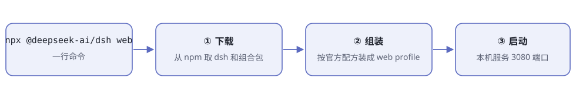
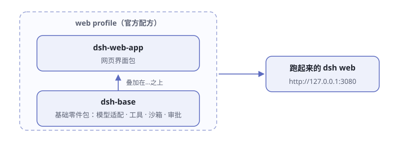
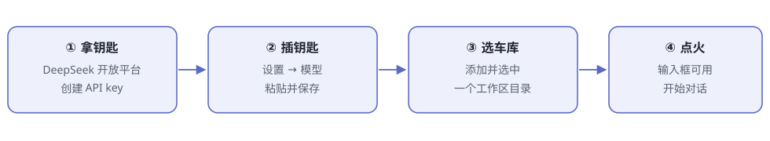

# 第2章 5 分钟跑起来

> **阅读提示**
> 本章在你自己电脑上把 dsh 跑起来，并完成第一次真实对话。一切顺利的话 5 分钟；要装 Node.js 的话再加 5 分钟。

## 眼见为实

看别人演示 AI 编程助手，你心想：这玩意儿我也想在电脑上跑一个。

多数开源项目到这里就开始劝退了——装环境、配依赖、改配置，半天过去还没见到界面。dsh 把门槛压到了一行命令。这一章就干两件事：把它跑起来，和它说上第一句话。

## 准备：只缺一样东西

dsh 跑在 Node.js 上，这是唯一的硬性前提。官方对版本的要求写在仓库的 `package.json` 里：

```text
Node.js ^22.19.0 或 >=24.0.0
```

翻译成人话：**22 系列要 22.19 及以上，或者干脆用 24 系列**。注意 23 系列不在允许范围——这种"挑版本"的写法在 Node 项目里很常见，照办即可。

检查方法：终端输入 `node -v`。版本不够或提示"找不到命令"，就去 [nodejs.org](https://nodejs.org/) 下载 LTS 版安装，一路下一步。

## 一行命令的安装

```sh
npx @deepseek-ai/dsh web
```

这一行在幕后干了三件事（图2-1）：



**图2-1 一行命令做的三件事**

`npx` 是 Node.js 自带的"临时下载并运行"工具：从 npm 仓库取来 dsh 和它需要的所有组合包，按官方配方组装，然后启动。首次运行要走网络下载，耐心等。

看到终端打印出类似这样一行，就是起来了：

```text
http://127.0.0.1:3080
```

本机启动时，dsh 会顺手用默认浏览器打开这个页面。`127.0.0.1` 是"本机地址"的专用写法——这个服务只在你自己电脑上可见，别人从网上摸不进来，可以放心跑。

两件事要心里有数：

- **这个服务会一直运行**，占着这个终端窗口。想停，在终端里按 `Ctrl + C`。
- 不想让它自动开浏览器，加 `--no-open`。通过 SSH 在远程服务器上跑时，它只打印地址，由你自己打开。

## 你下载的其实是"零件 + 配方"

容易误会 dsh 是"一个程序"。实际上下载的是一箱乐高零件，加一份官方装配配方——配方名叫 **profile**。



**图2-2 web profile 的配置树**

`dsh web` 用的配方叫 `web`，从下往上叠四层：

1. **dsh-base**——每个 profile 都有的地基：模型适配、工具、持久化、沙箱与审批策略、凭据
2. **dsh-web-app**——浏览器应用，也就是网页界面那一半
3. **profile 自己的 patch 文件**——你对这个配方的改装
4. **home 级 patch 和临时 `--patch`**——最后叠加，优先级最高

"后叠的盖住先叠的"——这就是 dsh 的改装机制，第 12 章拼装自己的 agent 时全靠它。

配方和零件都存在你电脑上的 dsh 之家（环境变量叫 `$DSH_HOME`）。想知道当前这台车到底装了哪些零件，不用启动，直接问：

```sh
npx @deepseek-ai/dsh web --dump-config
```

它把组装好的完整配置树打印出来。第一次看会很懵，没关系——这本书的第二部分就是带你逐个认零件。

## dsh 之家长什么样

`$DSH_HOME` 默认就是你家目录下的 `~/.dsh`。第一次跑过 dsh 之后，打开看看，里面大致是这些东西：

**表2-1 dsh 之家的住户**

| 里面有什么 | 是什么 |
|---|---|
| `profiles/web/`、`profiles/headless/` 等 | 官方配方的家（模板现有五个：web、headless、acp、sdk、sdk-minimal），首次使用时从模板自动初始化 |
| `profiles/<名字>/cordis.patch.yml` | 你对某个配方的改装记录 |
| `cordis.patch.yml`（home 级） | 对所有配方生效的全局改装 |
| `.credentials.yaml` | API key 的保险柜，设置页里只存它的引用 |
| `AGENTS.md` | dsh 放给 agent 看的全局工作守则 |

以后你想改装这辆车——换零件、加插件、改规矩——改的基本都是这里。第 12 章细讲。

## 常用命令速查

日常最常用的几条命令：

**表2-2 常用命令速查**

| 命令 | 干什么 |
|---|---|
| `dsh web` | 启动网页界面（`--profile web` 的别名） |
| `dsh --profile headless "任务"` | 无界面干完一件事，打印最终答案后退出 |
| `dsh --profile web --port 8080` | 换个端口启动 |
| `dsh plugin --profile web <pnpm 参数>` | 给这个 profile 安装、管理插件 |
| `dsh web --dump-config` | 不启动，只打印当前配置树 |

有一条位置规矩要记住：**启动应用时，`--profile` 写在应用名前面；用 `plugin` 子命令时，`--profile` 紧跟在 `plugin` 后面**。其余参数属于被启动的应用——比如 `--port` 不是启动器的参数，是 web 应用的，所以要写在后面。写错了没关系——dsh 对无效命令一律报错退出，不会默默按错误理解执行。

## 打开浏览器后的四步

全新的 dsh 像一辆没钥匙、没车库的车。打开 [http://127.0.0.1:3080](http://127.0.0.1:3080) 后，按顺序做四件事（图2-3）：



**图2-3 首次使用四步**

**① 拿钥匙。** 去 [DeepSeek 开放平台](https://platform.deepseek.com/) 注册账号，创建一个 API key。

> **注意**
> dsh 本身免费开源，没有订阅制，模型调用全靠 API key **按量计费**——不会有任何东西在你花超之前叫停你。日常简单任务一次几分钱，但价格以[官方定价页](https://api-docs.deepseek.com/zh-cn/quick_start/pricing)为准，用多少心里要有数。

**② 插钥匙。** 打开 **设置 → 模型**，在 DeepSeek 卡片里粘贴 API key，保存。模型路由立即可用，**不用重启**。

这里有个值得点头的安全细节：key 保存后，页面永远看不到明文，只剩一个脱敏描述符。真正的 key 存在 `$DSH_HOME/.credentials.yaml` 里，设置里只保留一个"凭据引用"——相当于保险柜里放现金，钱包里只放存条。

除了 DeepSeek，同一个界面还能**添加提供方**（Anthropic、OpenAI 等，选目录、填 key 即可）或**添加自定义提供方**（公司网关、自建服务器，填地址和协议）。dsh 对"大脑"不挑食，这正是第 1 章说的"换大脑应该不难"。

**③ 选车库。** dsh 启动时所在的目录，是它的默认文件系统位置；但全新界面还要你手动**添加并选中一个工作区**——选中之前，输入框是灰的。

为什么非要选工作区？这是刻意的安全设计：身体只在你圈定的地盘里活动。第 9 章讲沙箱时还会再见这个思路。

**④ 点火。** 工作区选中后输入框亮起，这辆车就能开了。

## 第一次真实对话

[官方指南](https://github.com/deepseek-ai/deepseek-harness/blob/master/docs/user/guide/index.zh.md)建议的开场白：

> Summarize this repository and identify its main packages.
> （总结这个仓库，找出它的主要包。）

把工作区选成一个有内容的代码目录再发这句话，然后看着它干活：agent 会自己读文件、跑命令、维护计划。如果某个动作按权限策略需要审批，界面会先弹窗问你——那是"规矩"器官在工作（第 6 章细讲）。

第一次看到 agent 自己翻页你的文件时，很多人会本能地想按停止。不必紧张：你随时可以打断，而且每个动作都记在日志里，事后可查——这是第 5 章的主题。

## 另一种形态：无头模式

dsh 出厂带两种形态，按需选：

**表2-3 两种形态对照**

| | web 形态 | headless 形态 |
|---|---|---|
| 界面 | 浏览器聊天界面 | 没有界面 |
| 交互 | 多轮对话，随时插话、审批 | 一条命令一件事，中途不打断 |
| 结束方式 | 服务一直开着，等你说话 | 打印最终答案，进程退出 |
| 适合 | 人盯着干活、探索着用 | 写进脚本、挂进自动化 |

不想开网页的话，一条命令干完一件事：

```sh
npx @deepseek-ai/dsh --profile headless "把这个目录里的 markdown 笔记整理出一份目录"
```

它新开一个持久化会话，自己干完，**打印最终答案，进程退出**。注意它不是"没头脑的快跑"——会话照样完整记账，只是没有界面。

这个形态是为自动化而生的：写进脚本、挂进定时任务、嵌进别的系统。第 12 章组装自己的 agent 时还会用到。

> **实录 2-1｜一次真实的无头任务**
> 任务：「列出当前目录顶层的文件和文件夹，每个用一句话介绍」
>
> dsh 的输出（节选）：
>
> - **docs/** — 书稿正文目录，包含首页、各章 Markdown 文件以及手画 SVG 插图
> - **mkdocs.yml** — 站点配置文件，定义书名、主题和全书章节导航结构
> - **STYLE.md** — 全书写作规范

这段输出背后发生的事：模型先**申请用"列目录"工具**，身体执行后记入日志，模型再把结果整理成答案——正是图1-2 的那次往返。

## 想读源码？从源码跑

不满足于"用"，想把仓库 clone 下来读？官方的源码运行方式：

```sh
git clone https://github.com/deepseek-ai/deepseek-harness.git
cd deepseek-harness
pnpm install
pnpm run build
pnpm dsh web
```

注意两点：源码方式要用 **pnpm**（不是 npm）；`pnpm run build` 先把仓库产物准备好，之后的 `pnpm dsh web` 直接用现成产物，不会重复构建。

第 3 章会带你俯瞰这个仓库的完整地图。

## 出问题了？对照这张表

**表2-4 首次运行常见状况**

| 症状 | 原因与解法 |
|---|---|
| 报错提到 Node 版本 | 版本不在 `22.19+` 或 `24+` 范围，升级 Node |
| 下载卡住不动 | 网络到 npm 仓库慢，可给 npm 换国内镜像后重试 |
| 端口 3080 被占 | 加 `--port 8080`（写在命令最后）换个端口 |
| 浏览器没自动打开 | 手动复制终端里打印的地址打开即可 |
| 输入框是灰的 | 还没选中工作区，回到"③ 选车库" |
| 命令直接退出并报错 | dsh 对无效参数一律报错退出，读最后一行错误信息 |

## 🧪 本章实验

> **实验 2-1 ★｜装起来**
> 目标：看到 dsh 的网页界面。
> 步骤：终端运行 `npx @deepseek-ai/dsh web`，等打印出地址，浏览器打开。
> 验收：看到 dsh 界面，终端里服务还在运行。

> **实验 2-2 ★★｜第一次对话**
> 目标：让 agent 真的读一次你的文件。
> 步骤：填好 API key、选中一个有内容的文件夹当工作区，发送官方开场白。
> 验收：agent 给出了基于真实文件的总结；留意中途弹出的审批弹窗（如果有）。

> **实验 2-3 ★★｜使唤一次无头模式**
> 目标：体验"一条命令干完一件事"。
> 步骤：对一个笔记目录运行上面的 headless 命令。
> 验收：终端打印最终答案，进程自己退出。

> **实验 2-4 ★｜看一眼配置树**
> 目标：对"零件 + 配方"建立实感。
> 步骤：运行 `npx @deepseek-ai/dsh web --dump-config`，找到 `dsh-base` 和 `dsh-web-app` 两个名字。
> 验收：你能指出配置树里哪一层来自官方配方。

## 🤔 思考题

1. ★ 为什么 dsh 要先选工作区才让你说话？如果默认全盘可动会怎样？
2. ★ "没有订阅、纯按量计费"对尝鲜者是好处还是风险？
3. ★★ API key 保存后连页面都看不到明文，这种"只写不读"的设计防的是什么？
4. ★★ 想在一台机器上同时跑两个互不干扰的 dsh，你会改端口还是改 home 目录？（提示：`--port` 和 `$DSH_HOME`）

## 📝 小结

- **安装一行命令**——`npx @deepseek-ai/dsh web`，前提是 Node.js 22.19+ 或 24+
- **下载的是零件 + 配方**——四层叠加：dsh-base → dsh-web-app → profile patch → home/--patch
- **首次四步**——拿 API key → 填进设置 → 选中工作区 → 开始对话
- **审批弹窗**是"规矩"器官在干活；**输入框灰着**是在等你圈地盘
- **headless 形态**——一条命令一件事，干完打印答案就退出，为自动化而生

下一章，我们飞到天上看看这辆车到底有多少零件。➡️ [第3章 俯瞰地图](ch03.md)
