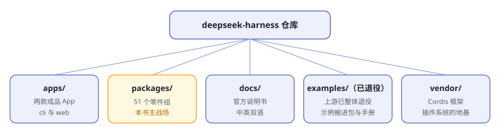

# 第3章 俯瞰地图

> **阅读提示**
> 车已经开起来了，这一章打开引擎盖看全景：仓库里有哪些零件、各管什么、后面的章节分别拆哪一块。不要求记住，混个脸熟即可。

## 仓库的五个大区

dsh 的仓库是一个 monorepo（一个大仓库装下所有零件）。从天上往下看是五个区（图3-1）：

**图3-1 仓库五大区**

**表3-1 五大区各是什么**

| 区 | 一句话 | 里面有什么 |
|---|---|---|
| `apps/` | 用户实际运行的两个入口 | `cli`（命令行）、`web`（网页界面的宿主半边） |
| `packages/` | 全部能力零件 | 50 个组，按"组 → 包"两级分文件夹 |
| `docs/` | 官方说明书 | 中英双语，仅顶层专题文档就有 18 篇，外加 cordis 教程和 cookbook |
| `examples/` | 官方样机车 | 6 台可直接运行的示例，从命令行 agent 到定时任务 |
| `vendor/` | 外购的地基 | 主角是 [Cordis](https://github.com/cordiverse/cordis)，"一切皆插件"就靠它 |

仓库根目录还有几个小一号的区，顺手认识一下：

**表3-2 次要目录**

| 目录 | 管什么 |
|---|---|
| `python/` | 官方 Python SDK——不想写 TypeScript 也能驱动 dsh |
| `native/` | 平台原生模块（目前只有 Linux 的 landlock 沙箱组件） |
| `scripts/` | 一百多个工程脚本，大量以 `verify-` 开头，是仓库的质量门禁 |
| `website/` | dsh 官网的源码 |
| `.agents/` | 留给 AI agent 的设计笔记和技能清单，第 13 章重点讲 |
| `AGENTS.md` | 写给 AI agent 的仓库工作守则——`CLAUDE.md` 只是它的快捷方式 |

## 五十个零件组，按器官归堆

`packages/` 里 50 个组，名字都像缩写，第一次看会懵。别慌——按第 1 章的五器官归堆，立刻清楚（表3-3）：

**表3-3 零件按器官归类**

| 器官 | 零件组 | 管什么 |
|---|---|---|
| 🔌 接大脑 | `llm/` `credentials/` | 模型抽象与各家适配器、API key 的存取与授权 |
| 🧠 记忆与循环 | `core/` `session/` `session-query/` `context/` `compaction/` `spill/` `storage/` `attachment/` | 会话日志、提示词组装、上下文压缩、附件与存储 |
| 🤚 手 | `shell/` `subprocess/` `terminal/` `code-runtime/` `fs/` | 执行命令、管理进程、持久终端、跑代码、读写文件 |
| 📏 规矩 | `sandbox/` `interaction/` `guard/` `feedback/` | 沙箱限制、审批与询问、循环卫生守卫、人类反馈 |
| 🎯 目标与任务 | `goal/` `plan/` `todo/` `schedule/` `jobs/` `workflow/` `subagent/` | 目标跟踪、计划模式、待办清单、定时、后台任务、子代理 |
| 👁️ 外设 | `web/` `lsp/` `skill/` `mcp/` `e2b/` | 联网搜索、语言服务协议、技能、外部工具协议、云沙箱 |
| 🚪 门面 | `api/` `sdk/` `acp/` `host/` `client/` `hooks/` | 对外接口、进程外 SDK、自动化协议、网页两半、与外部工具互通 |
| 🧱 车架 | `boot/` `bundle/` `preset/` `extensions/` `settings/` `workspace/` `identity/` `typert/` | 启动、配方、预置、运行时自修改、设置、工作区、匿名身份 |
| 🧪 支持 | `examples/` `test-support/` `util/` `experimental/` | 演示组合、测试基建、底层工具、未发布原型 |

不用背。后面每拆一个器官，对应的零件会再出场一次。

有两处细节值得多看一眼：

- 绝大多数组的定位是"**产品：稳定 API**"——官方当正式产品维护；`e2b/` 标着 POC（概念验证），`experimental/` 不发布。
- 组内还分"包"。比如 `llm/` 组里有 `llm`（抽象层）、`llm-deepseek`（DeepSeek 适配器）等五个包。**抽象和具体实现分开打包**，这是"换大脑不难"的工程真相。

## 主干上的六件套

所有零件里，`core/` 是主干——每辆车出厂都装着它。官方架构文档点名了其中六个：

**表3-4 core 主干六件套**

| 零件 | 大白话职责 | 注册名 |
|---|---|---|
| session | 会议纪要员：逐笔记录发生过的每件事 | `ctx.sessions` |
| system-prompt | 开场白编写员：把提示词片段和工具清单拼成给大脑的开场白 | `ctx.systemPrompt` |
| tools | 工具管理员：登记有哪些工具，执行前先过一遍关卡 | `ctx.tools` |
| agent | 前台：所有插件找 agent 办事，都通过这个接待口 | `ctx.agents` |
| agent-loop | 司机：真正执行"想一步→干一步→看结果"循环的人 | `ctx.agentLoop` |
| scope | 分房间：让每个 agent 有自己独立的工具和提示词 | （库，无注册名） |

`core/` 里还有两个没列入上表的小零件：`agent-default-model`（默认模型）和 `agent-tool-presentation`（工具的展示方式）。

其中藏着官方最得意的一个设计：**司机是可以换的**。其他插件（界面、钩子、工具）都只认识前台（`agent`），不认识具体哪个司机（`agent-loop`）在开车——所以换一个司机，全车不受影响。这个"只认接口、不认实现"的思路贯穿全书。

## 三种事件：dsh 的神经系统

零件之间靠什么通信？靠**事件**。dsh 把事件分成三个域，官方说"选对事件域是大多数改动的第一个决定"：

**表3-5 三种事件域**

| 事件域 | 例子 | 什么时候用 |
|---|---|---|
| 会话事件 | `session/event` | 要记入日志、重启后还必须存在的事实 |
| Agent 事件 | `agent/*` | 观察或拦截正在进行的工作：步骤、请求、续跑 |
| 能力事件 | `fs/*` `tools/*` | 不改循环，只给某项能力挂策略或适配器 |

现在看不懂没关系——第 5 章讲一次对话的旅程时，这张表会成为你的地图。

## 一条铁律：模型可见即已记录

dsh 有一条写进架构文档的运行时不变量，值得单独拎出来：

> **模型可见即已记录。** 抵达模型请求的一切，都必须能从会话日志重建。

换句话说：模型这次看到了什么提示词、哪些工具结果，日志里一定找得到完整出处；反过来说，想给模型看一样新东西，就必须先发明一种新的会话事件。

这条铁律换来了三样好处：**可回放**（事后能精确重演）、**可恢复**（进程重启，会话续得上）、**可审计**（模型为什么这么干，逐条查得到）。第 5 章会看到它如何落地。

## 设计考古：.agents 目录

仓库里有个别的开源项目罕见的目录：`.agents/`。里面是 **DeepSeek 自己用 AI agent 开发这个项目时留下的档案**：

**表3-6 .agents 里有什么**

| 内容 | 是什么 |
|---|---|
| `notes/` | 设计笔记，按 `proposed / implemented / rejected / archived` 四种状态归档，每篇写清"为什么这么设计、考虑过哪些备选" |
| `skills/` | 给 agent 的技能清单，如"代码评审""合并堆叠的 PR""文档翻译" |
| `AGENTS.md`（根目录） | 仓库工作守则，机器可执行的规则 |

想搞懂 dsh 某个设计"为什么长这样"，除了读代码，还可以去翻对应的设计笔记——这是第一手的决策记录。第 13 章会专门讲从这套做法里能偷师什么。

## 怎么逛这个仓库

官方给的两条建议（来自[架构文档](https://github.com/deepseek-ai/deepseek-harness/blob/master/docs/architecture.zh.md)）：

- **动 `packages/` 之前，先读架构文档**
- **用 agent 探索代码库**——让 dsh 自己读自己，是官方推荐用法

零件的说明书就在每个零件自己的目录里：`packages/<组>/<包>/README.md`，用途、接口、扩展点、已知局限都写清了。遇到术语拿不准，查[官方术语表](https://github.com/deepseek-ai/deepseek-harness/blob/master/docs/glossary.zh.md)——dsh 给每个概念规定了唯一的规范叫法，这对一本讲它的书来说是好消息：不会一义多词。

## 全书章节对照地图

本书后面每一章拆哪块零件，先给你地图（表3-7）：

**表3-7 章节 × 零件对照**

| 章 | 主题 | 主要零件 |
|---|---|---|
| 第4章 | 一切皆插件 | `vendor/cordis` |
| 第5章 | 一次对话的旅程 | `core/` `session/` |
| 第6章 | 工具执行流水线 | `core/tools` `interaction/` `guard/` |
| 第7章 | 目标与计划 | `goal/` `plan/` `todo/` |
| 第8章 | 上下文工程 | `compaction/` `spill/` `context/` |
| 第9章 | 安全的手脚 | `fs/` `subprocess/` `shell/` `terminal/` `sandbox/` |
| 第10章 | 连接外部世界 | `mcp/` `lsp/` `skill/` `subagent/` |
| 第11章 | 第一个插件 | `examples/` + 官方 cookbook |
| 第12章 | 组装自己的 agent | `boot/` `bundle/` `preset/` |

## 🧪 本章实验

> **实验 3-1 ★｜数一数零件**
> 目标：对规模有体感。
> 步骤：打开仓库网页版的 [packages 目录](https://github.com/deepseek-ai/deepseek-harness/tree/master/packages)，数数有多少个文件夹。
> 验收：数出 50 个，且能指着其中 3 个说出它归哪个器官。

> **实验 3-2 ★★｜让 dsh 介绍它自己**
> 目标：体验"用 agent 探索代码库"的官方用法。
> 步骤：把 deepseek-harness 仓库 clone 到本地，选为工作区，问它：「介绍一下 packages/core 下的各个包分别负责什么」。
> 验收：它基于真实源码给出了介绍——这就是"自己读自己"。

> **实验 3-3 ★★｜翻一篇设计笔记**
> 目标：感受"设计考古"。
> 步骤：打开 [`.agents/notes/implemented/`](https://github.com/deepseek-ai/deepseek-harness/tree/master/.agents/notes/implemented) 随便挑一篇带 `.zh` 后缀的笔记读。
> 验收：你能说出那篇笔记解决了什么问题、拒绝了哪个备选方案。

## 🤔 思考题

1. ★ 为什么"其他插件只认前台、不认司机"是个好设计？想想如果反过来会怎样。
2. ★★ 表3-3 里哪个器官的零件最让你意外？为什么？
3. ★★ "模型可见即已记录"这条铁律，对排查"它怎么突然胡说八道"有什么帮助？
4. ★★★ 如果让你给一个开源项目加 `.agents/notes/` 这样的设计档案，最先受益的是人还是 AI？

## 📝 小结

- **五大区**——apps、packages、docs、examples、vendor；另有 python、scripts、.agents 等小区
- **零件按器官归堆**——接大脑/记忆循环/手/规矩/目标/外设/门面/车架/支持，共 50 组
- **core 六件套**——session、system-prompt、tools、agent、agent-loop、scope；司机可换是核心设计
- **三种事件域**——会话事件记账、agent 事件盯过程、能力事件挂策略
- **一条铁律**——模型可见即已记录，换来可回放、可恢复、可审计
- **逛法**——先读架构文档，让 agent 带你逛，零件说明书在各自 README，术语查术语表

第一部分到此结束：你见过了它、跑起来了它、看全了它。
下一部分开始解剖。➡️ [第4章 一切皆插件](ch04.md)
