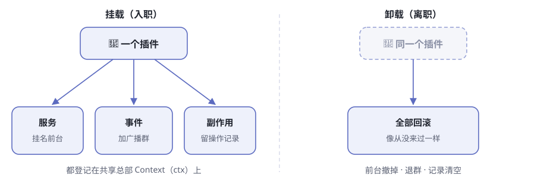
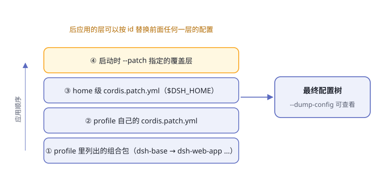

# 第4章 一切皆插件

假设你想把 dsh 的模型供应商从 DeepSeek 换成另一家。一个常见做法是找到调用模型的核心代码，修改它，再重新编译整套应用。

dsh 给出的答案更大胆：模型适配器不是核心代码里的一个分支，而是插件树上的一个节点。工具、会话日志、agent loop（智能体循环）、Web 界面也采用同一种组织方式。

这就是官方所说的 **“一切皆插件”**。不过，这一章先不急着相信这句话。我们要用三个问题检验它：

1. 运行中的 dsh，能不能把自己的插件树展示出来？
2. 插件卸载以后，它留下的监听器和资源会不会一起消失？
3. 更换一个实现时，其他部件是否只依赖稳定接口，而不依赖具体实现？

> **阅读提示**
> 本章保留“公司总部”和“换零件”的类比，但不会停在类比上。每个关键结论后面都给出配置、源码或运行证据。

> **证据基线**
> 本章核对的是 DeepSeek Harness 提交 [`99f6f02`](https://github.com/deepseek-ai/deepseek-harness/tree/99f6f02fecdb7dff40c3fbc9470f5907c29f74ca)，验证日期为 2026-08-26。dsh 尚处于开发者预览阶段，命令、包名和配置以后可能变化。

## 先把“一切皆插件”变成可以验证的话

“插件很多”不能证明“一切皆插件”。一个项目完全可以把外围功能做成插件，却把真正重要的决策锁死在核心代码里。

dsh 的主张更具体（表4-1）：

**表4-1 三个可以被检验的主张**

| 主张 | 应该观察到什么 | 反例是什么 |
|---|---|---|
| 产品部件来自组合 | 启动前能看到模型、工具、日志、循环和界面对应的配置项 | 关键部件藏在固定启动代码里，配置树中不存在 |
| 插件贡献是可逆的 | 卸载插件时，它注册的资源、监听器和子插件被撤销 | 插件卸载后仍留下定时器、监听器或旧服务 |
| 消费方依赖接口 | 更换提供方不要求修改所有调用者 | 调用者直接导入并判断某个具体实现 |

后面的内容都围绕这三条展开。这样，“一切皆插件”不再是一句宣传语，而是一组可以查证、也可能被证伪的工程判断。

## 第一份证据：让 dsh 打印自己的插件树

在 DeepSeek Harness 仓库根目录执行：

```sh
pnpm dsh --profile web --dump-config
```

这个命令不调用模型，不需要 API Key。它会把 `web` profile 最终合成的配置树输出为 YAML。下面是本次实际输出中截取的三组条目：

```yaml
# == @deepseek-ai/dsh-base
- id: llm
  name: '@deepseek-ai/dsh-llm'

# == @deepseek-ai/dsh-base
- id: agent-loop
  name: '@deepseek-ai/dsh-agent-loop'
  config:
    agents: []

# == @deepseek-ai/dsh-web-app
- id: web-runtime
  name: '@deepseek-ai/dsh-web-app'
  inject:
    - webStartup
```

这里至少能确认三件事：LLM 能力、默认 agent loop 和 Web 运行时都出现在同一棵配置树里；每个节点都有稳定的 `id`；输出还标出了节点来自 `dsh-base` 还是 `dsh-web-app`。

配置里还有一种更有意思的来源标记：

```yaml
# == @deepseek-ai/dsh-base, patched by @deepseek-ai/dsh-web-app
- id: tool-pwsh
  name: '@deepseek-ai/dsh-tool-pwsh'
  disabled: true
```

这不是另一份 Web 专用工具定义。`dsh-web-app` 找到 `dsh-base` 中 id 为 `tool-pwsh` 的行，并对它应用了 patch。最终输出同时保留“原来从哪来”和“后来被谁修改”的线索。

不过，`--dump-config` 只能证明**产品部件参与了组合**，不能单独证明卸载真的干净，也不能证明调用者没有偷偷依赖具体实现。为回答后两个问题，我们还要进入 Cordis。

## Cordis：插件怎样互相找到对方

Cordis 是 dsh 底下的插件框架。dsh 把它整体放在仓库的 `vendor/cordis` 中，而不是只依赖一个远端 npm 包。因此这层地基的源码可以被审计、修补和固定版本；本章的所有源码链接也都指向同一个提交，而不是会继续变化的 `master`。

可以继续用公司的类比理解 Cordis，但每个类比都要对应一个真实机制（表4-2）。

**表4-2 类比与真实机制**

| 大白话 | Cordis 概念 | 真实作用 |
|---|---|---|
| 公司总部 | `Context`，代码中常写作 `ctx` | 保存并解析服务，承载事件与插件生命周期 |
| 入职员工 | Plugin | 在 `apply(ctx)` 中贡献能力 |
| 带名字的服务台 | Service | 通过稳定的 `ctx.<key>` 暴露能力 |
| 入职条件 | `inject` | 声明插件启动前必须具备哪些服务 |
| 公司广播 | Event | 让插件在不知道彼此实现的情况下通信 |
| 离职清单 | Effect / disposer | 卸载时撤销注册和外部资源 |



**图4-1 插件挂载时贡献能力，卸载时沿原路撤销**

一个插件挂载时，可以提供服务、监听事件、挂载子插件和登记外部资源；卸载时，这些贡献应该沿原路撤销。官方仓库还提供了一套七课的中文 [Cordis 教程](https://github.com/deepseek-ai/deepseek-harness/tree/99f6f02fecdb7dff40c3fbc9470f5907c29f74ca/docs/cordis-tutorial)，可以和本章交叉阅读。

### Context：共享总部，不是全局变量袋子

`Context` 表面上像一个共享对象，例如 `ctx.tools`、`ctx.llm`、`ctx.sessions`。但插件不是把任意字段随手塞进去；这些名字由服务机制管理，可以被隔离、替换并跟随生命周期回收。[`Context` 源码](https://github.com/deepseek-ai/deepseek-harness/blob/99f6f02fecdb7dff40c3fbc9470f5907c29f74ca/vendor/cordis/src/context.ts#L42)显示，它实际是一个代理对象：普通属性读取会经过服务解析器。

这一区别很重要。普通全局变量只解决“大家都能访问”，Context 还要回答“当前作用域该访问哪个实现”“实现何时可用”“卸载后如何消失”。

### Service 与 inject：只认服务名，不认柜台后面的人

服务按名字挂在 Context 上。下面是几项真实服务（表4-3）：

**表4-3 几个真实的服务键**

| 键 | 管什么 |
|---|---|
| `ctx.sessions` | 会话日志与事件记录 |
| `ctx.systemPrompt` | 系统提示词片段和工具清单的组装 |
| `ctx.tools` | 工具注册与带策略的执行 |
| `ctx.agents` | agent 的统一接待入口 |
| `ctx.agentLoop` | 默认的“想一步→干一步”循环实现 |
| `ctx.llm` | 消息、流式事件与模型适配器接口 |

假设一个插件需要执行工具。它声明依赖 `tools` 服务，然后通过 `ctx.tools` 调用，而不是直接导入某个工具注册表实现。这就是可替换性的第一半：**消费者依赖稳定的服务名和接口，而不是具体提供方。** 只要新提供方履行同一接口，消费者不需要知道柜台后面换了人。

如果 `tools` 尚未出现，依赖它的插件会保持 `PENDING`，等服务就绪后再启动。配置文件里的上下顺序不负责表达依赖，`inject` 才负责。

而且 `inject` 不是只在开机时检查一次。运行中如果提供方被卸载，依赖它的插件也会跟着卸载；服务回来后，依赖方再重新加载。这避免了调用者继续攥着一个已经失效的服务引用，也是“热换零件”能够成立的地基。

### Event：不认识对方，也能合作

服务适合直接调用；事件适合观察、拦截或扩展流程。例如工具执行前后的策略，不必修改 agent loop，可以监听 `tools/*` 事件。

Cordis 的事件名和消息格式通过类型声明约束；每类事件还有明确的分发模式（表4-4）。

**表4-4 事件的五种分发模式**

| 模式 | 怎么走 | 等待吗 | 有返回值吗 | 大白话 |
|---|---|---|---|---|
| `emit` | 监听者按注册顺序观察 | 否 | 无 | 广播通知，喊完就走 |
| `waterfall` | 沿一排负责人传递，每层可包装或短路 | 否 | 有 | 传令审批，能扣下 |
| `parallel` | 所有监听者并发执行 | 是 | 无 | 扇形铺开，等大家都干完 |
| `serial` | 按注册顺序执行 | 是 | 有 | 排队逐个办，收好回执 |
| `bail` | 按序传递，直到有人返回 bail 值停下 | 否 | 有 | 第一个举手的人说了算 |

注意：分发模式不是注释，是**公开契约**。新事件要用 `@mode` 标签声明自己的模式，生成目录的脚本会拿声明去核对每一处分发调用点——声明和用法对不上，门禁直接报错。

Waterfall 像一条可包裹的中间件链：监听器调用 `next()` 才会继续交给下游；不调用就会短路。因此，只负责观察或标注的监听器必须调用 `next()`，直接返回意味着“这个决策到我为止”。

审批中的 `approval/request`、模型请求前的 `agent/request`，以及工具调用前后的策略，都可以借助这种机制扩展流程，而不用互相直接导入。官方的 [Cordis 入门](https://github.com/deepseek-ai/deepseek-harness/blob/99f6f02fecdb7dff40c3fbc9470f5907c29f74ca/docs/cordis-primer.zh.md)把整套关系概括为插件、上下文、依赖注入、类型化事件和可逆 effect。

## 真正的关键不是“能插”，而是“能拔干净”

很多系统都能在运行时注册一个回调，难点是卸载后不留下幽灵资源：重复监听器、没有关闭的定时器、仍占端口的服务器、继续响应请求的旧实现。

Cordis 把插件产生的外部影响记为 effect。effect 在建立资源时返回一个 disposer；插件卸载时，Cordis 会执行这些 disposer。许多内置操作已经属于 effect（表4-5）。

**表4-5 已纳入生命周期的注册**

| 动作 | 卸载时会发生什么 |
|---|---|
| `ctx.on(...)` 监听事件 | 监听器被移除 |
| `ctx.plugin(...)` 挂载子插件 | 子插件随父插件一起释放 |
| 注册服务 | 提供方卸载时服务被摘除 |
| `ctx.tools.register(...)` 等注册表调用 | 返回的释放函数附着到调用插件 |

Cordis 不知道的资源——例如定时器、连接和文件 watcher——则必须显式包进 `ctx.effect()`，并返回清理函数。

下面是本章实际运行过的最小探针。把它保存到操作系统临时目录，然后在 DeepSeek Harness 仓库根目录用 `pnpm exec tsx <文件路径>` 运行：

```ts
import { Context } from '@deepseek-ai/cordis'

void (async () => {
  const ctx = new Context()
  const events: string[] = []

  const fiber = ctx.plugin((pluginCtx) => {
    events.push('plugin loaded')
    pluginCtx.effect(() => {
      events.push('resource opened')
      return () => events.push('resource closed')
    })
  })

  if (fiber.inertia) await fiber.inertia
  await fiber.dispose()
  console.log(events.join(' -> '))
  await ctx.fiber.dispose()
})()
```

本次实际输出是：

```text
plugin loaded -> resource opened -> resource closed
```

这条输出很短，却验证了一个完整因果链：插件加载时资源被建立；调用 `fiber.dispose()` 后，属于该插件的 disposer 被执行，资源随之关闭。

源码中的链路也能对上（表4-6）：

**表4-6 从挂载到清理的源码链路**

| 环节 | 源码事实 |
|---|---|
| `ctx.plugin(...)` | 为每次挂载创建一个 Fiber，即插件实例的运行时句柄 |
| `ctx.effect(...)` | 把 disposer 记录到当前 Fiber |
| `fiber.dispose()` | 进入卸载流程并等待清理完成 |
| 多个 disposer | 按相反顺序撤销，适合处理“后建立的资源先关闭” |

具体实现可从 [`Fiber.effect()`](https://github.com/deepseek-ai/deepseek-harness/blob/99f6f02fecdb7dff40c3fbc9470f5907c29f74ca/vendor/cordis/src/fiber.ts#L406)继续往下读。官方[生命周期教程](https://github.com/deepseek-ai/deepseek-harness/blob/99f6f02fecdb7dff40c3fbc9470f5907c29f74ca/docs/cordis-tutorial/02-lifecycle-and-effects.zh.md)还演示了定时器如何跟随插件卸载。

### 失败也必须有明确状态

Fiber 不是只有“存在/不存在”两种状态（表4-7）。

**表4-7 Fiber 状态机**

| 状态 | 含义 |
|---|---|
| `PENDING` | 已声明，但所需服务还未就位 |
| `LOADING` / `ACTIVE` | `apply` 正在运行／已完成 |
| `FAILED` | 加载或配置校验抛出异常 |
| `UNLOADING` / `DISPOSED` | 正在清理／已经清理完成 |

`PENDING` 是合法状态，不是错误；提供方可能稍后才挂载。加载失败则进入 `FAILED`。完整 dsh 启动还会审计没有解析或没有激活的配置项并明确失败，而不是带着半棵插件树假装启动成功。

所以“可逆”不只是为了热更新。它首先是一条资源所有权规则：**谁在加载时建立影响，谁就必须在卸载时撤销影响。**

## “一切”到底有多彻底

在 dsh 的产品层，模型适配、工具注册、会话日志、agent loop、Web 界面和安全策略都由插件贡献。官方[架构说明](https://github.com/deepseek-ai/deepseek-harness/blob/99f6f02fecdb7dff40c3fbc9470f5907c29f74ca/docs/architecture.md#L9-L13)明确把这些部件列为可从配置替换的插件。

**表4-8 产品部件为什么能被替换**

| 部件 | 稳定接缝 | 可以变化的实现 |
|---|---|---|
| 模型调用 | `ctx.llm` | DeepSeek 或其他适配器/路由器 |
| 工具执行 | `ctx.tools` + `tools/*` 事件 | 工具集合、执行策略、前后置守卫 |
| 会话记录 | `ctx.sessions` | 持久化与投影实现 |
| agent 驱动 | `ctx.agents` / `ctx.agentLoop` | 默认循环或其他驱动方式 |
| 文件与进程能力 | `ctx.fs`、`ctx.subprocess` 等 | 本机、沙箱或远端提供方 |
| 交互界面 | 会话事件与 Agent 接口 | Web、CLI、ACP 等入口 |

教程还给出一个典型过程：如果 `shell` 的提供方被替换，所有注入了 `shell` 的插件会先卸载，再使用新实现重新启动。消费方不需要逐个修改。

这里需要补一个边界：“没有特权内核”不等于“系统没有不可缺少的基础”。Cordis 的 Context、Fiber、Loader 以及 dsh 的启动代码仍然负责承载、解析和装配插件。

更准确的说法是：**dsh 没有一块写死业务能力、只能靠修改核心分支扩展的产品内核。** 基础框架当然存在，但模型、工具、日志和循环等产品能力不因此获得特殊地位。

### 连注册都能分房间

插件之间平等，但“谁能看见谁的注册”仍然受 scope（作用域）约束。一项工具、提示词段、变量或监听器可以对所有 agent 全局可见，也可以只归属于一个 agent。

同名项相遇时，带作用域的注册可以在自己的 scope 内遮蔽全局项。这让某个 agent 能拥有专属提示词或工具实现，同时不影响其他 agent。可替换性因此不等于所有东西都暴露给所有人。

## Profile：插件不是堆起来，而是分层组装

一棵实际运行的插件树通常不是一份巨大 YAML 手写出来的。dsh 从空列表开始，按顺序应用多层 patch（图4-2）。



**图4-2 后应用的配置层拥有更高优先级**

截至本章基线版本，主要顺序是：

1. profile 清单中列出的 bundle，按清单顺序应用
2. 当前 profile 的 `cordis.patch.yml`
3. Harness home 下的 `cordis.patch.yml`
4. 命令行 `--patch` 指定的 overlay，按参数顺序应用

这里有两个需要分清的词（表4-9）。

**表4-9 Profile 与 bundle**

| 词 | 是什么 |
|---|---|
| profile | 一套具名组装：列出 bundle，保存自身的 patch，并可安装树外插件；`web` 和 `headless` 是随发行版交付的模板 |
| bundle | Cordis 配置项及挂载代码的分发格式；它加入的节点仍可被更高层 patch |

每个 profile 都建立在 `dsh-base` 之上；`dsh-web-app` 增加浏览器应用，`dsh-headless` 增加不带服务器的一次性运行器。

实际启动和 `--dump-config` 共用同一套组合算法。[`prepareProfile()`](https://github.com/deepseek-ai/deepseek-harness/blob/99f6f02fecdb7dff40c3fbc9470f5907c29f74ca/apps/cli/src/profile-boot.ts#L132-L170)按上述次序把各层交给 `composeEntries()`，因此打印出的树不是另一套近似配置，而是对启动组合的离线呈现。

这里还有一个容易踩坑的细节：patch 找到 id 后，会**替换该行的整个 `config`，不是递归深度合并**。上层若只写一个新字段，却忘了重述需要保留的旧字段，旧字段不会自动留下。

分层带来的好处是本地改装不必复制整份官方配置；代价是同一个节点可能被多层修改。`--dump-config` 中的来源注释正是为了解决“最后是谁改了它”的追踪问题。

## 自修改：可逆不等于没有风险

官方 [`web-cordis` 示例](https://github.com/deepseek-ai/deepseek-harness/blob/99f6f02fecdb7dff40c3fbc9470f5907c29f74ca/examples/web-cordis/README.zh.md)允许 agent 检查当前 Cordis 进程，并在内存中挂载或卸载模型编写的临时插件（表4-10）。

**表4-10 自指工具的五个动作**

| 动作 | 干什么 |
|---|---|
| `cordis_inspect` | 只读查看当前插件和注册项 |
| `cordis_define` | 登记一个模型写出的包，但不运行 |
| `cordis_run` | 在沙箱中启动临时插件 |
| `cordis_stop` | 停止并清理插件，但保留定义 |
| `cordis_undefine` | 必要时先停止，再删除定义 |

这些动态包只存在于当前进程内存：不创建插件文件、不安装依赖、不修改配置，也不会跨重启保留。开发时的 HMR 也依赖同一条纪律：先卸载旧实例、撤销 effect，再加载新代码。

这证明插件树不仅能在启动前组合，也能在运行时改变。但官方同时写明：临时插件可能影响同一进程中的其他会话。换句话说，可逆性解决的是“如何撤销”，并不自动解决权限、作用域和错误代码的风险。

**表4-11 插件化设计的收益与代价**

| 收益 | 对应代价 |
|---|---|
| 能力可以替换 | 必须维护稳定的服务与事件接口 |
| 注册可以随插件卸载 | 每个外部资源都要正确登记 disposer |
| 配置可分层覆盖 | 最终值的来源更难追踪 |
| 支持运行时自修改 | 必须控制权限、作用域和失败恢复 |

这比“插件很灵活”更接近真实工程结论：**dsh 用严格的生命周期和接口纪律，换取运行时的可组合性。**

## 为什么“换零件”成立

回头看，“换零件”不是一个点子，而是三件事合在一起（表4-12）。

**表4-12 换零件的三个条件**

| 条件 | 机制 | 结果 |
|---|---|---|
| 可换 | 服务按名字消费，消费方不导入提供方 | 配置里换提供方，消费方不必修改 |
| 可撤 | 每个注册都是 effect，卸载即回滚 | 热替换和自修改出错后可以撤销 |
| 可叠 | 配置分层组合，后层按 id 修补前层 | 不改源码、不重新编译也能改装 |

缺少任何一条，“一切皆插件”都会退化成口号：只有可换而不可撤，会留下旧资源；只有可撤而不可叠，每次仍要复制整套配置；只有可叠而没有接口隔离，换实现仍会牵动所有调用者。

## 🧪 本章实验

> **实验 4-1 ★｜比较两棵真实配置树**
> 目标：验证 Web 和 headless 形态由不同插件组合产生，而不是启动代码中的两个固定分支。
> 步骤：在 Harness 仓库根目录分别运行 `pnpm dsh --profile web --dump-config` 和 `pnpm dsh --profile headless --dump-config`。在 PowerShell 中可将输出接到 `Select-String "agent-loop|web-runtime|headless"`，POSIX shell 可使用 `grep -E`。
> 验收：两份输出都能找到基础能力；`web-runtime` 只属于 Web 组合；每个命中项附近能看到来源层注释。

> **实验 4-2 ★★｜亲眼看见资源被撤销**
> 目标：验证插件卸载不只是从列表里删除名字，还会执行它拥有的清理逻辑。
> 步骤：把本章“最小探针”保存到操作系统临时目录，在 Harness 仓库根目录执行 `pnpm exec tsx <文件路径>`，运行后删除临时文件。
> 验收：输出严格包含 `plugin loaded -> resource opened -> resource closed`，并且进程能自行退出。

> **实验 4-3 ★★｜追一条注册的所有权链**
> 目标：从一个真实 dsh 插件中确认“注册属于插件生命周期”。
> 步骤：任选一个调用 `ctx.on(...)`、`ctx.effect(...)` 或注册表 `.register(...)` 的插件；找到它的 `apply(ctx)`，再沿注册调用查看返回的 disposer 如何附着到 Fiber。
> 验收：写出四行笔记：谁创建资源、谁拥有 Fiber、谁触发 dispose、资源怎样消失。不要用“框架会自动处理”代替这四个答案。

> **实验 4-4 ★｜数一条真实广播的听众**
> 目标：用项目数据感受插件间的事件协作。
> 步骤：打开官方[事件生产方与消费方矩阵](https://github.com/deepseek-ai/deepseek-harness/blob/99f6f02fecdb7dff40c3fbc9470f5907c29f74ca/docs/event-producer-consumer.zh.md)，找到 `session/event`。
> 验收：列出至少三个监听它的包，并说明它们为什么不需要互相导入。

## 本章验证记录

**表4-13 证据状态（2026-08-26）**

| 项目 | 状态 | 说明 |
|---|---|---|
| `web --dump-config` | **本次实际跑通** | 成功输出完整配置树及 bundle/patch 来源 |
| 最小生命周期探针 | **本次实际跑通** | 实际输出加载、打开资源、关闭资源三步 |
| Profile 与配置导出测试 | **本次实际跑通** | `profile.spec.ts` 与 `config-dump.spec.ts` 共 20 个测试通过 |
| Cordis 生命周期行为 | **已有源码与官方教程覆盖** | 本次只跑最小探针，没有执行 Cordis 全量测试 |
| `web-cordis` 自修改演示 | **本次未运行** | 需要 `DEEPSEEK_API_KEY`，这里只核对了官方示例与源码说明 |

这张表刻意把“存在测试”“本次跑通”和“未运行”分开。技术书中的可信度，不来自所有结论都写成成功，而来自读者能看清每个结论究竟站在哪一层证据上。

## 🤔 思考题

1. ★ 如果一个插件用 `setInterval()` 建立定时器，却没有放进 `ctx.effect()`，卸载后可能出现什么现象？
2. ★ `inject` 为什么比“把提供方写在配置文件前面”更可靠？
3. ★★ “没有特权产品内核”和“没有基础框架”有什么区别？为什么要把这两个说法分开？
4. ★★ patch 替换整个 `config` 而不做深度合并，减少了哪类歧义，又增加了什么使用成本？
5. ★★★ 如果模型可以挂载自己生成的插件，除了可回滚之外，还需要哪些权限与作用域约束？

## 📝 小结

- **先把口号变成可验证主张**——能否看见组合、能否干净卸载、消费者是否只依赖稳定接口
- **Context 负责解析服务与作用域**——它不是随意存放全局变量的对象
- **Service、inject 和 Event 解耦插件**——调用者不必知道具体实现，加载顺序由依赖表达
- **可逆 effect 是插件化的核心纪律**——挂载时产生的影响，卸载时沿所有权链撤销
- **“没有特权内核”有边界**——Cordis 和启动层是基础，但 dsh 的产品能力不被写死在其中
- **Profile 用分层 patch 组装插件树**——后层优先，`--dump-config` 用来源注释解释最终结果
- **可组合性不是免费的**——它要求生命周期、接口、配置来源、权限和失败恢复都更严格

下一章，我们不再看静态的插件树，而是跟着一条用户消息走进 agent loop。➡️ [第5章 一次对话的完整旅程](ch05.md)
