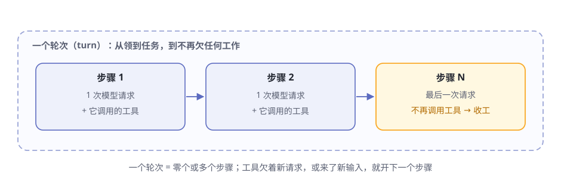
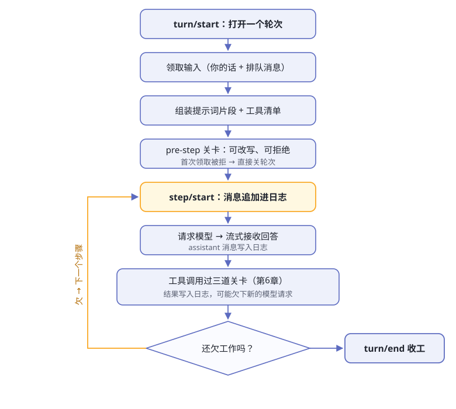

# 第5章 一次对话的完整旅程

> **阅读提示**
> 第 2 章你看到了 agent 给出的答案。这一章打开黑盒：从你按下回车，到答案出现，dsh 内部到底发生了什么。两个新词：**轮次**和**步骤**。

## 轮次和步骤：一次对话的度量衡

先定义两个词，全书通用：

- **步骤（step）**：一次模型请求，加上这次请求里它调用的工具
- **轮次（turn）**：零个或多个步骤的集合。领到第一条输入时打开，不再欠任何工作时关闭

**图5-1 轮次与步骤的关系**

为什么这么分？因为"你问一句它答一句"只是最简单的情形。真实干活时，agent 常常要来回好几步：查一次文件、再跑一次命令、再改一处代码——每一步都是一次"想 + 干"，合起来才是一个完整的轮次。

## 一个轮次的完整流程

**图5-2 一个轮次的完整流程**

流程里藏着三个值得注意的设计：

- **pre-step 关卡**：消息进模型之前，插件可以改写甚至拒绝它。首次领取就被拒？那也照样关一个轮次、记一笔日志——**尝试过就要留痕**
- **每步先记账**：`step/start` 时，你的消息先追加进日志，然后才从日志派生出给模型看的历史
- **欠债驱动循环**：工具欠着新的模型请求、或者又来了新输入，就开下一个步骤；什么都不欠了，`turn/end`

## 两种事件：账本的和实时的

dsh 里的"事件"分两种，选错地方是新手第一个坑（表5-1）：

**表5-1 两种事件域**

| 类型 | 特点 | 例子 | 什么时候用 |
|---|---|---|---|
| 会话事件（账本） | 写进日志，永久保存，重启还在 | `turn/start` `user/message` `assistant/*` `tool/*` | 这个事实必须在重载后仍然存在 |
| 实时事件（广播） | 只活在当下，不落账 | `agent/*` `fs/*` `tools/*` | 观察或拦截正在进行的工作 |

其中一种实时事件很特殊，叫 **waterfall（瀑布）**：消息像传令一样经过一排负责人，每人都要显式说"继续"才能传到下一个。图5-2 里的 pre-step、模型请求、三道工具关卡，全是瀑布事件。

## 会话日志：唯一的真源

整个 dsh 只有一本账：**会话日志**（追加式事件流）。模型看到的历史，是从这本账里**投影**出来的，不是单独存的。

由此诞生一条铁律：

> **模型可见即已记录。** 凡是模型能看到的输入，必须能在日志里重建出来。运行时有一项断言专门盯着这条。

推论很直接：想让模型看到一种新东西？先发明一种新事件。没有捷径。

一本账的好处（表5-2）：

**表5-2 都从同一本账派生**

| 能力 | 怎么来的 |
|---|---|
| 恢复对话 | 重放日志 |
| fork（分叉会话） | 复制日志再改 |
| 界面回放 | 原始 `assistant/chunk` 事件保真 |
| 遥测、导出文字记录 | 还是读日志 |

## 递话的三种姿势

你的消息都通过同一个 inbox（收件箱）到达司机。收件箱分两列：给下个轮次的、给下个步骤的。对着 agent 递话有三种姿势（表5-3）：

**表5-3 followup / steer / inject**

| 姿势 | 大白话 | 会立刻唤醒司机吗 |
|---|---|---|
| followup | 正常追加一个新任务 | ✅ 会 |
| steer | 给正在干的活纠偏 | ✅ 会（或在下一步边界消费） |
| inject | 塞一份背景资料进去 | ❌ 不会，等别人叫醒 |

inject 的"不唤醒"很有意思：你可以提前把资料放进收件箱，它安静躺着，直到下一条消息把司机叫醒时才一起带上车。

## 🧪 本章实验

> **实验 5-1 ★｜翻一翻真账本**
> 目标：亲眼看到会话事件流。
> 步骤：跑完一次 headless 任务后，打开 `$DSH_HOME/storages/` 目录，找到最新的会话文件（第 2 章那次就有），翻一翻。
> 验收：能找到 turn 和 step 的痕迹——账本不是比喻，是真有。

> **实验 5-2 ★★｜试试 steer**
> 目标：体验"给正在干的活纠偏"。
> 步骤：在 Web UI 里给 agent 一个需要干一会儿的任务，趁它干活时再发一句修正要求。
> 验收：它的行为在随后的步骤里被你的话带偏了。

## 🤔 思考题

1. ★ 为什么"尝试过也要留痕"（被拒绝的轮次也记录）对排查问题很重要？
2. ★ "模型可见即已记录"这条铁律，防的是哪类 bug？
3. ★★ inject 不唤醒司机——想一个恰好需要这种行为的场景。

## 📝 小结

- **步骤 = 一次模型请求 + 它调的工具**；轮次 = 若干步骤，欠债驱动
- **事件分两种**——账本的（会话事件，永久）和实时的（广播，当下）
- **会话日志是唯一真源**——模型历史是投影出来的，"模型可见即已记录"
- **递话三姿势**——followup 加任务、steer 纠偏、inject 塞资料

下一章，解剖工具调用要过的那三道关卡。➡️ [第6章 工具执行流水线](ch06.md)
