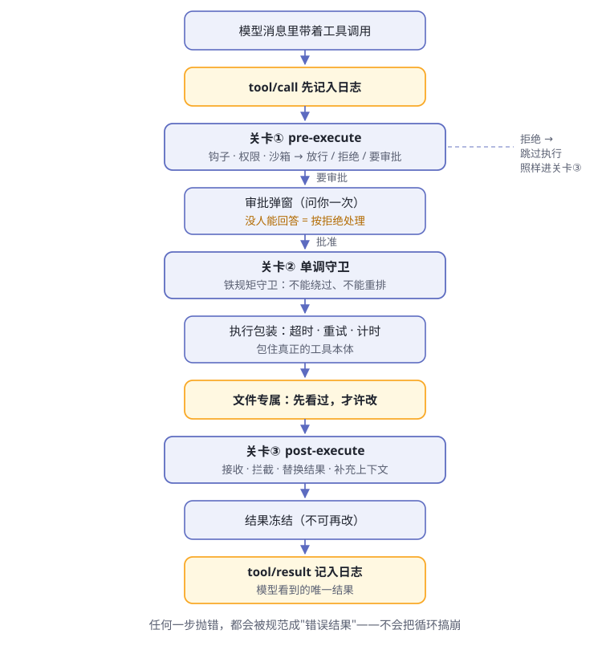

# 第6章 工具执行流水线

> **阅读提示**
> 模型说"我要执行一条命令"，到命令真的跑起来，中间隔着一条长长的流水线。这一章拆流水线上的每道关卡——记账、门禁、守卫、包装、冻结。我们会陪一条 bash 命令从头走到尾。

## 模型从不亲自动手

复习第 1 章的分界线：大脑只负责**申请**用工具——"我要用 bash 工具跑这条命令"，真正动手的永远是身体。

但身体不是听话就冲的愣头青。申请递进来之后，要先过一条执行流水线（图6-1），才谈得上真的执行。官方给这条流水线画过一张详图（[原文](https://github.com/deepseek-ai/deepseek-harness/blob/master/docs/tool-execution-pipeline.zh.md)），本书把它简化成人话版：

**图6-1 工具执行流水线（人话版）**

先记住流水线的骨架：**记账 → 关卡① → 守卫 → 包装执行 → 关卡③ → 冻结记账**。后面逐段拆开。但在那之前，得先回答一个更靠前的问题：工具本身是从哪来的？

## 工具注册表：先登记，后上岗

身体不是天生会做事，每一只"手"都要先向**工具注册表**（`ctx.tools`）报到。注册的是完整的"岗位说明书"：名字、描述、参数规格、输出长什么样的声明，加上真正干活的那个执行函数（[tools 包](https://github.com/deepseek-ai/deepseek-harness/blob/master/packages/core/tools/README.zh.md)）。

登记完成后，两件事自动发生：

- 工具的参数规格自动流入系统提示词——大脑是从这里才"知道"自己有这只手的（第 3 章的开场白组装员负责拼接）
- 以后大脑申请用它时，流水线拿这份说明书校验申请、呈现结果

注册还分两个层级（表6-1）：

**表6-1 工具注册的两种层级**

| 注册方式 | 可见范围 | 典型用途 |
|---|---|---|
| 全局注册 | 所有 agent 可见 | bash、read_file 这类出厂工具 |
| 带作用域注册 | 只有那一个 agent 可见 | 给某个 agent 私有定制的手 |

带作用域注册引出两个机制。一是**遮蔽（shadowing）**：agent 作用域里的工具若与全局工具同名，在这个 agent 里就顶替全局版本——好比连锁店挂了块同名招牌，进店的客人去的是分店。二是**掩码过滤**（`restrict`）：给某个 agent 发一张允许／拒绝清单，把一批全局工具直接藏起来。

> **注意**
> 官方术语表把这条界线分得很清：掩码过滤管的是**可见性**，不是**权限**——藏起来的工具模型调不到，但这不是安全边界。真正的准入，靠的是下面的关卡。

顺带一提：注册表还决定工具以什么方式呈现给模型。除了逐个调用的原生方式，还有一种 Code Mode——模型写一小段程序批量调用工具，子调用照样要走完整条流水线。它是可选配置，不影响本章主线。

## 动手之前，先记账

流水线第一步不是执行，而是**记账**：`tool/call` 事件先写进会话日志，然后才轮到关卡；界面上同时亮起一张"待处理"卡片。

哪怕这次调用最后被拒绝、什么都没干，日志里也有它"申请过"的记录。和第 5 章"被拒绝的轮次也留痕"一个道理：**尝试过就要有迹可循**。

**表6-2 一次调用的两笔记账**

| 事件 | 什么时候写 | 记的是什么 |
|---|---|---|
| `tool/call` | 执行开始**之前** | 申请本身：工具名与参数 |
| `tool/result` | 调用结算时——无论真执行了还是被拒了 | 冻结的最终结果，模型可见的唯一版本 |

## 关卡①：pre-execute

第一道关卡是瀑布式的：三类负责人依次过手，每人都要给出明确意见（[流水线文档](https://github.com/deepseek-ai/deepseek-harness/blob/master/docs/tool-execution-pipeline.zh.md)）：

**表6-3 关卡①的三类负责人**

| 负责人 | 管什么 |
|---|---|
| 钩子（hooks） | 外部系统挂进来的检查逻辑 |
| 权限策略 | 这类操作在当前预设下许不许 |
| 沙箱策略 | 在受限环境里能不能跑 |

裁决只有三种（表6-4）：

**表6-4 三种裁决**

| 裁决 | 后果 |
|---|---|
| 放行 | 进入下一关 |
| 拒绝 | 跳过工具本体，直接去关卡③ 收尾 |
| 要审批 | 弹一次窗问你 |

这道关卡有两条重要的设计规矩。

**第一，关卡只能裁决，不能改单。** pre-execute 有意不允许修改调用参数——如果关卡能偷偷改参数，日志里记的、界面显示的，就会和真正跑的对不上。想改内容？官方把这想法留在了提案阶段，至今没放行。

**第二，审批有个保守设计：没人能回答时，按拒绝处理。** 你不在电脑前、应答者出了故障、环境里根本没有人类通道——一律不干。官方说法是"以拒绝方式关闭"（[审批包](https://github.com/deepseek-ai/deepseek-harness/blob/master/packages/interaction/user-approval/README.zh.md)）。宁可不干，不可乱干。

审批本身也很克制，应答词汇只有四种：**批准（仅此一次）、拒绝、取消、无人应答**。注意"仅此一次"——结果词汇里**没有"永远允许"**，下次遇到照样再问。审批的过程记两笔账（`approval/asked` 与 `approval/decided`）进日志，模型看到的只是最终那条工具结果。

日常使用中，你通常不逐个配权限，而是选一个**权限预设**——它把沙箱模式与审批策略打包成一档（[权限预设](https://github.com/deepseek-ai/deepseek-harness/blob/master/packages/interaction/permission-presets/README.zh.md)）：

**表6-5 出厂的两档权限预设**

| 预设 | 沙箱模式 | 审批策略 | 大白话 |
|---|---|---|---|
| `workspace-write` | 只许写工作区 | 需要时问一次 | 圈地干活，大事问你 |
| `danger-full-access` | 不设限 | 从不弹窗 | 全放开；注意"从不弹窗"意味着需要审批的操作会被**自动拒绝**，而不是放行 |

## 关卡②：单调守卫

第二道关卡叫"单调守卫"。"单调"的意思是：**裁决单向，不能绕过、不能重新排序**。

关卡①的权限策略可以商量（预设可配），但在这里注册的守卫是铁规矩：它们在关卡①之后发声，返回的拒绝**不能被后面的监听器重新变回放行**，位置也固定不可挪（[tools 包](https://github.com/deepseek-ai/deepseek-harness/blob/master/packages/core/tools/README.zh.md)）。

**表6-6 关卡①与关卡②的分工**

| | 关卡① pre-execute | 关卡② 单调守卫 |
|---|---|---|
| 性质 | 可配置的准入商量 | 不可翻转的最后否决 |
| 顺序 | 瀑布传令，可插队扩展 | 固定位置，不可重排 |

注册表提供守卫席位，具体谁来坐由部署决定。官方 [guard 包家族](https://github.com/deepseek-ai/deepseek-harness/tree/master/packages/guard)做的两件"循环卫生"事务，就从别的位置入手：

**表6-7 guard 家族的两个成员**

| 成员 | 管什么 | 在哪管 |
|---|---|---|
| 重复调用提醒 | 模型拿相同参数反复调同一个工具、原地打转 | 事后、建议性：注入逐级增强的提醒 |
| 调用截止时间 | 单次调用挂住不回来 | 执行时：给声明了预算的调用套上截止时间 |

重复调用提醒的判定规则值得细看（表6-8）：

**表6-8 重复提醒怎么认定"打转"**

| 规则 | 说明 |
|---|---|
| 认定标准 | 同一工具 + 规范化后完全相同的参数，算连续（[原文](https://github.com/deepseek-ai/deepseek-harness/blob/master/packages/guard/repeat-tool-reminder/README.zh.md)） |
| 默认阈值 | 连续 3 次、5 次、8 次各提醒一次；第一次简短，后面附带明细 |
| 被拒的调用也计数 | 反复尝试已被拒绝的调用，恰是最该打断的循环 |
| 只建议，不否决 | 不改写、不拦截调用；换方式还是收工，全由模型自己决定 |

提醒以注入的用户消息形式出现在工具结果之后——对模型可见、带来源、可从日志重建，但**绝不替换**工具本来的结果。

截止时间那位则是"声明与执行分离"的样板：工具注册时可以声明协作预算 `timeoutMs`，但注册表只记录、不执法；执法由 [超时策略包装层](https://github.com/deepseek-ai/deepseek-harness/blob/master/packages/guard/timeout-policy/README.zh.md) 完成——它给声明了预算的调用设置截止时间，先到时就返回结构化的 `TOOL_TIMEOUT` 结果。

而且它是**协作式**的：截止时间只是通知，工具自己不理通知就不会停。出厂的 bash、read、write、edit 有意不声明预算——它们的超时由各自的执行器另行掌管。

## 执行本体：包着跑

过了关卡，才轮到工具真正执行。但执行也被一层包装罩着，官方叫"环绕分发"，管三件事：**超时、重试、计时**（[tools 包](https://github.com/deepseek-ai/deepseek-harness/blob/master/packages/core/tools/README.zh.md)）。

执行期间可能出的各种意外，全被流水线规范成同一种形状（表6-9）：

**表6-9 执行中的意外，都被规范成错误结果**

| 情况 | 模型看到的 |
|---|---|
| 参数不合法 | `INVALID_ARGS` 错误结果——还没碰到策略和工具本体 |
| 工具本体抛异常 | 规范成带原因的错误结果 |
| 截止时间先到 | 结构化 `TOOL_TIMEOUT` |
| 调用被取消 | `ABORTED` 类结果 |

关键是：流水线不会因任何一次调用崩掉。模型看到的是"这一步失败了，原因是……"，然后它自己决定下一步。

碰文件的操作还有一道专属小关卡：**先看过，才许改**。没读过的文件不许直接编辑——防止模型凭想象改代码。这道关卡挂在文件类工具之下，通过 `fs/*` 事件实现（[流水线文档](https://github.com/deepseek-ai/deepseek-harness/blob/master/docs/tool-execution-pipeline.zh.md)）。

## 实录：一条 bash 命令的过关卡之旅

用最典型的一只手——bash 工具（[tool-bash](https://github.com/deepseek-ai/deepseek-harness/blob/master/packages/shell/tool-bash/README.zh.md)）——把上面的关卡串一遍。模型说"我要跑一条命令"之后，发生的事（表6-10）：

**表6-10 一次 bash 调用的旅程**

| 站点 | 在这里发生什么 |
|---|---|
| 记账 | 申请（命令、一句话描述、工作目录）写入日志，界面亮起终端卡片 |
| 关卡① | 权限与沙箱策略裁决；命令若想要比当前更宽的沙箱权限，模型必须附上理由走审批 |
| 关卡② | 守卫检查是否重复调用；bash 未声明预算，不套截止时间 |
| 执行 | 执行器真正起进程——本地执行、沙箱执行是两个可换的提供方 |
| 关卡③ | 结果过检 |
| 冻结记账 | 输出与退出码冻结，`tool/result` 落账 |

bash 工具有几条有趣的规矩，正好把本章的概念全用上：

- **必须附带一句话描述**（主动语态、5~10 个词），只用于界面和日志展示——那是给你看的，不影响执行
- **调用之间不保留状态**：每次调用都是全新进程；要指定工作目录用参数，别指望 `cd` 能留到下次
- **非零退出码不算失败**：退出码只是结果的一部分，交给模型解读；只有进程没起来这类基础设施故障才算错误
- **系统提示词里有条固定叮嘱**：每个 bash 结果都要看 `[exit code: N]` 标记，失败了先调查原因再继续

最后一条值得展开：bash 的结果文本依次是标准输出、可选的 `[stderr]` 段，再加一串状态标记——`[exit code: N]`、`[timed out after …ms]`、`[sandbox: file access denied…]`、截断提示等等。输出太长会被截断，并附上完整输出的文件位置——身体知道上下文窗口是有限的（这是第 8 章的主题）。

## 关卡③：post-execute

结果出来后，还要过第三道瀑布关卡。这里能做的事比"看一眼"多（表6-11）：

**表6-11 post-execute 的四种动作**

| 动作 | 大白话 |
|---|---|
| 接收 | 原样放行；也可以只换措辞（content）或只换值 |
| 拦截 | 这次结果不给模型看，变成带反馈的失败 |
| 替换 | 换一个结果给模型 |
| 补上下文 | 在结果之后附加说明 |

前面说的重复提醒就是从这道门进来的：它作为附加上下文挂在工具结果之后，随后被循环以注入的用户消息送达模型。

> **注意**
> 官方特意提醒：**替换内容不是保密边界**。当某个值绝不能到达某类消费方时，应当直接拦截或替换整个值，而不是指望"换个措辞"。

## 冻结与记账：唯一的版本

过了三关，结果先经过工具定义自己持有的最后一道内容边界（`finalizeContent`——只能改最终措辞，不能改值），然后被**冻结**——不可再改。

接着三件事依次发生（表6-12）：

**表6-12 冻结之后的收尾**

| 步骤 | 说明 |
|---|---|
| 结果落账 | `tool/result` 事件追加进会话日志——这是模型能看到的**唯一**结果版本 |
| 界面显示 | 渲染完成卡片；bash 是终端卡片，退出码单独成块 |
| 批次结算 | 同批还有其他调用就都结算完，循环再决定要不要开下一个步骤（回到图5-2） |

注意"唯一版本"：日志里的、模型看到的、界面显示的，是同一个冻结结果。没有"模型看到一个版本、日志记另一个版本"的空间——第 5 章那条"模型可见即已记录"的铁律，在工具层面就是这么落地的。

工具执行时还会顺手记一些自己的账：待办清单写入的 `todo/write`、文件被观测的 `fs/observed`、钩子触发记录等等。它们各归各主，都进同一本日志——下一章的三层外存，就从这里接上了。

## 🧪 本章实验

> **实验 6-1 ★｜触发一次审批**
> 目标：亲眼看关卡①的弹窗。
> 步骤：Web UI 里让 agent 干一件按权限预设需要审批的事（比如删除一个你随手建的测试文件）。
> 验收：弹出审批询问；你点拒绝后，agent 告诉你"被拒了"而不是硬来，且该命令一个字符都没执行。

> **实验 6-2 ★★｜在账本里找到流水线痕迹**
> 目标：把图6-1 和真日志对上。
> 步骤：做完实验 6-1 后，打开该会话的日志文件（方法回顾实验 5-1）。
> 验收：能找到 `tool/call` 和 `tool/result` 事件；被拒的调用也有 `tool/call` 记录——尝试过就要有迹可循。

> **实验 6-3 ★★｜让重复提醒现身**
> 目标：看见建议性守卫的工作方式。
> 步骤：给 agent 一个容易打转的任务（比如找一个不存在的文件），观察它连续用相同参数查找时的变化。
> 验收：连续重复达到阈值后，出现要求它换思路的注入提醒；提醒以用户消息形式出现，工具结果本身没被替换。

## 🤔 思考题

1. ★ 为什么"没人回答审批"要按拒绝处理，而不是先干了再说？
2. ★ 关卡③能"替换结果"——想一个正当用途。（提示：敏感信息）
3. ★★ 关卡①为什么有意禁止修改调用参数？如果允许改写，哪两样东西会先对不上？
4. ★★ 重复提醒"只建议、不否决"——你觉得官方为什么这么保守？
5. ★★ 如果让模型直接执行命令、跳过整条流水线，最先出的事会是什么？

## 📝 小结

- **先登记后上岗**——工具注册表管岗位说明书；全局与作用域两级，同名遮蔽、掩码管可见性不管权限
- **动手前先记账**——`tool/call` 先落日志，被拒也留痕；审批过程记两笔账
- **关卡①**——钩子／权限／沙箱，裁决三选一；只能裁决不能改单；审批一次只批一次，没人答 = 拒绝
- **关卡②**——单调守卫，拒绝不可翻转、位置不可重排；guard 家族管重复提醒（只建议）与调用截止时间（协作式）
- **执行带包装**——超时／重试／计时；一切异常规范成错误结果，循环不崩；文件先看过才许改
- **关卡③**——结果可被接收／拦截／替换／补充；替换不是保密边界
- **冻结记账**——`tool/result` 是模型可见的唯一版本，日志、界面、模型三方同源

流水线保证了"不乱干"。但 agent 的失败往往不是"干不了"，而是"干着干着跑偏了"。下一章看 dsh 怎么防跑偏。➡️ [第7章 目标与计划](ch07.md)
