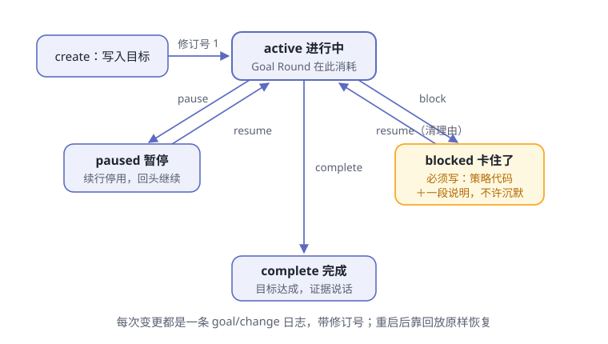

# 第7章 目标与计划

> **阅读提示**
> agent 最常见的失败不是干不了，而是**干着干着跑偏了**。这一章看 dsh 的三层"防跑偏"外存：todo、plan、goal，外加一位会话内的提醒员 schedule。

## 大活儿会跑偏

给 agent 派一件大活："给这个项目补齐三个模块的集成测试，全部跑绿。"

这是要干一阵子的任务。你去倒了杯咖啡回来，发现它正在给一个无关的函数做重构——测试补到哪了？它自己也快说不清了。

跑偏不奇怪。模型的记忆只活在上下文窗口里，任务一长，开头定的目标会被后面的细节挤出注意力——就像人干活干到一半，忘了最初为什么干。光靠"记性好"防不住，得靠外存。

**表7-1 三种典型的跑偏**

| 跑偏的样子 | 缺的是哪层外存 |
|---|---|
| 忘了总目标，追着一个细节越走越远 | 目标卡（goal） |
| 没商量好就动工，方向错了才发现 | 计划（plan） |
| 干到一半不知道当前该做哪一步 | 待办清单（todo） |

## 写下来，写在模型外面

解决办法很朴素：**把目标写下来，写在模型外面**。dsh 给了三层，越外圈管得越长远（图7-1）：

**图7-1 goal、plan、todo 三层外存**

三层各自守一段边界（表7-2）：

**表7-2 三层外存各管什么**

| 层 | 回答的问题 | 谁在写 | 住在哪 |
|---|---|---|---|
| todo | 眼下这一步做什么 | 模型自己 | 会话日志（`todo/write` 事件） |
| plan | 这个任务打算怎么干 | 你开关，模型按引导调研 | 会话日志（`plan/mode` 事件） |
| goal | 这次会话的总目标是什么 | 你或模型，关键变更要人类授权 | 会话日志（`goal/change` 事件） |

注意第三列全是同一个地方：**会话日志**。三层外存不是贴在内存里的便签，而是第 5 章那本账里的正式条目——这埋着本章结尾要收的一个重要结论。

## todo：冰箱上的便签

最里面一层是待办清单，模型通过一个叫 `todo_write` 的工具维护它（[tool-todo](https://github.com/deepseek-ai/deepseek-harness/blob/master/packages/todo/tool-todo/README.zh.md)）。

把它想象成冰箱上的便签，但有个特别的规矩：**每次改动都是整张重写**。模型不做"把第三条改成完成"这种局部编辑——每次调用都交出整份清单，新清单整体替换旧清单。

**表7-3 待办的三种状态与清单规矩**

| 状态 | 大白话 |
|---|---|
| `pending` | 还没开始 |
| `in_progress` | 正在干 |
| `completed` | 打勾完成 |

清单的规矩还有几条：

- **条目极简**：一条只有内容加状态，想塞 id、优先级等额外字段会被明确拒绝——落账的必须和模型自认为写入的一致
- **不许空话和复读**：空内容、重复内容都过不了校验
- **单一所有者**：清单只属于写它的那个 agent 会话，不存在共享清单
- **同时几个"进行中"由部署定**：有的部署要求恰好一个（单线纪律），有的允许多个（方便并行子任务）——这是配置开关，不是硬编码

它的作用有两个。给模型自己：下一步做什么，看清单就知道；给你：界面按当前清单渲染出进度条，agent 干到哪了你一目了然。界面还有个讲究：计划条只跟"当前有效计划"——下一个轮次一开始，旧清单就让位，不给过期的待办刷存在感。

## plan：先画蓝图再动工

中间一层是计划。有些任务值得先商量再动手——dsh 的 plan 机制（[plan-mode](https://github.com/deepseek-ai/deepseek-harness/blob/master/packages/plan/plan-mode/README.zh.md)）支持的正是"**直接进入、评审退出**"。

**表7-4 进出计划模式的三条路**

| 路径 | 怎么走 | 谁批准 |
|---|---|---|
| 直接进入 | 你输入 `/plan`（可附带一句要求） | 你说了算，即刻生效 |
| 评审退出 | 模型调研完，用 `exit_plan_mode` 把完整方案呈给你 | 你明确点头才退出 |
| 直接退出 | 你输入 `/plan off` | 你说了算 |

评审退出是最讲究的一条：模型把方案作为一次"决定"呈现给你，你批准，它才退出计划状态正式开工；你拒绝，评审意见会原样带回去；你干脆关掉弹窗去说别的，"用户已接手"也会如实报告给模型，让它留在计划状态里等你的话。

计划状态本身只做一件事：往模型的提示词里注入一段部署方配置的引导（官方示例大致是"你在计划模式中，先探索和设计，再通过退出工具呈现完整计划"）。**它是软引导，不是手铐**——真正管住"不许动手改东西"的，是第 6 章的沙箱与审批关卡。引导负责让模型不想动，关卡负责让它动不了，两层各司其职。

这就是很多 agent 产品里的"计划模式"。好处是把"方向错了"的损失压到最低——方案阶段纠错，成本几乎为零。

## goal：一张带生命周期的目标卡

最外圈是目标卡，也是最讲究的一层。官方术语表给的定义值得原样请出来：**目标是附着在现有会话上的单个持久完成目标，是一种状态，不是调度器，也不是一段独立对话**（[术语表](https://github.com/deepseek-ai/deepseek-harness/blob/master/docs/glossary.zh.md)）。

拆开说：一个会话同一时间**只有一张**当前目标卡；每次修改都带上修订号，旧版本可追溯；它只管"目标是什么、处于什么阶段"，什么时候继续干活另有其人（下一节讲）。

一张目标卡有四个阶段（表7-5，图7-2）：

**表7-5 目标卡的四个阶段**

| 阶段 | 大白话 |
|---|---|
| `active` | 进行中 |
| `paused` | 暂停，回头继续 |
| `blocked` | 被阻塞：卡住了，干不下去 |
| `complete` | 完成 |

**图7-2 目标卡的生命周期**

## 卡住了，必须说话

四条阶段转换里，`blocked` 这条带着最硬的规矩：**阻塞必须给理由，而且要给两份**。

一份是**机器能分类的代码**——策略自有的短代码（小写连字符格式），比如模型自报的阻塞就有一个稳定的代码；另一份是**人和模型都能读懂的自由说明**，写清楚到底卡在哪。

为什么这么较真？看看官方把哪些情形都塞进了 `blocked` 这一个阶段（表7-6）：

**表7-6 四种"卡住"都用同一个阶段**

| 卡住的原因 | 例子 |
|---|---|
| 提供方限制 | 模型服务的额度、配额问题 |
| 配置预算 | 部署配置卡住了某类操作 |
| 执行错误 | 反复失败，换路也没用 |
| 需要人工输入 | 等你拍板 |

四种截然不同的"卡住"共用一个阶段，不扩增生命周期状态——区分它们靠的就是随阻塞写下的代码和说明。这给"之后接着干"留了接口：未来无论是人还是程序来恢复，翻出理由就知道该补什么。官方对模型的指引更直白：**困难、不确定、还有有价值的活没干，都不算阻塞**——不许拿"有点难"冒充"干不下去"，更不许沉默停止。

模型还不能一遇挫折就喊阻塞：同一个阻塞条件必须**连续持续至少 3 个 Goal Round**（可配置），模型才有资格报告它。

## Goal Round：有封顶的续命

目标卡是"进行中"时，谁推着它往下走？同会话的**续行驱动器**：它把活跃目标转换成一个个 **Goal Round**——为当前目标接纳的一次续行周期，落地为目标触发的轮次（[goal-round-driver](https://github.com/deepseek-ai/deepseek-harness/blob/master/packages/goal/goal-round-driver/README.zh.md)）。

但续命有封顶。每张目标卡带着一个"最多跑多少轮"的上限 `maxGoalRounds`（部署默认 256）。到了上限还不收工，`resume` 会被拒绝——这是防打转的最后一道闸：第 6 章的守卫管"一次调用别重复"，这里管"整个目标别无限续命"。

**表7-7 Goal Round 上限的记账规矩**

| 规矩 | 说明 |
|---|---|
| 什么才计数 | 只有来源标记为"目标"、被接纳的用户消息才推进轮次编号（[术语表](https://github.com/deepseek-ai/deepseek-harness/blob/master/docs/glossary.zh.md)） |
| 你插话不花钱 | 同一会话里无关的人类轮次**不消耗**上限——你随时纠偏，不挤占目标的预算 |
| 预留与作废 | 驱动器先预留下一个编号，陈旧的预留被拒不消耗编号 |
| 每个 Round 的开场白 | 点名目标全文与"第几轮／共几轮"，把会话状态当权威，要求完成前给证据 |
| 上限耗尽 | 不能恢复续行；要续，先按规矩改上限 |

封顶只管轮数这一件事——token、花费、时间另有各自主人，互不兼任。

## 重启之后，不吓你一跳

目标卡还有个精巧的安全设计，分两个词：**armed（已激活）／ disarmed（已停用）**。

续行的启用状态是**进程本地的，绝不持久化**。每次会话重新加载，哪怕日志回放出一张 `active` 的目标卡，续行也一律先处于停用状态——目标还在原阶段等着，但**不会自动开工**。想让它继续，必须由人类明确授权一次恢复变更：你输入 `/goal resume`，或让模型经你授意的轮次里执行恢复。

**表7-8 重启前后，什么留下、什么清零**

| 项目 | 重启后 |
|---|---|
| 目标内容、阶段、修订号、已消耗轮次 | ✅ 原样恢复（日志回放） |
| 续行许可（armed） | ❌ 清零，等人类授权 |

为什么要这样想？设想目标跑了一半，你的电脑重启、或者你 fork 了一份会话——如果目标二话不说自动接着干，等于机器在你不知情时自行开工。dsh 的选择是：**恢复可以无感，开工必须有令**。

## 两个把手：命令与工具

操作目标卡有两套把手，一套给你，一套给模型。

你用的是 `/goal` 命令——直接观察或更改当前目标，不经过模型轮次（[command-goal](https://github.com/deepseek-ai/deepseek-harness/blob/master/packages/goal/command-goal/README.zh.md)）：

**表7-9 /goal 命令速查**

| 输入 | 结果 |
|---|---|
| `/goal` | 查看当前目标、阶段、轮次进度与续行状态 |
| `/goal <目标内容>` | 创建新目标并启用续行（未完成的目标不会被悄悄顶替） |
| `/goal edit <新内容>` | 改写目标，阶段不变 |
| `/goal pause` | 暂停，续行停用 |
| `/goal resume` | 恢复；重启后也靠它重新授权续行 |
| `/goal clear` | 清除当前指针，历史与墓碑保留 |

模型用的是三个工具：`get_goal`、`create_goal`、`update_goal`（[tool-goal](https://github.com/deepseek-ai/deepseek-harness/blob/master/packages/goal/tool-goal/README.zh.md)）。给模型的权限设计有三道门：

- **建目标要人类源头**：`create_goal` 只在人类直接发起的顶层轮次里可用；非人类的调用方和子代理一律被拒。模型可以从你的话里推断目标意图，但"这是个人类托付的目标"这个事实，必须由你的消息背书
- **改目标要对暗号**：每次更新都要带上先读到的目标 id 和修订号，对不上就拒绝——防止拿着过期信息乱改
- **报完成／阻塞要资格**：自主轮次里报 `complete` 或 `blocked`，必须身处一个合法的 Goal Round；报完，物理轮次随即收工

## schedule：不出会话的提醒员

三层外存之外，还有一位小角色值得认识：提醒（[schedule](https://github.com/deepseek-ai/deepseek-harness/blob/master/packages/schedule/schedule/README.zh.md)）。

先打破一个容易有的期待：它**不是**闹钟服务，不会在你关机会话冷冻时给你发通知。官方定位写得很清楚：**仅限会话内的提醒**。

**表7-10 提醒的三种定法与交付规矩**

| 定法 | 说明 |
|---|---|
| `after_seconds` | 延时多久后提醒一次 |
| `at` | 指定绝对时刻（必须显式给时区，不猜你的本地时区） |
| `every_seconds` | 固定间隔重复，最快每 5 分钟一次 |

交付的规矩也全是"会话内"的：提醒状态住在会话日志里，计时器只是可随时丢弃的投影；到期时若会话活着、agent 空闲，提醒就以一条普通后续轮次进入同一对话——**绝不打断正在进行的谈话**。会话冷冻时到期的提醒变成逾期记录，等会话再次活过来才补处理，而且只补**最近一次**发生，不回放错过的积压。提醒内容还会被明确标注为"不可信的提醒内容"，防止它冒充你的新指令。

想要离开会话也能响的闹钟？那不是它的工作——它是给"这次对话"配的记忆外挂，边界就画在会话门口。

## 一切都记账

现在可以收开头埋的结论了。三层外存加提醒，全都以会话事件的形式住在日志里（表7-11）：

**表7-11 四层外存的账目**

| 外存 | 每次变化记什么 | 重启后 |
|---|---|---|
| todo | `todo/write`：完整清单快照 | 回放最新一条即得当前清单 |
| plan | `plan/mode`：完整状态替换 | 原样恢复计划状态 |
| goal | `goal/change`：带修订号的完整快照 | 目标、阶段、轮次全恢复；续行待授权 |
| schedule | `schedule/change`：创建、删除、交付 | 活动提醒恢复，逾期待补 |

所以：目标被改过几次、什么时候被阻塞、理由是什么，翻日志全都能还原。重启进程，目标卡还在原来的阶段等着续跑——这正是第 5 章"会话日志是唯一真源"在防跑偏这件事上的回报。

## 🧪 本章实验

> **实验 7-1 ★｜看一次待办清单**
> 目标：观察 agent 自己列清单。
> 步骤：给 agent 一个至少三步的任务（比如"总结这个目录、找出最大的三个文件、写一份说明"）。
> 验收：你看到它列出待办并随进度逐条打勾；界面上的计划条与清单同步。

> **实验 7-2 ★★｜中途盘问目标**
> 目标：验证目标外存真的在起作用。
> 步骤：用 `/goal` 给 agent 立一个多轮目标，任务干到一半时问它："你现在要完成的总目标是什么？还差哪几步？"
> 验收：它能准确复述原始目标，而不是被最近的细节带偏。

> **实验 7-3 ★★｜亲手摆弄目标卡**
> 目标：体验人类命令与生命周期。
> 步骤：依次输入 `/goal 写一份本目录的说明草稿`、`/goal`（查看）、`/goal pause`、`/goal resume`。
> 验收：每次查看都能看到阶段与轮次上限随你的操作变化；暂停期间自动续行停下，恢复后才继续。

## 🤔 思考题

1. ★ 为什么把目标"写下来"比让模型"记住"更可靠？
2. ★ 阻塞理由要带一个机器可分类的代码——这对"以后自动恢复"有什么用？
3. ★★ 轮数上限设大了有什么代价？设小了呢？
4. ★★ 重启后续行一律先停用、要人类授权才开工——这个设计保护的是谁、防的是哪种事故？
5. ★★ plan 模式只是软引导，硬限制交给沙箱与审批。为什么不让 plan 模式自己当手铐？

## 📝 小结

- **三层外存**——todo 管这一步（整表重写），plan 管这个任务（软引导），goal 管整个会话（单张目标卡）
- **计划模式**——直接进入、评审退出；引导归引导，动手的限制归第 6 章的关卡
- **阻塞必须给理由**——策略代码 + 自由说明，四种"卡住"共用一个阶段；不许沉默停止，也不许拿困难冒充阻塞
- **Goal Round 有封顶**——默认上限 256 轮；只有目标来源的轮次计数，你插话纠偏不消耗预算
- **重启不自动开工**——续行状态绝不持久化，恢复可以无感，开工必须有令
- **都记账**——`todo/write`、`plan/mode`、`goal/change`、`schedule/change` 全会话事件，重启可续跑

外存防的是跑偏，可上下文窗口本身的容量是另一道物理限制——装不下了怎么办。➡️ [第8章 上下文工程](ch08.md)
