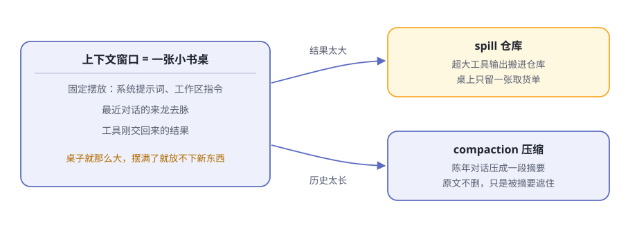
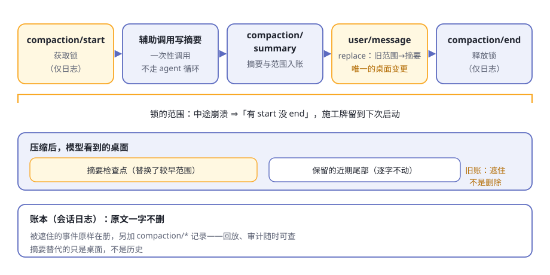

# 第8章 上下文工程

一个工作日下午，你让 agent 修一个拖延已久的 bug。

它干得很卖力：翻了几十个源码文件，跑了七八条命令，每个工具都交回一大摞结果，你们还讨论了一个钟头。然后怪事出现了——你早先强调过的要求，它忘了；一个工具交回三十万字符的日志之后，它开始变慢、变笨。

不是大脑坏了，是书桌堆满了。这一章讲 dsh 管理这张书桌的全套手法，这门学问有个正式名字：**上下文工程**。

> **阅读提示**
> 书桌（上下文窗口）就那么点大。dsh 的三个办法：桌面固定摆放、大件进仓库、旧账压摘要。读完你能回答：为什么"桌面永远是重新摆好的"。

## 书桌不是仓库

每次请求模型，dsh 都要把它"此刻需要知道的一切"摆上书桌：开场白、你们的对话历史、工具刚交回的结果。书桌有容量上限，就是模型的上下文窗口；摆满了，新东西就放不下。

三个经典难题（表8-1）：

**表8-1 书桌的三个难题**

| 难题 | 场景 | dsh 的招 |
|---|---|---|
| 桌面怎么摆 | 每次都要带的固定内容，放哪、放多少 | system-prompt 固定摆放 |
| 大件放不下 | 一个工具交回几十万字的输出 | spill 进仓库 |
| 旧账太多 | 聊了一下午，前边的对话占满桌面 | compaction 压摘要 |

**图8-1 书桌、仓库与压缩**

有个容易混淆的点要先说清：**书桌不是仓库**。模型的上下文窗口只是临时摆放区，会话日志才是仓库——第 5 章说过，模型看到的历史是从日志投影出来的。这一章的三招，管的全是"投影到桌面上的那一份"。

## 桌面固定摆放：开场白是怎么拼的

每次请求前，[system-prompt](https://github.com/deepseek-ai/deepseek-harness/blob/master/packages/core/system-prompt/README.zh.md) 零件负责拼装开场白。它手里有四类素材（表8-2）：

**表8-2 开场白的四类素材**

| 素材 | 谁提供 | 例子 |
|---|---|---|
| 固定身份 | system-prompt 自己 | 顺序 −100 的开场一句："You are an AI agent powered by DeepSeek Harness." |
| 有序段 | 各插件登记 | 工具包自带的用法指引；部署方配置的人设段 |
| 工具 schema | 工具注册表自动供给 | 模型"得知自己能干什么"的完整清单 |
| 变量 | 各插件注册 | 循环登记的当前模型、当前目录，按名字插进段里 |

拼装的规矩很讲究：

- **段按顺序号排，不按注册先后。** 身份是 −100，人设是 0，工具指引用 100–199。注册顺序只是插件加载时序的产物，顺序号才是桌面布局。
- **工具 schema 是开场白的一部分。** 官方把"模型获知自己能做什么"当成一个连贯整体：段和 schema 是同一次组装的两半。
- **变量插值宁严勿松。** 引用了没注册的变量、或者格式写错，组装直接报错——明确失败，胜过交出一份错的提示词。

最关键的是时机：第 5 章的流程图里，**每个步骤的开头都有一次组装**。桌面永远是重新摆好的——插件刚登记的段，下一步就上桌；插件卸载，它的段随之下桌。

> **注意**
> 开场白还有个隐性要求：**稳定**。只要渲染结果逐字不变，请求前缀就能被提供方的缓存复用；任何变动都可能让缓存从第一个变化的字符起作废。所以 dsh 连段的排序都规定得死死的——这不是洁癖，是省钱。

## 工作区规矩与时间：上桌的动态上下文

开场白之外，还有一类内容以用户消息的身份上桌。它们来自 [context 零件家族](https://github.com/deepseek-ai/deepseek-harness/blob/master/packages/context/README.zh.md)——专职"在不新增工具的前提下，往请求里添加模型可见的上下文"。

### AGENTS.md：项目的规矩

[agent-instructions](https://github.com/deepseek-ai/deepseek-harness/blob/master/packages/context/agent-instructions/README.zh.md) 干的事：把散落在各处的 `AGENTS.md` 找出来端给模型。加载顺序是**从宽泛到具体**（表8-3）：

**表8-3 工作区指令的加载顺序**

| 顺位 | 文件 | 范围 |
|---|---|---|
| 1 | `$DSH_HOME/AGENTS.md` | 用户全局，对所有项目生效 |
| 2 | 项目根到工作目录，每级的 `AGENTS.md` | 项目内逐目录，默认认 `.git` 为项目根 |
| 3 | 同目录的 `AGENTS.local.md` 等本地覆盖 | 个人私货，叠加在基础文件之后 |

（同目录里另一个兼容候选是 `CLAUDE.md`：内容若与 `AGENTS.md` 完全相同，只渲染一次，不占双份桌面。）

模型看到的这些指令被包在一个"系统提醒"框里，并附带一句关键的优先级声明：**更具体的指令优先于更宽泛的，但它们都不能压过系统、开发者或你直接下达的指令。** 规矩可以建议，不能造反。

两条工程细节值得点头：

- **预算是必填项。** 指令总字节数有硬上限，超了就**先整份丢掉宽泛的，再截断最具体的**，并发一条模型可见的通知——桌面空间永远留给离当前工作最近的规矩。
- **发现跟随文件系统。** agent 用读、写、编辑工具进到更深的目录时，新冒出来的指令文件会追加进桌面；文件被改动或删除，桌面收到对应的更新或移除通知。没有文件监听器，一切由真实的文件操作驱动。

### 时间上下文：今天几号、干了多久

[time-context](https://github.com/deepseek-ai/deepseek-harness/blob/master/packages/context/time-context/README.zh.md) 更简单：在每个步骤的准备期，往桌面添三行字——当前时间（带时区）、这次请求来自哪个浏览器时区、距离上一条模型可见消息过了多久。

它默认不启用，由需要它的部署（比如要按用户时区解释日期的网页场景）挂载。别小看这三行：模型本身没有钟，"把模糊的日期解释为用户所在时区""这个任务已经跑了两个小时"，全靠它（表8-4）。

**表8-4 两类动态上下文**

| 上下文 | 默认 | 作用 |
|---|---|---|
| 工作区指令 | 启用 | 项目的规矩上桌，具体优先 |
| 时间上下文 | 不启用 | 给模型一块钟 |

## spill：大件进仓库

工具交回的结果太大怎么办？[spill 家族](https://github.com/deepseek-ai/deepseek-harness/blob/master/packages/spill/README.zh.md) 三兄弟的分工（表8-5）：

**表8-5 spill 三兄弟**

| 零件 | 角色 | 干什么 |
|---|---|---|
| `dsh-spill` | Service Definition | 定义"存一段超大文本、换回定位信息"的接口 |
| `dsh-spill-local` | Service Provider | 存进本机的会话私有文件 |
| `dsh-spill-policy` | Consumer | 守在流水线关卡③，决定何时 spill |

（接口三角色是下一章的正题，这里先混个脸熟。）

[策略员](https://github.com/deepseek-ai/deepseek-harness/blob/master/packages/spill/spill-policy/README.zh.md) 守在工具执行之后：最终呈现给模型的**纯文本**结果，一旦超过配置的上限（按 UTF-8 字节计；上限不设，策略整体不启用），它就动手——

1. 全文原样搬进**仓库**：[本地后端](https://github.com/deepseek-ai/deepseek-harness/blob/master/packages/spill/spill-local/README.zh.md) 把内容存到按会话隔离的私有文件，文件名带随机前缀、权限仅限所有者，防止别人预置符号链接使坏；
2. 递给模型的换成一张**取货单**：保留的首尾预览，外加一行通知——省略了多少字节、全文存在哪、怎么取（对该路径用 read 或 grep）。

取货单有硬性纪律：**替换后的整体绝不超过原上限**。预算先紧着通知，剩余才分给预览；实在连通知都放不下，就宁可保留原文——所以 spill 永远不会让结果变大。

还有两条保守规矩：

- **尽力而为。** 存储失败（没权限、磁盘满）就记个警告、原样保留内联结果。spill 失败绝不会把一次成功的调用变成错误。
- **读文件的结果豁免。** `read` 的结果不做二次 spill，否则会陷入"读 → 存 → 再读"的死循环。

模型拿到取货单，多数时候不必动手——"知道有这么个东西、知道去哪取"就够了；真要细节，再用读或搜工具按路径去取。仓库里的全文一个字不少，随时可取。

## compaction：旧账压摘要

对话越来越长，旧消息占着桌面。[压缩家族](https://github.com/deepseek-ai/deepseek-harness/blob/master/packages/compaction/README.zh.md) 的解法：挑一段旧账，请模型写一份摘要，**用摘要替换桌面上的原文**。

**什么时候动手**，有三个入口（表8-6）：

**表8-6 压缩的三种触发**

| 触发 | 时机 | 说明 |
|---|---|---|
| 压力 | 每个步骤边界自动测量 | 桌面用量达到容量的阈值比例（默认八成）就动手 |
| 溢出 | 提供方明确报"超出窗口" | 紧急通道：绕过常规策略，做一次最大幅度的平衡缩减 |
| 手动 | 你输入 `/compact` | 没到压力也压；没有可压历史时如实报告 |

测量由独立的 token 计量服务完成：在最新的日志快照上，把开场白、工具、历史、工具结果全算进去——量的是**整张桌子**，不只是对话。

**怎么压**，讲究更多：

- **选一段"平衡"的旧账。** 切分点绝不跨越尚未回答的工具调用——把调用和结果拆散，桌面上就会出现没主的半句话。
- **保留近期尾部。** 默认留下最近约一成六的窗口逐字不动，只压最旧的部分。
- **摘要是一次独立调用。** [后端](https://github.com/deepseek-ai/deepseek-harness/blob/master/packages/compaction/compaction-basic/README.zh.md) 直接发起一次模型调用，不走 agent 循环：把会话自己的开场白、工具和待压缩的消息逐字回放，末尾追加压缩指令——这样能复用提供方的热前缀缓存，省钱。
- **摘要只收正文。** 模型返回的推理和工具调用一律排除：前者是隐私，后者会变成没主的遗留调用。
- **可选的无模型修剪。** 动手前可先让[修剪器](https://github.com/deepseek-ai/deepseek-harness/blob/master/packages/compaction/compaction-tool-result-pruner/README.zh.md) 把超大工具结果砍成"头 + 省略标记 + 尾"；砍完重新测量，压力消失了就不必写摘要。

压缩完成后，模型看到的桌面变成：一段检查点前导（大意是：这是自动生成的摘要，当作既定背景，直接继续任务）、摘要正文、以及原样保留的近期尾部。

> **注意**
> 压缩是有代价的：替换会让缓存从第一个被遮住的历史 token 起作废。用一份摘要换取后续每次请求的空间——这笔账要在"书桌将满"时才划算，所以 dsh 宁缺毋滥，压就压到位。

## 施工牌：压缩的事件锁

压缩是个手术活：要动桌面，又不能弄丢账本。dsh 给它上了一把用事件做的锁（图8-2）：

**图8-2 压缩的事件顺序**

五步，全部写进日志：

1. `compaction/start`——先记一笔，**获取锁**；
2. 发起辅助调用，写摘要；
3. `compaction/summary`——摘要、范围、token 数，全部入账；
4. 追加一条携带"替换"操作的用户消息——**这是唯一改变桌面的事件**：较早范围被摘要遮住；
5. `compaction/end`——释放锁。

这套顺序最见品格的是崩溃时刻：**在第 1 步和第 5 步之间崩了，日志里就是"有 start 没 end"**——一块看得见的施工牌。下次启动，dsh 能发现"上次压缩没干完"：最新的未配对 start 会被识别为活跃锁，阻止新的压缩插队；而更早生命周期留下的孤儿 start，会被新的会话端点事件判定为陈旧证据，不再阻塞。

反过来的坏设计是：先干活、最后才记"完成"。那样中途崩溃会**假装压缩已经完成**，而桌面从未被替换。dsh 选择让失败显形，而不是让失败隐身。

锁之外还有两条纪律：

- **所有入口共用一把日志锁。** 自动、手动、编程调用都排队，压缩不会并发打架；
- **手动压缩先订座。** 它同步预留空闲轮次接纳，摘要期间你提交的提示词不会丢，压缩落地后才放行。

而那条最重要的纪律，还是第 5 章的铁律：**原文一个字不删**。被遮住的事件原样留在日志里，摘要只是桌面上的替身。回放是确定的，审计的人翻开账本还能看到原文。

## "模型可见即已记录"对上下文意味着什么

把整章收拢回铁律：**抵达模型请求的一切，都必须能从会话日志重建**——运行时有一项断言专门盯着这一点。

对上下文工程，这条铁律落到一句话：**想给模型看一样新东西，必须先发明一种新的会话事件**。看桌上每样内容的户口（表8-7）：

**表8-7 桌面内容的账本户口**

| 桌面内容 | 账本里的身份 |
|---|---|
| 工作区指令、时间读数、沙箱政策 | 带来源的用户消息（会话事件） |
| 压缩检查点 | 携带"替换"操作的用户消息，外加 `compaction/*` 记录 |
| spill 取货单 | 工具结果事件（替换后的版本） |
| 开场白与工具清单 | 每次组装由注册表与配置现算；同一份组装必然摆出同一张桌面 |

所以桌面永远是**从账本摆出来的**，不是从某处内存缓存里端出来的。派生历史这个动作每个步骤重做一次，账本是唯一真源。

换来的是第 5 章说过的三样东西，在上下文的语境里再看一遍（表8-8）：

**表8-8 铁律换来的三样**

| 好处 | 在上下文里的样子 |
|---|---|
| 可回放 | 重演任何一次请求，桌面能原样摆回去 |
| 可恢复 | 进程重启，会话续上，桌面照旧 |
| 可审计 | 模型为什么"忘"了、为什么"看"过这段，逐条查得到 |

## 🧪 本章实验

> **实验 8-1 ★｜给项目立个规矩**
> 目标：亲眼看工作区指令上桌。
> 步骤：在工作区根目录放一个 `AGENTS.md`，写一条明确规则（比如"回答一律先列要点"），开始对话并提一个普通问题。
> 验收：agent 的行为遵循了这条规则；把文件删掉再继续，它会收到"指令已移除"的通知。

> **实验 8-2 ★★｜制造一次 spill**
> 目标：亲眼看到"取货单"。
> 步骤：让 agent 处理一个超大文本（几万行的日志或大文件），观察它收到的工具结果。
> 验收：结果不是全文，而是首尾预览加一行"省略了 N 字节、全文存在某路径、可用 read/grep 取用"的指引；需要细节时，它真的按路径去取了。

> **实验 8-3 ★★｜手动压一次**
> 目标：见到压缩的账本痕迹。
> 步骤：和一个会话聊上许多轮，然后输入 [`/compact`](https://github.com/deepseek-ai/deepseek-harness/blob/master/packages/compaction/command-compact/README.zh.md)。
> 验收：命令报告被替换的历史条数与估算 token；后续对话仍能接上前文；日志里能找到 `compaction/*` 事件。若没有可压历史，它会如实显示"还没有可压缩的历史"。

## 🤔 思考题

1. ★ spill 只给模型"取货单"——如果模型懒得去取，会出什么问题？反过来，什么都全文上桌又会怎样？
2. ★ 压缩为什么宁可"遮住"原文也不删？想想第 5 章的铁律。
3. ★★ 压缩的切分点为什么不能跨越"尚未回答的工具调用"？跨越了，桌面上会出现什么？
4. ★★ 工作区指令"具体优先于宽泛，但谁也不能压过你的直接指令"——为什么后半句比前半句更重要？
5. ★★★ "有 start 没 end = 施工牌"——你的工作里有没有同款"让失败显形"的设计？

## 📝 小结

- **书桌不是仓库**——上下文窗口是临时摆放区，会话日志才是真源；三招管投影：摆桌、进仓、压账
- **固定摆放**——system-prompt 每步重拼开场白：身份、插件段、工具 schema、变量；排序规定死，前缀稳定可复用缓存
- **动态上下文**——AGENTS.md 从宽泛到具体上桌、预算先行；时间上下文给模型一块钟
- **spill**——超大纯文本结果进仓库，桌面只留首尾预览加取货单；尽力而为，绝不超上限
- **compaction**——压力、溢出、手动三入口；平衡范围加保留尾部加独立摘要调用；日志原文不删，只是被遮住
- **施工牌**——`compaction/start` 到 `end` 是一把锁；中途崩溃留下"有 start 没 end"，失败显形
- **铁律收拢**——桌面每样内容都有账本户口；新输入 = 新会话事件

第二部分到此结束：五个器官解剖完毕。
下一章进入第三部分，看这双手怎么保证不闯祸。➡️ [第9章 安全的手脚](ch09.md)
