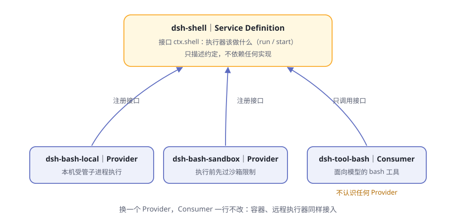

# 第9章 安全的手脚

你让 agent "清理一下构建缓存"，它痛快地写出一条删除目录的命令。

你盯着这条命令看了三秒：路径写对了还好，万一错一个字符，删掉工作区之外的东西怎么办？手是最危险的器官——**能改文件的那一刻，它就有了闯祸的能力**。问题从来不是"要不要给手"，而是"怎么给它画圈"。

> **阅读提示**
> 这一章看 dsh 给手脚立的规矩：四只手各是谁、能力接口的三种角色、沙箱三档、每台电脑不同的锁、"先选地盘"的设计哲学，以及审批和"模型反问"怎么收尾。

## 四只手

先认全 dsh 的四只手（表9-1）：

**表9-1 四只手**

| 零件 | 干什么 | 一个安全细节 |
|---|---|---|
| [fs](https://github.com/deepseek-ai/deepseek-harness/blob/master/packages/fs/README.zh.md) | 读、写、编辑文件，glob/grep 检索 | 文件读写不设超时——截止时限只会杀掉操作系统仍会完成的工作 |
| [shell + subprocess](https://github.com/deepseek-ai/deepseek-harness/blob/master/packages/shell/README.zh.md) | 执行命令、管理后台进程 | 每次调用都是全新的 `bash -c`，不保留任何 shell 状态 |
| [terminal](https://github.com/deepseek-ai/deepseek-harness/blob/master/packages/terminal/README.zh.md) | 持久终端会话（伪终端） | 每项操作都要求"恰好是发起它的那个 agent"，别的 agent 碰不了 |
| [code-runtime](https://github.com/deepseek-ai/deepseek-harness/blob/master/packages/code-runtime/README.zh.md) | 跑模型写的小程序，捕获它打印和返回的内容 | 运行时可替换，消费方不动 |

每一只手都受两套规矩管：**审批**（第 6 章的关卡①）管"干之前问不问你"，本章的**沙箱**管"就算许了干，能碰到多大范围"。双保险。

还有个共同的底座细节：命令执行前，环境先"洗澡"。[子进程基底](https://github.com/deepseek-ai/deepseek-harness/blob/master/packages/subprocess/README.zh.md) 会把形似凭据的环境变量（名字含 KEY、PASSWORD、SECRET、TOKEN 的）一律抹掉，再交给命令——密钥不能顺着环境漏进 shell。

## 能力的接口：capability seam 的三角色

dsh 把每一项可替换的能力都拆成三种角色，官方叫它 **seam**（接缝）。第 3 章提过"只认接口、不认实现"，这里看它的标准件——用 shell 组当样板（表9-2）：

**表9-2 shell 组的三个角色**

| 角色 | 包 | 干什么 |
|---|---|---|
| Service Definition | [`dsh-shell`](https://github.com/deepseek-ai/deepseek-harness/blob/master/packages/shell/shell/README.zh.md) | 定义"执行器该做什么"：前台跑命令、后台起进程；不规定怎么做 |
| Service Provider（本地） | [`dsh-bash-local`](https://github.com/deepseek-ai/deepseek-harness/blob/master/packages/shell/bash-local/README.zh.md) | 在本机起受管子进程执行 |
| Service Provider（沙箱） | [`dsh-bash-sandbox`](https://github.com/deepseek-ai/deepseek-harness/blob/master/packages/shell/bash-sandbox/README.zh.md) | 沿用本地机制，但每次执行前先过沙箱限制 |
| Consumer | `dsh-tool-bash` | 面向模型的 bash 工具，只认接口，不认识任何提供方 |

**图9-1 用 shell 组看 seam 三角色**

三角色的纪律：

- **定义不依赖实现。** `dsh-shell` 只描述词汇和约定，绝不 import 任何后端；
- **消费方不认识提供方。** `dsh-tool-bash` 只调用接口 `ctx.shell`；它探测到执行器声明了"我走沙箱"这项能力时，才向模型公布升权字段——工具不关心笼子是本地沙箱还是别的什么；
- **加一种实现，就是多一个提供方。** [架构文档](https://github.com/deepseek-ai/deepseek-harness/blob/master/docs/architecture.zh.md)的原话是：添加一项能力，意味着把三个角色一并设计。

拆分的红利在哪？**换一个提供方，消费方一行不改**。想给所有命令上沙箱？把组合里的 `dsh-bash-local` 换成 `dsh-bash-sandbox` 就行——模型用的还是同一个 `bash` 工具，连工具说明都会自动带上沙箱升权的指引。

## 沙箱三档

沙箱管的是**文件系统**上的手脚范围，词汇只有三个词（图9-2）：

**图9-2 沙箱三档，越靠内越严**

**表9-3 三档对照**

| 档位 | 能干什么 | 备注 |
|---|---|---|
| `read-only` | 全看得见，一个字改不了 | 默认档；`/dev` 里只放行 `/dev/null`，所以 `>/dev/null` 还能用 |
| `workspace-write` | 只能写工作区 + 一个平台临时区域 | 出了圈就拦 |
| `danger-full-access` | 不设防 | 这档**从不咨询沙箱提供方**，命令按原样执行 |

三个词要读准：

- **默认是只读。** 部署不填，就是 `read-only`——故障安全的方向是"更严"，不是"更松"。
- **第三档不是"更宽的沙箱"，而是"没有沙箱"。** 名字以 `danger-` 开头，本身就是警告。
- **词汇只覆盖文件操作。** 网络不在其中，进程可见性也不承诺——别指望这套词汇拦网络请求，那需要别的机制（见文末思考题）。

## 每台电脑，锁法不同

同一个"三档"概念，落到不同操作系统，用的是各家自己的锁（表9-4）：

**表9-4 四种平台的沙箱实现**

| 平台 | 用的锁 | 怎么锁 |
|---|---|---|
| Linux（首选） | bwrap | 只读挂载宿主根目录、全新 `/dev`、私有 PID 命名空间；写档另加临时 `/tmp` 和工作区绑定挂载 |
| Linux（备选） | Landlock | 用自带的 `landlock-run` 启动器，下一节细讲 |
| macOS | Seatbelt | 默认放行、写操作白名单；只读档只放行 `/dev/null`，写档加工作区、`/tmp` 和每用户临时区 |
| Windows | ACL 受限令牌 | 每个工作区一个写入标识；会话私有临时目录另发一套可撤销的授权 |

两条铁律贯穿所有平台（由 [本地后端](https://github.com/deepseek-ai/deepseek-harness/blob/master/packages/sandbox/sandbox-local/README.zh.md) 执行）：

**失败关闭。** 探测不到任何可用后端时，命令**拒绝执行**，错误信息直接告诉你该修什么——装 bubblewrap、换支持 Landlock 的内核、修 `sandbox-exec`，或者干脆显式改用 `danger-full-access`。绝不静默地"那就别关笼子了"。

**诚实报告。** 每个后端要自报设防的完整度，只有两种答案：`full`（承诺的每一条都管住了）或 `partial`（只管住一部分）。比如 Windows 的受限令牌为了完成进程初始化必须保留 Everyone 权限，外部授予 Everyone 写的对象仍可写，NTFS 硬链接还能让工作区内外指向同一个文件对象——dsh 不假装完美，如实报告 `partial`。需要绝对边界的场景，看到这个标记就该换更重的隔离，而不是被"已沙箱"三个字安慰。

## landlock-run：先限制自己，再执行

Linux 备选档用的启动器值得单独看一眼。它放在仓库的 [native/ 目录](https://github.com/deepseek-ai/deepseek-harness/blob/master/native/landlock-run/README.zh.md)——dsh 仅有的平台原生组件。

`landlock-run` 是一个"先限制自身、再执行"的小程序：约 300 行 C11，静态链接，直接对着内核接口写。工作方式三个关键词（表9-5）：

**表9-5 landlock-run 的三个关键词**

| 关键词 | 含义 |
|---|---|
| 先限制，后执行 | 先给自己装上文件系统允许清单（哪些路径只读、哪些可读写），再执行被包装的命令 |
| 规则继承 | 规则集跨执行继承——命令及其派生的**每一个**进程都在限制下运行 |
| 失败关闭 | 内核管不住，就不运行命令直接退出 |

妙处还有一句：**笼子只关命令，不关狱卒**——发起调用的 dsh 自己不受限制。

它的边界也很诚实：要求内核 5.13 以上，内核能力的新旧决定自报 `full` 还是 `partial`；探测还有第三档 `unusable`。二进制按架构预发布（x64/arm64），装不上就是装不上，不提供现场编译的侥幸。

它还定了一条诊断约定：**退出码 125 加一行特定致命诊断**，才归因为"启动器自己坏了"；否则一律按命令自己的结果处理。沙箱的问题和命令的问题，必须分得清。

## 先选地盘：边界跟着调用走

还记得第 2 章的"先选车库"吗？不选工作区，输入框就是灰的。那不是界面矫情，是本章这套规矩的地基。

dsh 给沙箱政策设了唯一的归属位置（[sandbox-policy](https://github.com/deepseek-ai/deepseek-harness/blob/master/packages/sandbox/sandbox-policy/README.zh.md)），设计分三层（表9-6）：

**表9-6 先选地盘，三条设计**

| 设计 | 含义 |
|---|---|
| 地盘一次选定 | 会话创建时记下的工作区根目录**不可变**；这个会话每次调用的可写范围都以它为锚 |
| 换档必留痕 | 运行时切换档位 = 往会话日志追加一条事件；重启后回放，档位原样恢复；两个会话各记各的账 |
| 边界跟着调用走 | 每次调用单独解析一张完整边界条：**显式批准 > 会话最后一次切换 > 部署默认** |

第三条最要紧。同一时刻，不同会话可以跑在不同档位上；一次被拒后的"批准重试"，也只是换一张更宽的边界条重新调用——**已批准的升权不改变任何进程状态，只改变这一次调用的政策**。

模型也不被蒙在鼓里：每次请求前，当前政策（什么档、工作区在哪）会作为上下文告诉它。它拿到的是"此刻的规矩"，而不是一份能力清单让它自己琢磨。

## 审批预设与"模型反问"

手脚的最后一道规矩在人这边（表9-7）：

**表9-7 人机协作三件**

| 零件 | 干什么 |
|---|---|
| [权限预设](https://github.com/deepseek-ai/deepseek-harness/blob/master/packages/interaction/permission-presets/README.zh.md) | 把"沙箱档位"和"审批策略"打包成一组，界面上是一个选择器 |
| [审批](https://github.com/deepseek-ai/deepseek-harness/blob/master/packages/interaction/user-approval/README.zh.md) | 一次性授权：批一次，只管这一次 |
| [模型反问](https://github.com/deepseek-ai/deepseek-harness/blob/master/packages/interaction/tool-ask-user/README.zh.md) | 模型缺信息时，带着选项来问你 |

**权限预设**出厂两组：`workspace-write` 配"要审批"，`danger-full-access` 配"从不审批"——档位和问不问捆在一起选，省得配出自相矛盾的组合。预设在**会话创建时固定**：之后你再改默认值，也影响不到已经开着的会话。

**审批**的词汇只有两个词：`ask` 或 `never`。批就是**一次**——没有"永远允许"，没有记住规则；`never` 档下需要审批的操作直接拒绝。而最重要的保守纪律第 6 章讲过了：**没人能回答时，按拒绝处理**。

**模型反问**（`ask_user_question` 工具）是这套规矩的柔性一面：模型拿不准时，可以带着问题和选项来问——每个选项带说明，推荐项标注后放第一位，还能多选。你答完，答案原样回到循环。注意边界：**被委派出去干活的子代理不能代主人向你提问**——问题必须由和你直接对话的那个 agent 发出。

## 更大的笼子：把整只手伸到别处

沙箱接口有个明确的边界声明：**只管与宿主共享文件系统和内核的子进程**。想要更强的隔离——容器、微型虚拟机、远程执行——怎么办？

官方的回答很 dsh：它们**不是这个接口的另一个后端**，而是整组替换（表9-8）。

**表9-8 两种隔离路径**

| 路径 | 做法 | 隔离到什么程度 |
|---|---|---|
| 沙箱后端 | 在现有接口内选一个平台锁 | 子进程与宿主共享内核和文件系统，只圈住文件操作 |
| 整组替换 | 把命令执行与文件系统两个能力的提供方，换成同一套指向远端的实现 | 整个执行世界搬到别处 |

妙处在"执行世界"这个词：文件系统和进程提供方共享同一个执行世界。把这个世界的坐标指向远端，bash、终端、语言服务会**一起搬过去**，不用为每只手单独改造。第 4 章"只认接口、不认实现"的红利，在这里兑现了。

## 🧪 本章实验

> **实验 9-1 ★｜撞一次墙**
> 目标：亲眼看到沙箱拦截。
> 步骤：工作区外放一个空文件夹，让 agent 往里面写个文件（挑无害的内容）。
> 验收：写入被拦下，工具结果里出现"当前模式下文件访问被拒"一类的标记，或先弹出审批；agent 会解释原因，而不是硬闯。

> **实验 9-2 ★★｜查你的档位**
> 目标：弄清当前会话跑在哪一档。
> 步骤：直接问 agent"你现在的文件政策是什么、工作区根在哪"，或查权限设置。
> 验收：它能说出当前档位（默认 `read-only`）和工作区根路径——这些是每次请求前就摆在它桌上的上下文。

> **实验 9-3 ★★｜让模型反问你**
> 目标：触发一次 `ask_user_question`。
> 步骤：给一个故意二选一的任务（比如"用方案 A 或 B 整理这个目录"，不说明选哪个）。
> 验收：弹出带选项的提问；你选择后，它按所选执行。

## 🤔 思考题

1. ★ 为什么"danger-full-access 从不咨询沙箱提供方"比"把沙箱放宽到最大"是更诚实的设计？
2. ★ 沙箱后端自报 `partial` 而不假装 `full`——这对用户的信任意味着什么？
3. ★★ 沙箱词汇只管文件操作。真要拦网络请求，你会把它加在哪一层？（提示：想想 seam 的三角色）
4. ★★ 为什么"已批准的升权"要做成"拿更宽的边界条重新调用一次"，而不是给当前进程松绑？
5. ★★★ 把执行世界指向远程沙箱，"手"就安全了吗？还有什么会跟着过去？

## 📝 小结

- **四只手**——fs、shell/subprocess、terminal、code-runtime；环境先洗澡，凭据不下传
- **capability seam 三角色**——定义立约、提供方实现、消费方只认接口；shell 组是样板，换提供方不动消费方
- **三档**——read-only（默认）/ workspace-write / danger-full-access；第三档 = 没有沙箱；词汇只管文件
- **每台电脑一把锁**——Linux bwrap/Landlock、macOS Seatbelt、Windows 受限令牌；失败关闭，诚实自报 full/partial
- **landlock-run**——先限制自己再执行，规则跨执行继承；笼子只关命令，不关狱卒
- **先选地盘**——工作区根不可变；换档必留痕；边界跟着调用走，不跟着进程走
- **人这边**——预设捆住档位与审批；授权只有一次；没人回答 = 拒绝；模型可以带着选项反问

下一章，看 agent 怎么把手伸出电脑，连接外部世界。➡️ [第10章 连接外部世界](ch10.md)
