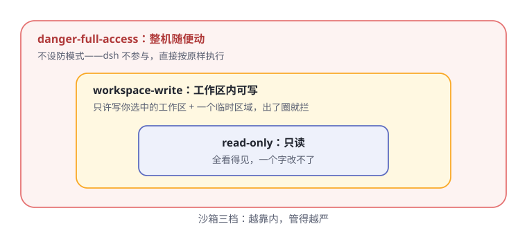

# 第9章 安全的手脚

> **阅读提示**
> 手是最危险的器官——能改文件的那一刻，就有了闯祸的能力。这一章看 dsh 怎么给手脚上规矩：四只手是哪些、沙箱三档怎么分、每台电脑的锁法为什么不一样。

## 四只手

先认全 dsh 的四只手（表9-1）：

**表9-1 四只手**

| 零件 | 干什么 | 类比 |
|---|---|---|
| fs | 读写文件、找文件 | 翻抽屉 |
| shell / subprocess | 执行命令（受管进程组） | 干活的手 |
| terminal | 持久终端会话 | 一直开着的工位 |
| code-runtime | 跑代码片段 | 随手做实验 |

每一只手都受两套规矩管：**第 6 章的审批**管"干之前问不问你"，本章的**沙箱**管"就算许了干，能碰到多大范围"。双保险。

## 沙箱三档

沙箱管的是**文件系统**上的手脚范围，分三档（图9-1）：

**图9-1 沙箱三档，越靠内越严**

**表9-2 三档对照**

| 档位 | 能干什么 |
|---|---|
| read-only | 全看得见，一个字改不了 |
| workspace-write | 只能写你选中的工作区 + 一个临时区域 |
| danger-full-access | 不设防——注意：这档**不经过沙箱**，直接按原样执行 |

第三档的名字本身就是警告：`danger-` 开头。它不是"更宽的沙箱"，而是"没有沙箱"。

还有一个边界要说清：沙箱只管文件。**网络和进程可见性不在这套词汇里**——别指望它拦网络请求。

## 每台电脑，锁法不同

同一个"三档"概念，落到不同操作系统，用的是各家自己的锁（表9-3）：

**表9-3 四种平台的沙箱实现**

| 平台 | 用的锁 |
|---|---|
| Linux | bwrap / Landlock |
| macOS | Seatbelt |
| Windows | ACL 受限令牌 |

## 诚实的"部分设防"

有个细节很见品格。沙箱后端要自我报告设防的完整度，只有两种答案：

- **full**：这档承诺的每一条，我都管住了
- **partial**：我只能管住其中一部分

比如 Windows 的 ACL 方案，因为系统本身的 Everyone 权限和硬链接边界，做不到滴水不漏——dsh **不假装完美**，如实报告 partial。需要绝对边界的场景，看到这个标记就该自己想办法（比如换容器），而不是被"已沙箱"三个字安慰。

## 每次调用一张边界条

沙箱策略不是全局开关，而是**每次调用单独解析**：每条命令带着自己那张边界条上场。

所以同一时刻，不同会话可以跑在不同档位上；同一次被拒后的"批准重试"，也是一张新的、更宽的边界条。边界跟着调用走，不跟着进程走。

## 更大的笼子：把整只手伸到别处

沙箱 seam（接口）还有兄弟实现：**容器、微型虚拟机、远程执行**。

妙处在哪？文件系统和进程这两只手共享同一个"执行世界"——把这个世界的坐标指向远程沙箱，bash、终端、LSP 会**一起搬过去**，不用为每种手单独改造。第 4 章"只认接口、不认实现"的红利，这里兑现了。

## 🧪 本章实验

> **实验 9-1 ★｜撞一次墙**
> 目标：亲眼看到沙箱拦截。
> 步骤：工作区外放一个空文件夹，让 agent 往里面写个文件（注意挑无害的内容）。
> 验收：写入被拦下或要求升级审批；agent 会解释原因。

> **实验 9-2 ★★｜查你的档位**
> 目标：弄清当前会话跑在哪一档。
> 步骤：翻设置里的权限/沙箱配置，或让 agent 自报它现在的文件系统边界。
> 验收：你能说出当前是 read-only 还是 workspace-write，以及工作区根在哪。

## 🤔 思考题

1. ★ 为什么"danger-full-access 不经过沙箱"比"沙箱放宽到最大"是更诚实的设计？
2. ★ 沙箱后端自报 partial 而不假装 full——这对用户的信任意味着什么？
3. ★★ 把执行世界指向远程沙箱，"手"就安全了吗？还有什么会跟着过去？

## 📝 小结

- **四只手**——fs、shell/subprocess、terminal、code-runtime
- **双保险**——审批管"问不问"，沙箱管"碰多大"
- **三档**——read-only / workspace-write / danger-full-access（第三档 = 没有沙箱）
- **沙箱只管文件**，网络和进程可见性不在词汇内
- **诚实报告**——full 或 partial，不假装完美
- **每次调用一张边界条**；更大的笼子是容器/远程执行，接口同款

下一章，看 agent 怎么把手伸出电脑，连接外部世界。➡️ [第10章 连接外部世界](ch10.md)
