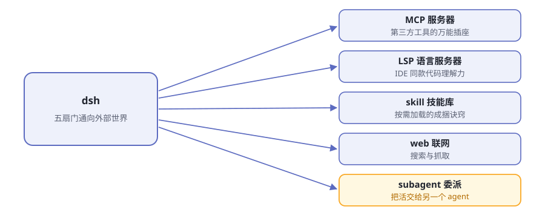
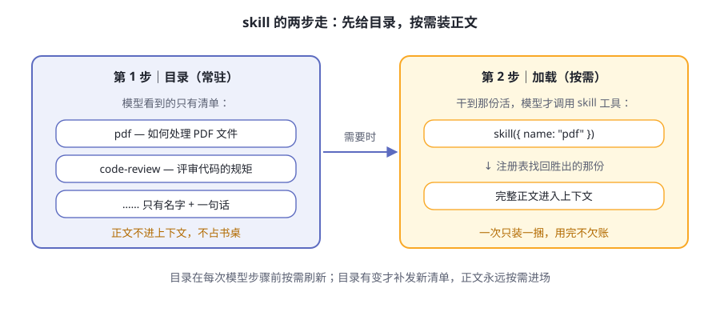
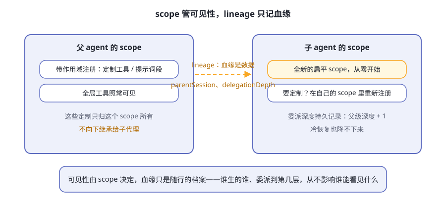

# 第10章 连接外部世界

先接一个你可能真会遇到的任务：

> "我们依赖的一个开源库上个月改了 API。帮我查清楚它改了什么，把我们的代码改对，把结论记进长期记忆；同时派人并行验证一下旧版本还能不能跑。"

别急着想要怎么干，先看这个任务会依次敲开哪些门：

**表10-1 一个任务穿过五扇门**

| 动作 | 敲开的门 | 门后发生什么 |
|---|---|---|
| 查清楚 API 改了什么 | web | 搜索网上资料，抓下关键页面 |
| 看清我们代码哪里在用旧 API | LSP | 问语言服务器：定义在哪、谁在引用 |
| 按团队规矩改代码 | skill | 加载一份"怎么干这类活"的说明书 |
| 把结论记进长期记忆 | MCP | 一个第三方记忆服务器替它记账 |
| 并行验证旧版本 | subagent | 把子任务委派给另一个 agent |

一个任务，五扇门。这一章把每扇门认全：通向哪、解决什么问题、配一个真实例子，最后再看一扇挂着"施工中"牌子的门。

> **阅读提示**
> 前面九章，器官都在电脑里。可真实的活在电脑外面：第三方工具、代码智能、网上资料，甚至别的 agent。这一章讲 dsh 怎么把门开出去，以及每扇门守的是什么规矩。

## 五扇门，都是"外设"

先看全景（图10-1）：



**图10-1 dsh 的五扇门**

五扇门有个共同身份：**可选能力**。官方文档在 LSP、web、subagent 的子系统说明里反复写着同一句话——"不属于 agent loop（智能体循环）主干"；skill 的说法是"位于核心控制主干之外"。意思都一样。

换句话说：把五扇门全关上，dsh 依然是一个完整的 agent——轮次照转、工具照跑、日志照记（第 5、6 章讲过的那套骨架纹丝不动）。门是外接设备，不是本体器官。

这背后还是第 4 章的思想：门都挂在缝（seam）上，缝的一侧是五花八门的提供方，另一侧是模型熟悉的工具接口。换提供方，模型毫无察觉。

## MCP：万能插座

MCP（Model Context Protocol）是行业里的通用协议，官网在 [modelcontextprotocol.io](https://modelcontextprotocol.io/)：任何人用任何语言实现一个 MCP 服务器，任何会说 MCP 的客户端都能插上它。dsh 这边的桥是 [@deepseek-ai/dsh-mcp-client](https://github.com/deepseek-ai/deepseek-harness/tree/master/packages/mcp/mcp-client)：连接外部服务器，把它们注册进工具注册表，变成模型可用的原生工具。

类比：dsh 自带的手是"原厂配件"，MCP 是**通用插座**——别人造的手，插上来就能用。插座的形状由协议规定，手是谁造的无所谓。

**工具叫什么名？** 每个工具都带"服务器限定"的姓：`mcp__<serverName>__<工具名>`。接一个名为 github 的服务器，它的 create_issue 在模型眼里就是 `mcp__github__create_issue`。两个服务器都有 search 工具？不打架，各在各的命名空间里。

名字太长或含怪字符也不怕：桥会按确定性规则规范化，保证不同工具绝不撞名。

**怎么接？** 两种传输（表10-2）：

**表10-2 MCP 的两种传输**

| 传输 | 怎么连 | 谁负责活着 |
|---|---|---|
| stdio | dsh 拉起对方的可执行文件当子进程，走标准输入输出 | dsh 负责：随插件生命周期启动和停止 |
| streamable-http | 连接一个 HTTP URL | 上游服务必须已经在运行 |

桥对现实世界考虑得相当周到，两个机制值得记住：

- **热替换**。改一行配置，桥就断开重连，不用重启整个进程；`serverName` 不变，工具名一字不差。
- **重连预算**。stdio 子进程崩了，桥按指数退避重启：首次 500 毫秒，每次翻倍，封顶 30 秒；一次中断里连败 10 次就彻底停手，等下次重载——偶尔崩溃的服务器能无限自愈，崩溃循环的服务器不会被无限重启。

> **注意**
> stdio 桥在启动子进程前，会**主动移除环境中名称通常表示凭据的变量和所有 `DSH_*` 变量**；其余环境变量仍会继承。上游服务器还需要额外密钥时，写进配置项的 `config.env`，别把密钥直接糊进 YAML。

边界也说清楚：这座桥目前**只搬运 MCP 的工具能力**，协议里的资源和提示词模板还在暂缓清单上。

### 真实例子：给 agent 接一块外挂记忆

官方 [mcp-memory 示例](https://github.com/deepseek-ai/deepseek-harness/tree/master/examples/mcp-memory)把三个第三方记忆系统接成 dsh 的外挂记忆，三份参考配置都**默认关闭**（表10-3）。官方特意声明：收录只作互操作参考，不代表认可或合作。

**表10-3 mcp-memory 的三选一**

| 系统 | 传输 | 上游前置条件 |
|---|---|---|
| [Memorix](https://github.com/AVIDS2/memorix) | stdio | Node 22.18+，全局安装 `memorix@1.3.0` |
| [MCP Reference Memory](https://github.com/modelcontextprotocol/servers/tree/main/src/memory) | stdio | 全局安装 `@modelcontextprotocol/server-memory@2026.7.4` |
| [Engram](https://github.com/Gentleman-Programming/engram) | stdio | Go 1.25.10+，或安装匹配的发布版二进制 |

选一个，装好上游，一行命令启用（以 Memorix 为例）：

```sh
npm install --global memorix@1.3.0
dsh web --patch "$PWD/examples/mcp-memory/memorix.cordis.yml"
```

`--patch` 就是第 4 章讲过的覆盖层：往组合上多盖一层补丁，不传就一切照旧。官方给的验收方法是一套三步接力：在会话 A 里让模型记住一个带唯一后缀的值；**新建会话 B**（不复制会话 A 的对话），问它记不记得，确认它调用了记忆服务器的检索工具；再让它用这个偏好给个建议。第二步能过，才叫真的跨会话记忆。

## LSP：IDE 同款理解力

LSP（Language Server Protocol）是编辑器世界的标准：每种语言有自己的语言服务器，提供查定义、找引用、看诊断这类服务。你的编辑器按 F12 能跳定义，靠的就是它。

dsh 把这套接成一条能力缝，拆成三个包（表10-4）：

**表10-4 LSP 缝的三件套**

| 包 | 角色 | 人话 |
|---|---|---|
| `dsh-lsp` | Service Definition | 能力注册表：谁注册了、按扩展名归谁管 |
| `dsh-lsp-stdio` | 通用提供方 | 通用的语言服务器宿主，按查询临时打开文档 |
| `dsh-tool-lsp` | 消费方 | 模型看到的 `lsp` 工具 |

这条缝刻意做得很"抠"：**恰好公开四种语义操作，不多不少**（表10-5）。

**表10-5 LSP 的四种操作**

| 操作 | 回答的问题 |
|---|---|
| goToDefinition | 这个符号定义在哪？ |
| findReferences | 谁在用它？（始终包含声明本身） |
| goToImplementation | 实现在哪？ |
| hover | 这个符号的说明是什么？ |

这份清单是"闭合"的：想加第五种操作，必须同时改缝、提供方和工具，编译器会逼你三处一起改完。缝也**不提供通用协议逃生口**——模型永远不能绕过这四个操作，对语言服务器提任意要求。

注意这里的分工：提供方注册的是**能力**而非工具；面向模型的工具名、schema 和提示词指引，唯一的所有者是 `dsh-tool-lsp`。所以换语言服务器，只换传输，模型请求导航的方式一个字不变。

还有个细节见功夫：协议内部用从零开始的 UTF-16 坐标，而模型习惯从 1 数数。工具层在进出时悄悄换算，两边谁也不用迁就谁。

**真实例子**：在一个 TypeScript 项目里问 agent"这个函数定义在哪？谁调用了它？"它可以不靠文本搜索瞎猜，而是通过 `goToDefinition`、`findReferences` 问语言服务器，拿到的就是你在编辑器里按 F12 得到的那种答案。

LSP 还有个跨章伏笔：stdio 宿主基于 `ctx.fs` 和 `ctx.subprocess` 干活。等这两个服务换成沙箱实现（下一节就有例子），语言服务器会跟着搬进沙箱，宿主本身一行不用改。

## skill：按需加载的诀窍

skill（技能）是成捆的"怎么干某类活"的说明书。机制分三层：

- **提供方注册表**（`ctx.skills`）：技能从哪来。默认提供方扫本地目录，也可以换嵌入式或远程提供方——面向模型的约定不变。
- **目录**：模型看到的清单，只有名字和一句话描述，没有正文。
- **加载器**：模型调用 `skill` 工具，胜出那份的正文才进上下文。

两步走的妙处在图10-2：



**图10-2 skill 的两步加载**

**技能从哪些目录来？** 本地提供方按 rank 扫六个根目录，重名时 rank 小的直接赢（表10-6）：

**表10-6 技能发现优先级**

| Rank | 来源 | 位置 |
|---|---|---|
| 100 | 项目 `.dsh` 目录 | `<项目根>/.dsh/skills` |
| 200 | 项目 `.agents` 目录 | `<项目根>/.agents/skills` |
| 300 | 自定义目录 | 配置里自己加的目录 |
| 400 | 用户 `.dsh` 目录 | `<dsh 主目录>/skills` |
| 500 | 用户 `.agents` 目录 | `<agents 主目录>/skills` |
| 600 | 随包技能 | 部署方配置的随包目录 |

项目根是**包含 `.git` 的最近祖先目录**。技能文件要么是目录包（`<name>/SKILL.md`），要么是单个 Markdown（`<name>.md`），名字必须 kebab-case。留意 `.agents/skills` 这个根：它不是 dsh 专属的命名，为别的 agent 工具写的技能，在这里常常直接能用。

目录本身也有生命周期：在会话的第一个合格时机注入初始目录，之后每次模型步骤前比对一遍——目录变了才补发一份完整替换，没变就绝不打扰。这套机制保证了：一百个技能躺在磁盘上，平时只占一份清单的钱。

**真实例子**：在项目里建 `.dsh/skills/deploy-checklist.md`，写上你们团队的上线检查清单。以后说"准备发布"，agent 会在目录里看到它、按需加载正文、照单执行。团队的隐性知识，从此是 agent 能借用的器官。

## web：联网的眼睛

web 缝只有两项操作——**搜索**与**抓取**，共用一个提供方选择服务（表10-7）：

**表10-7 web 家族**

| 包 | 职责 |
|---|---|
| `dsh-web` | Service Definition：提供方注册、选择与共享错误词汇 |
| `dsh-web-search-exa`／`-perplexity`／`-deepseek` | 三个搜索提供方 |
| `dsh-web-fetch-http` | 抓取提供方：公共 HTTP/HTTPS 资源 |
| `dsh-tool-web` | 模型看到的 `web_search` 与 `web_fetch` |

提供方怎么选？规则铁面无私，完全不看注册顺序（表10-8）：

**表10-8 提供方选择规则**

| 情况 | 结果 |
|---|---|
| 配置了明确的 id，且已注册、可用 | 用它 |
| 配置了，但没注册或不可用 | 明确报错（缺的、不可用的，各报各的码） |
| 没配置，恰好只有一个可用 | 自动选中 |
| 没配置，却有多个可用 | 明确报错"歧义"——绝不悄悄用先注册的那个 |

两个细节见设计品味：

- **非 2xx 响应是结果，不是错误**。抓一个返回 404 的页面，得到的是带着状态码的结果，而不是异常——网页的状态本身就是信息。
- **本地抓取后端不拦截私有网络目标**。官方文档把话说得很直白：在能触及敏感内部目标的环境中，禁止启用 `web_fetch`。这道防线留给部署配置——呼应第 9 章的主题：安全边界按部署画。

**真实例子**：问 agent 一个训练数据里不可能有的新近事件。你会看到它用 `web_search` 扇出查询（一次最多并发好几个、相同查询只跑一遍），拿回带 URL 的来源清单，再用 `web_fetch` 精读关键页面——HTML 会被渲染成 markdown，省下真金白银的 token。

## subagent：委派之门

最有意思的一扇门。subagent 递给模型一个统一的委派动作：**把一部分活交给另一个 agent**。

和 bash 只允许一个执行器不同，`ctx.subagents` 是**按名字注册、多提供方共存**的注册表（表10-9）：

**表10-9 官方提供的子代理提供方**

| 提供方 | 干什么 |
|---|---|
| spawn（进程内） | 启动全新的进程内子代理，不带父级对话 |
| fork（进程内） | 以父级已完成的历史记录为种子启动 |
| acp | 通过 ACP（Agent Client Protocol）启动进程外子代理 |
| Harness SDK | 通过 TypeScript SDK 启动进程外的 Harness 子代理 |
| 两个可选集成 | 委派给成熟的第三方编程 agent 产品；用 `dsh plugin` 单独安装，移除即撤回 |

模型面前只有一个委派工具（默认名 `subagent`），**收不到提供方选择器**——想暴露另一种传输，就再挂一个名字不同的实例。配套还有两组可选工具：控制三件套 `send_message`／`interrupt_agent`／`list_agents`（给可继续子代理发消息、打断当前轮次、列名单），以及一条子到父的报告通道 `report`。

### 两种子代理

- **一次性**：委派 → 干活 → 拿结果 → 释放。像派人跑腿，等他回来交差。
- **可继续**：子代理是一份持久会话，有自己的收件箱，随时可以追加消息，冷了能从存储里恢复唤醒。像开了一条常驻的工作线。

### 启动时能力门禁

每个提供方亮出自己的启动时能力旗标：输出 schema、深度上限、工具过滤、独立 persona。请求在**启动之前**对照旗标检查——要了对方没有的，当场拒绝、明确报错，绝不"先收下再静默忽略"。还是全书那条原则：让失败显形。

### 这扇门最要紧的规矩：scope 与 lineage

官方[术语表](https://github.com/deepseek-ai/deepseek-harness/blob/master/docs/glossary.zh.md)把两条规矩钉得很死，值得专门画一张图（图10-3）：



**图10-3 两条互不干涉的线**

- **带作用域的注册，不向下继承给子代理。** 父代理给自己定制了工具或提示词段，那是它一个 scope 的事。子代理拿到的是**全新的扁平作用域**——要定制，在自己的 scope 里重新登记。术语表原文：作用域只有两层，扁平结构。
- **lineage 是数据，不是结构。** 父子关系靠数据字段随行携带：`parentSession` 记录谁生的谁，持久的 `delegationDepth` 记录委派深度（子 = 父 + 1，冷恢复也降不下来）。这些档案**从不影响可见性**。

设计意图一句话：父亲的定制不会漏给儿子，孙子的辈分永远有账可查。可见性归 scope，血缘归数据，两条线互不干涉。

## e2b：一扇挂着"施工中"牌子的门

最后看一扇特别的门。[e2b 家族](https://github.com/deepseek-ai/deepseek-harness/tree/master/packages/e2b)把文件系统与进程执行环境搬进 E2B 云端 Linux 沙箱，一共三个包（表10-10）：

**表10-10 e2b 家族的三个包**

| 包 | 职责 |
|---|---|
| `e2b` | 管沙箱生命周期：创建、准备工作目录与运行时目录、超时或释放时删除 |
| `fs-e2b` | 通过 E2B Filesystem API 实现文件缝 |
| `subprocess-e2b` | 通过 E2B Commands 与 PTY API 实现子进程缝 |

**标着 POC 是什么意思？** POC 即 Proof of Concept（概念验证）。官方定位很直白：这是**实验性的提供方组合验证**——验证"这样组合行得通"。它不是完整的 harness 迁移，也不是工作区同步功能。边界画得清清楚楚（表10-11）：

**表10-11 e2b POC 的边界**

| 搬进沙箱 | 留在宿主 |
|---|---|
| 文件系统状态（读写、临时文件） | harness 进程本身、Cordis 对象 |
| 进程执行（命令、终端、PTY） | 模型调用、agent／会话状态 |
| 语言服务器的运行（跟着 lsp-stdio 走） | 会话持久化、skills、SDK 缓冲 |

妙处在于杠杆：现有的 bash 执行、终端、LSP stdio 宿主**一行不用 fork**，因为它们把一切可变状态操作都委托给了 `ctx.fs` 和 `ctx.subprocess`——把这两个服务换成 E2B 适配器，整个"可变世界"就搬进了云沙箱。这正是第 4 章缝设计的红利。

官方 headless 示例里就带一份 [e2b 覆盖层](https://github.com/deepseek-ai/deepseek-harness/blob/master/examples/headless-agent/e2b.cordis.yml)，在同一个沙箱里驱动 FS、Bash、PTY 和 LSP，并证明沙箱最终真的被删除。文件与命令的改动只存在于沙箱；宿主工作区既不上传也不挂载。想看"执行环境也能当外设"的完整演示，就是它。

## 🧪 本章实验

> **实验 10-1 ★｜让它联网**
> 目标：看到 web 工具干活。
> 步骤：问 agent 一个必须靠最新信息才能回答的问题（本地训练数据里不可能有的事），观察它的工具调用。
> 验收：它先用 `web_search` 搜索，再用 `web_fetch` 读页面，最后给出带来源 URL 的回答。

> **实验 10-2 ★★｜自己造一个技能**
> 目标：亲手走一遍技能的发现与加载。
> 步骤：在某项目目录建 `.dsh/skills/my-first-skill.md`，正文写一份诀窍（比如"当用户说'发布'时，先检查这三件事"）；在该目录启动 dsh，先问"你现在有哪些技能"，再说"准备发布"。
> 验收：目录清单里出现 my-first-skill；谈到发布时，agent 调用 skill 工具加载正文并照做。

> **实验 10-3 ★★｜接一块外挂记忆**
> 目标：跑通 mcp-memory 的三步验收。
> 步骤：按[示例 README](https://github.com/deepseek-ai/deepseek-harness/tree/master/examples/mcp-memory) 装一个记忆服务器（比如 `npm install --global @modelcontextprotocol/server-memory@2026.7.4`），用 `dsh web --patch "$PWD/examples/mcp-memory/mcp-reference-memory.cordis.yml"` 启动，然后做"写入 → 新会话召回 → 使用"三步，全程用唯一值。
> 验收：会话 B 不复制会话 A 的对话，也能从记忆里召回那个唯一值。

## 🤔 思考题

1. ★ MCP 被称为"万能插座"。想想充电接口统一之前的世界：统一协议对工具生态意味着什么？
2. ★ skill 为什么用"先目录、后加载"两步走，而不是把所有诀窍直接塞进系统提示词？
3. ★★ 带作用域的注册不向下继承给子代理——这条规矩防住了什么"特权泄漏"？代价是放弃了什么便利？
4. ★★ 本地 `web_fetch` 后端刻意不拦截私有网络，把这道防线留给部署配置。什么时候"不在零件里砌墙"才是更好的选择？

## 📝 小结

- **五扇门都是可选能力**——MCP（第三方工具）、LSP（代码智能）、skill（诀窍）、web（搜索与抓取）、subagent（委派）；全关上，dsh 依然是完整的 agent
- **MCP 是万能插座**——工具以 `mcp__<server>__<tool>` 落户；官方记忆示例一行 `--patch` 接入，配套三步验收
- **LSP 只开四种操作**——清单闭合、没有协议逃生口；提供方注册能力，模型约定归工具独家所有
- **skill 两步走**——目录常驻只报名字，正文按需加载；六个根目录按 rank 裁决
- **subagent 规矩最硬**——能力在启动时门禁；子代理拿全新扁平 scope，血缘记在数据里、从不影响可见性
- **e2b 标着 POC**——验证的是"提供方组合行得通"：可变世界搬进云沙箱，其余留在宿主

第三部分到此结束。最后一部分，你自己上手。➡️ [第11章 你的第一个插件](ch11.md)
