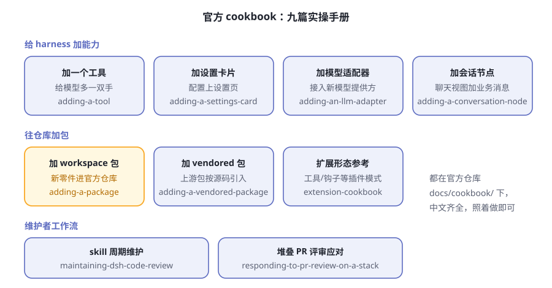
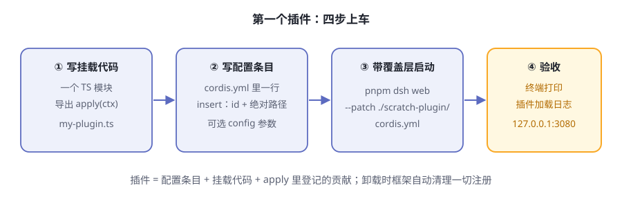
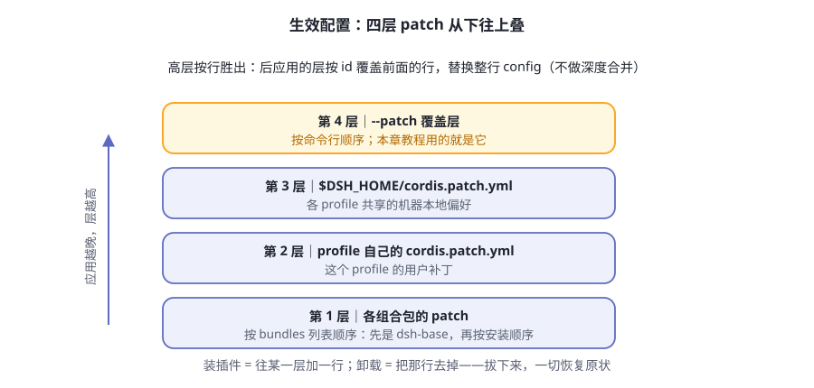

# 第11章 你的第一个插件

第 4 章说过，dsh 是一盒乐高：别人卖车，它给你造车车间。前十章你一直在拆别人的零件，这一章轮到你自己造一个。

目标放得很低：**给 agent 加一个 `greet` 工具**——你报一个名字，它回一句问候。就这么点出息？对。零件的价值不在大小，在于从头到尾走一遍"造出来、挂上去、验明白、发出去"的全流程。走完这一遍，社区里任何插件在你眼里都不再是黑盒。

> **阅读提示**
> 本章是一个完整 walkthrough：从 0 写一个最小插件，挂载、加工具、加配置、打包发布，全程跟着官方教程走。最小插件只有几行；就算你不亲手写，读完也能看懂插件生态在干什么。

## 插件的最小形态

在 dsh 里，插件就是一个导出 `apply` 函数的 TypeScript 模块。框架加载它时调用 `apply`，递进来一个 `ctx`——第 4 章那个共享总部。你通过 `ctx` 登记一切贡献。

```ts
import type { Context } from '@deepseek-ai/cordis'

export const name = 'hello-plugin'

export function apply(ctx: Context) {
  console.log('[hello-plugin] plugin loaded!')
}
```

官方教程的原话：这就是完整形态。三句话翻译：

- `apply` 是"入职手续"——插件被挂载时，框架调用它；声明过的依赖会在它运行前就绪
- `ctx` 是共享总部——你在里面登记工具、监听事件、获取服务
- 函数体干的事，就是这个插件的全部贡献

除了函数，插件还有对象和类两种形态（表11-1），新手只需要认识第一种：

**表11-1 插件的三种形态**

| 形态 | 长什么样 | 什么时候用 |
|---|---|---|
| 函数 | 导出 `apply` 函数 | 绝大多数场景，起步就用它 |
| 对象 | 默认导出带 `apply` 方法的对象 | 需要挂点元数据时 |
| 类 | 继承 `Service` 的类 | 要对外提供正式服务、给别的插件用时 |

## 出发前先看地图：插件能干什么

动手之前，先看一眼官方的九篇实操手册（图11-1），全在仓库 [docs/cookbook/](https://github.com/deepseek-ai/deepseek-harness/tree/master/docs/cookbook)，中文齐全——插件的能力版图一目了然：



**图11-1 官方 cookbook 全景**

给模型加能力、给界面加配置、给仓库加包、给维护者定流程，各占一类。本章走最直观的一条路：**加一个工具**——给模型多一双手。其余的菜谱，走完这一章你就都能读懂了。

想吃透底层框架，还有 [Cordis 教程](https://github.com/deepseek-ai/deepseek-harness/tree/master/docs/cordis-tutorial)七课：在临时目录里动手搭一个迷你运行时，不需要 API 密钥。官方自己指路：为 harness 本身写插件，走本章这条教程；想懂原理的人，去读 Cordis 教程。

## Walkthrough 第一步：写一个 hello 插件

官方教程的起点是一个已完成[从源码运行](https://github.com/deepseek-ai/deepseek-harness/blob/master/README.zh.md)准备的仓库检出（`git clone` → `pnpm install` → `pnpm run build`）。以下步骤与官方[《第一个插件》](https://github.com/deepseek-ai/deepseek-harness/blob/master/docs/user/develop/basic/index.zh.md)一致，命令可直接复制。

先建项目骨架：

```sh
mkdir -p scratch-plugin/src
```

再写挂载代码 `scratch-plugin/src/my-plugin.ts`：

```ts
import type { Context } from '@deepseek-ai/cordis'

export const name = 'hello-plugin'

export function apply(ctx: Context) {
  console.log('[hello-plugin] plugin loaded!')
}
```

然后在仓库根目录运行 `pwd` 拿到绝对路径，写配置条目 `scratch-plugin/cordis.yml`（把路径换成你的）：

```yaml
- insert:
    - id: hello
      name: '/absolute/path/to/deepseek-harness/scratch-plugin/src/my-plugin.ts'
```

两个细节官方专门叮嘱过：**插件路径必须是绝对路径**；这份文件只是一个覆盖层，它只贡献配置，不改变加载器解析模块时用的 profile 目录。

最后带覆盖层启动：

```sh
pnpm dsh web --patch ./scratch-plugin/cordis.yml
```

打开 [http://127.0.0.1:3080](http://127.0.0.1:3080)。启动期间，终端会打印 `[hello-plugin] plugin loaded!`——你的插件上车了。四步全景见图11-2。



**图11-2 第一个插件的四步**

## 插件三件套

回头看，一个能跑的插件恰好由三样东西组成（表11-2）。这个拆解是理解整个插件生态的钥匙：

**表11-2 插件三件套**

| 件 | 是什么 | 没了它会怎样 |
|---|---|---|
| 配置条目 | `cordis.yml` 里的 `insert` 行：id、模块名（路径或包名）、可选 `config` | 框架不知道有这号插件 |
| 挂载代码 | 导出 `apply` 的模块（可带 `name`、`inject`、`Config`） | 有条目也加载不出东西 |
| 注册副作用 | `apply` 里通过 `ctx` 登记的工具、监听器、定时器 | 插件加载了，但没贡献任何能力 |

第三件套有个重要的售后条款：**通过 `ctx` 注册的一切，在插件卸载时都会被自动清理**——不用你手动移除监听器或清定时器。如果有需要亲手打理的资源（比如一条网络连接），用 `ctx.effect()` 告诉框架怎么收尾：

```ts
export function apply(ctx: Context) {
  ctx.effect(() => {
    const timer = setInterval(() => console.log('heartbeat'), 5000)
    // 返回的函数在插件卸载时运行
    return () => clearInterval(timer)
  })
}
```

挂载时干活，卸载时还原——第 4 章承诺的可逆性，落实的就是这一条。

## Walkthrough 第二步：给模型造一只手

hello 插件只打了声招呼，现在干正事：把 `greet` 工具登记给模型。这一步对应官方[《开发一个工具》](https://github.com/deepseek-ai/deepseek-harness/blob/master/docs/user/develop/basic/tool.zh.md)，把 `my-plugin.ts` 整个替换为：

```ts
import type { Context } from '@deepseek-ai/cordis'
import { defineTool } from '@deepseek-ai/dsh-tools'

export const name = 'greet-tool'
export const inject = ['tools']

export function apply(ctx: Context) {
  ctx.tools.register(defineTool({
    name: 'greet',
    description: 'Greet someone by name.',
    parameters: {
      name: { type: 'string', required: true, description: 'The name to greet' },
    },
    output: {
      schema: { type: 'string' },
      render: (_args, value) => [{ type: 'text', text: value }],
    },
    async execute(args) {
      return `Hello, ${args.name}!`
    },
  }))
}
```

逐段看这段代码在"登记"什么：

- **`inject = ['tools']`**——声明依赖。框架等工具注册表就绪后才调用你的 `apply`
- **`parameters`**——给模型看的参数 schema：名字、类型、必填与否、描述。模型靠它知道"这个工具要喂什么"
- **`output.schema`**——结果长什么样的声明，`execute` 必须返回符合它的值
- **`output.render`**——把结果翻译成模型看得见的文本
- **`execute`**——真正干活的几行

一句话：**给模型加工具，必须把 schema 登记齐全**。模型不认识你的代码，它只认识登记上去的名字、描述和参数表——这正是第 6 章流水线的入口形状。登记清单见表11-3：

**表11-3 一个工具的登记清单**

| 登记项 | 谁在读它 |
|---|---|
| `name`、`description` | 模型靠它们决定要不要调用 |
| `parameters` | 模型照此填参数，框架照此校验 |
| `output.schema` | 声明结果形状，`execute` 必须照此返回 |
| `output.render` | 把结果翻译成模型看得见的文本 |
| `execute` | 真正干活的代码，模型看不见它 |

如果开发命令已停，重新启动：

```sh
pnpm dsh web --patch ./scratch-plugin/cordis.yml
```

打开 [http://127.0.0.1:3080](http://127.0.0.1:3080)，输入：`Use the greet tool to greet Ada.` 模型调用 `greet`，收到工具结果 `Hello, Ada!`。你造的手，模型真的用了。

## Walkthrough 第三步：让参数可配置

把问候语写死在代码里，别人想换个说法就得改代码。官方[《插件配置》](https://github.com/deepseek-ai/deepseek-harness/blob/master/docs/user/develop/basic/config.zh.md)的做法是：导出一个 `Config` 类型和同名的 schema，默认值直接写在 schema 里：

```ts
import type { Context } from '@deepseek-ai/cordis'
import Schema from '@deepseek-ai/schemastery'

export interface Config {
  greeting: string
  maxRetries: number
}

export const Config: Schema<Config> = Schema.object({
  greeting: Schema.string().default('Hello'),
  maxRetries: Schema.number().default(3),
})

export function apply(ctx: Context, config: Config) {
  console.log(config.greeting)  // 用户传的值，或 schema 里的默认值
}
```

用户侧只需在配置条目里多写几行：

```yaml
- insert:
    - id: hello
      name: '/absolute/path/to/deepseek-harness/scratch-plugin/src/my-plugin.ts'
      config:
        greeting: 'Hi there'
        maxRetries: 5
```

插件加载时，框架用你导出的 schema 校验配置、补齐没给的默认值；配置在运行期变更时还有热替换兜底（表11-4）。

**表11-4 配置变更时发生什么**

| 事件 | 框架动作 |
|---|---|
| 插件加载 | 用导出的 schema 校验配置；不合法就加载失败、明确报错 |
| 某字段没给值 | 填上 schema 里写的默认值 |
| `cordis.yml` 里的 `config` 被修改 | 热替换插件：卸载旧实例、加载新实例，旧注册随之清空 |

两条官方设计原则值得背下来：

- **无硬编码可调参数**——凡是不同部署可能取不同值的参数，都必须定义为配置字段。检验标准一句话：能不能只改 `cordis.yml` 就换值，不碰代码？
- **配置错误要响亮**——无效配置在加载时直接失败、给出明确错误，绝不带病上岗。

## 交付给别人：打包与安装

前三步靠 `--patch` 覆盖层加载本地文件，这是开发模式。要交付给别人，得把插件变成可安装的**组合包**（bundle）。这一节对应官方[《打包与安装插件》](https://github.com/deepseek-ai/deepseek-harness/blob/master/docs/user/develop/basic/publish.zh.md)。

先分清两个概念，它们回答不同的问题（表11-5）：

**表11-5 bundle 与 profile**

| 概念 | 回答的问题 | 在哪里 |
|---|---|---|
| 组合包（bundle） | "这个包贡献什么？"——一份插入插件行的 patch | npm 包，你编写并分发 |
| profile | "这套配置由哪些组合包按什么顺序组成？" | `$DSH_HOME/profiles/<名字>/`，用户用 `dsh --profile` 启动 |

没有东西同时是两者。组合包就是三样东西：`package.json`（声明 `dsh.bundle` 清单）、`cordis.patch.yml`（层内容）、插件模块本体。目录长这样：

```
hello-plugin/
├── package.json       # 声明 dsh.bundle
├── cordis.patch.yml   # 被 profile 列出时应用的层
└── index.js           # 插件模块
```

`cordis.patch.yml` 和你一直在写的覆盖层是同一种东西，唯一区别：插件行按**包名**引用（这样模块解析才能找到已安装的代码），而不是源码路径：

```yaml
- insert:
    - id: hello
      name: dsh-hello-plugin
```

安装进一个 profile（`dsh plugin` 会把参数转发给 pnpm，所以 pnpm 子命令都能用）：

```sh
dsh plugin --profile demo add ./hello-plugin
dsh --profile demo --dump-config   # 能看到 "# == dsh-hello-plugin" 层
dsh --profile demo
```

首次使用会自动初始化 profile，`@deepseek-ai/dsh-base` 成为它的第一个组合包。卸载也是一行：`dsh plugin --profile demo remove dsh-hello-plugin` 同时移除依赖和对应的层——第 4 章的可逆性又一次兑现。

### 四层配置，谁压谁

生效配置在空根之上按固定顺序逐层叠加（图11-3）：



**图11-3 生效配置的四层组合**

两条裁决规则：**后应用的层按行胜出**；**替换是整行替换**——patch 会替换目标行整个 `config`，而不是深度合并各键。由此推出两条给插件作者的忠告：你的层可以按 id 覆盖前面的行，但必须重述该行需要的每一个键；用户也能在自己的层里覆盖你的行而不用改你的包，所以把大概率会被保留的值写成默认，其余交给 schema。

### 从 GitHub 直接装：一道绕不开的坎

用户也可以不经过注册表，直接从 git 托管安装：

```sh
dsh plugin --profile demo add github:you/hello-plugin
```

但 git 安装拉取的是**源码，不是构建产物**：没有任何环节替你跑 `build`，TypeScript 包到手没有编译输出，加载会失败。作者必须提供一个自包含的 `prepare` 脚本（pnpm 在 git 安装后运行它来构建），用户则要为构建显式授权——pnpm ≥10 在得到允许前拒绝运行 git 依赖的构建脚本。

请如实看待这项授权：**允许该包的代码在安装时于你的机器上执行，且不在 agent 运行的任何沙箱之内**。官方建议：只对源码可信的包授权，并锁定 commit，让后续推送无法悄悄改变实际运行的内容。

不想让用户做授权？那就分发构建产物，两条路都不需要任何构建权限：发布到 npm（发布时带好构建好的输出），或用 `pnpm pack` 打成 tarball 交付。

### 让插件被找到

官方 README 给的生态约定一句话：为你的插件仓库加上 [`dsh-plugin` 话题](https://github.com/topics/dsh-plugin)，便于被发现。没有中心化应用商店——发现靠话题和口碑，这是开源生态的老配方。

## 最简样机：两行配方的自指 agent

最后看一眼官方示例里**最简单的一台样机**：[web-cordis](https://github.com/deepseek-ai/deepseek-harness/tree/master/examples/web-cordis)。它的全部配置就是一份覆盖层，核心只有两处（表11-6）：

**表11-6 web-cordis 的全部配置**

| 配置 | 作用 |
|---|---|
| 改一行 `webserver` 的端口 | 把 web 服务从默认 3080 挪开，避免撞车 |
| `insert` 两行插件 | 装上宿主运行器和 Cordis 工具组 |

就这两行，装配出一台**自指 agent**：它能检查当前进程里的插件树，挂载或卸载由模型当场编写的插件；临时插件在卸载或进程退出时消失，并可能影响同一进程中的其他会话。

这台样机也带着官方的一句忠告：临时插件能触及进程里所有注入的能力，**要把这种部署当作 shell 权限来对待，而不是安全边界**。第 9 章的主题在这里再次浮现：能力越强，部署时的边界越要自己画。

## 🧪 本章实验

> **实验 11-1 ★★｜跑通 hello 插件**
> 目标：亲眼看到自己的插件被挂载。
> 步骤：克隆官方仓库，完成从源码运行的准备，按本章"第一步"做一遍 `scratch-plugin`，用 `pnpm dsh web --patch ./scratch-plugin/cordis.yml` 启动。
> 验收：终端打印 `[hello-plugin] plugin loaded!`，[http://127.0.0.1:3080](http://127.0.0.1:3080) 正常打开。

> **实验 11-2 ★｜故意让它失败**
> 目标：验证"配置错误要响亮"。
> 步骤：给带 `Config` 的插件传一个不合法的值（比如把 `maxRetries` 写成字符串），重新启动。
> 验收：插件加载失败并给出明确错误信息，而不是带着错误配置悄悄运行。

> **实验 11-3 ★★｜打包、安装、卸载**
> 目标：走通交付闭环。
> 步骤：按"打包与安装"一节做出 `hello-plugin` 组合包，`dsh plugin --profile demo add ./hello-plugin`，先 `--dump-config` 再启动；最后 `remove`，再启动一次。
> 验收：安装后能看到专属层和加载日志；卸载后两者都消失，一切恢复原状。

## 🤔 思考题

1. ★ 生效配置用"后应用的层按行胜出、整行替换"，而不是深度合并。对插件作者和最终用户，这分别意味着什么？
2. ★ 从 GitHub 装插件，需要用户为构建脚本显式授权。为什么官方不把这一步自动化掉？
3. ★★ 如果为自己的工作写第一个插件，你会选"加一个工具"还是"加一张设置卡片"？说说判断依据。
4. ★★ web-cordis 让模型能挂载自己写的插件，官方提醒"当作 shell 权限对待"。插件的能力边界应该由框架管，还是由部署管？

## 📝 小结

- **最小插件 = 一个 `apply` 函数**——拿到 `ctx` 就能登记贡献；函数起步，类留给正式服务
- **三件套**——配置条目（`cordis.yml` 的 `insert` 行）、挂载代码（导出 `apply` 的模块）、注册副作用（走 `ctx`，卸载自动清理）
- **给模型加工具必须登记 schema**——参数表、结果声明、渲染方式一样不能少，模型只认登记过的东西
- **配置走 schema**——默认值写在 schema 里，加载时校验补齐，改配置还能热替换
- **交付 = 组合包**——`dsh.bundle` 清单 + patch + 模块；`dsh plugin add` 装进 profile，`remove` 即回滚；生效配置四层叠加、按行胜出
- **生态靠话题发现**——仓库打上 `dsh-plugin` 话题；九篇官方菜谱中文齐全，最简样机 web-cordis 只有两行 insert

下一章，把零件组装成一辆你自己的车。➡️ [第12章 组装自己的 agent](ch12.md)
