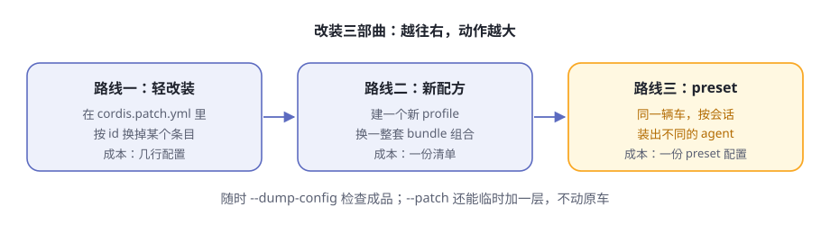

# 第12章 组装自己的 agent

> **阅读提示**
> 零件都认识了，这一章学总装。改装有三条路线，由轻到重：改 patch 层、配一份新配方、按会话 preset。沿途认识四台出厂车型、可换身份的 persona、给自动化用的 headless 组装，最后学会用 `--dump-config` 验货。

## 三个需求同时上门

先看一个场景。假设你和团队同时接下三件事：

第一件，日常自用。要有浏览器界面、全套工具，还想把审批策略调得严格一点。

第二件，跑基准测试。同一批任务要重复跑几百遍，agent 越精简越好——最好只留两个工具，把每一分算力都花在任务本身。

第三件，交给脚本。半夜里让 agent 自己干完一件事，打印结果，然后退出。没有人会守在浏览器前等它。

**表12-1 三个需求，三种组装**

| 需求 | 想要的样子 | 组装上的差异 |
|---|---|---|
| 日常自用 | 全套网页版 + 一点个人偏好 | 官方配方上加一层自己的 patch |
| 基准测试 | 两个工具、零多余动作 | 换一个不同的能力组合 |
| 脚本自动化 | 干完就退出，退出码可信 | 换一个不同的界面层 |

如果是一个封闭产品，答案多半是"买三档套餐"。dsh 的答案不一样：**底盘只有一个，装三辆不同的车**。这一章就把三种装法讲透。

## Profile：一辆车的全部档案

第 2 章把 profile 叫作"配方"。现在凑近看配方上到底写了什么：每个 profile 就是 `$DSH_HOME/profiles/<名字>/` 下的一个目录（`$DSH_HOME` 默认是 `~/.dsh`）。

**表12-2 profile 目录里有什么**

| 文件 | 作用 | 类比 |
|---|---|---|
| `package.json` | 档案主件：里面的 `dsh.profile` 清单声明叠哪些组合包、按什么顺序；`dependencies` 记录你装的树外插件 | 整车清单 + 外购件发票 |
| `cordis.patch.yml` | 你的改装层：按 id 换条目、加条目 | 改装单 |
| `cordis.yml` | 空的根配置，由 dsh 自己维护，你不用碰 | 出厂白板：一切改装都以"叠层"形式表达 |

还有一个不起眼的 `pnpm-workspace.yaml`，规定树外插件的安装方式，随 profile 一起创建，通常一辈子不用动。

注意：**profile 自己不存零件代码**。清单只写"叠哪些组合包"，改装单只写"改哪里"，真正的零件在 dsh 的安装目录和 profile 自己的 `node_modules` 里。所以 profile 轻得像一个文件夹——把它拷到另一台机器，只要零件装得上，就能装出同一辆车。档案与零件分离，是后面"创作可以只是复制"的前提。

## 改装三部曲



**图12-1 改装三部曲**

dsh 官方认可的改装路线有三条，动作一条比一条大（表12-3）：

**表12-3 三条改装路线对比**

| 路线 | 动的是什么 | 适合什么时候 | 成本 |
|---|---|---|---|
| 轻改装 | 自己的 `cordis.patch.yml` | 对当前配方的某个条目不满意：换工具、调策略 | 几行配置 |
| 新配方 | 一个新的 profile 目录 | 想要不同的组合包组合 | 一份清单 |
| preset | 一份 `agent.cordis.yml` | 同一个配方里，不同会话要不同的能力 | 一个 preset 目录 |

三条路线不是互斥的：你可以给一份新配方打自己的 patch，再让它按会话挂不同的 preset。下面逐条拆开。

## 路线一：patch 层——后叠的说了算

第 4 章讲过叠层，这里给出完整版。启动时，配置树从一张空桌子开始，按顺序叠上去：

**表12-4 叠层的完整顺序（从下往上）**

| 顺序 | 层 | 谁的 |
|---|---|---|
| 1 | 各组合包的 patch，按清单列出的顺序 | 出厂（官方或第三方组合包） |
| 2 | profile 自己的 `cordis.patch.yml` | 你，针对这份配方 |
| 3 | home 级 `$DSH_HOME/cordis.patch.yml` | 你，这台机器上所有配方通用 |
| 4 | 启动时 `--patch` 指定的覆盖层，可重复 | 只属于这一次启动 |

规则始终只有一条：**后叠的层说了算**。注意 home 级叠在 profile 层之上——官方把这一层定位为"机器本地偏好"，它管的是所有配方，所以优先级压过单个配方。

每条 patch 只做两种动作：

**表12-5 patch 的两种动词**

| 动词 | 效果 | 要注意 |
|---|---|---|
| 按 id 替换 | 找到那个条目，把它的 `config` **整个**换掉 | 不做合并：没改的字段也要原样重述 |
| `insert` | 新增一个或多个条目 | 给车加装原本没有的东西 |

最容易踩的坑是第一个：**替换不是合并**。想改某个组合包条目的一个字段，也得把整条重写一遍，没写上的字段就没了。这是有意为之——每一层都完整自解释，任何人读任何一层，都能看到这一层的全部意图，不用脑补"它保留了什么"。

还有三条小规矩，都是官方启动代码里写死的行为：

- 只含空白或注释的 patch 文件会直接报错（它解析出来是空，不是列表）。想让这层什么都不做，写 `[]`。
- patch 指向一个不存在的 id，不报错，但会打一条警告——等于改装单写了一个车上没有的零件号。
- 改装是**活的**。dsh 持续监视你的 `cordis.patch.yml`，改动会自动重新组合；改坏了也不怕，最后一棵健康的树继续运行。

## 路线二：新配方，从 dsh plugin 开始

随发行版交付的模板现有五个：`web`（base + web-app 两层）、`headless`（base + headless 两层），外加三个给程序调用的（`acp`、`sdk`、`sdk-minimal`），首次使用都会自动初始化。除此之外任何名字，都得通过 `dsh plugin` 命令创建：

```sh
dsh plugin --profile myagent add <包名>
```

这一条命令背后依次发生三件事（表12-6）：

**表12-6 dsh plugin 做的三件事**

| 步骤 | 动作 |
|---|---|
| 初始化 | 目录不存在就先建：清单、空白改装层 `[]`、安装规则文件。非模板配方的清单默认只列一个组合包：`dsh-base` |
| 安装 | 把参数原样转发给 pnpm，在 profile 目录里真正安装（机器上要先有 pnpm，缺了它会明确报错告诉你） |
| 对账 | 扫描装好的依赖：声明了 `dsh.bundle` 的包自动加入清单的 `bundles` 层；被移除的自动退出 |

对账这一步有个聪明之处：**一个包是不是组合包，由它自己的清单声明决定，而不是由它放在哪决定**。所以同一条命令既能装官方组合包、第三方组合包，也能装普通插件——对账步骤自动分流。普通插件只是装进来，之后你在自己的 `cordis.patch.yml` 里用名字引用它。甚至 `update` 一个包，如果新版本新增了 `dsh.bundle` 声明，它也会被自动激活为一层。

官方组合包名字（`dsh-base` 们）先从 dsh 安装目录解析，再找 profile 自己的目录——**出厂件永远优先于外购件**。profile 名字本身也有规矩：空名字、带斜杠或反斜杠、恰好叫 `.` 或 `..`、或者叫 `node_modules` 的名字会被直接拒绝。

新配方能干什么？两个方向：只叠 `dsh-base` 加 `dsh-headless`，得到一台精简无头车；或者装一个第三方组合包，叠出官方没有的表层。[组合包总览](https://github.com/deepseek-ai/deepseek-harness/blob/master/packages/bundle/README.zh.md)说得很直白：领域包可以携带自己的可选 profile 层，装上即叠。

## 三个出厂组合包

无论轻改装还是新配方，都得先认识三个主角官方组合包（表12-7）。本书写作后上游又添了三个给程序调用的：`dsh-acp-app`（ACP 自动化应用）、`dsh-sdk-app`（JSON-RPC SDK 运行时）、`dsh-sdk-minimal`（不含 base 的极简双工具组合）。

**表12-7 三个官方组合包**

| 组合包 | 叠上什么 | 特点 |
|---|---|---|
| `dsh-base` | 模型适配、默认模型选择、工具、持久化、沙箱与审批策略、设置与凭据、遥测、spawn/fork 委派提供方 | 每个 profile 的第一层，地基 |
| `dsh-web-app` | 浏览器表层：Web 服务器、API 网关、工作区、存储，加自动开浏览器等运行时粘合 | `dsh web` 的全部界面能力 |
| `dsh-headless` | 一次性任务 runner：接任务、干完、打印结果、退出；同时禁用热重载 | 没有服务器，不占端口 |

关键认知：**组合包的实体就是一份 patch 列表**——组合包也是"改装单"，只是出厂写好的那份。这正是你的一切改装都能生效的原因：上面每一层永远可以覆盖下面。

## 路线三：preset——同一辆车，按会话变车型

现在看最有意思的一条路线。前两条改的是"进程"：一个 dsh 进程只有一种 agent。preset 改的是"会话"：**同一个进程里，不同会话可以组装出不同的 agent**，互不打扰。

官方把组装划分成两个平面，依据是"什么必须共享"，而不是"什么感觉上属于 agent"：

**表12-8 组装的两个平面**

| 平面 | 实例数 | 内容 |
|---|---|---|
| 宿主平面 | 每进程一份 | 注册表本身、持久化、沙箱与审批、模型路由、Web 宿主 |
| agent 平面 | 每会话一份 | 单个 agent 对注册表的贡献：工具、人设、提示词段落、压缩策略 |

机制一句话讲清：名单（roster）把每个 preset 在进程里**只挂载一次**，形成一棵常驻子树；指名它的会话通过作用域父链"认父"加入，挂在子树上的工具和提示词就覆盖所有已加入的会话。挂在旁边的兄弟 preset 互相听不见。

发现机制也值得说：名单**不做缓存**，每次读取都真实扫描根目录——进程运行期间新写的 preset 立即可见，删掉的下次读取就消失。发现过程还负责健康检查：组装文件坏掉的目录不会被静默跳过，而是带着"损坏原因"列出来——因为被跳过的目录仍占着它的 id，而界面上却没有任何可删的东西。

还有一个信任事实要心里有数：**preset 就是组装，一个 preset 的权限恰好等于它引用的插件**。用户自己写的 preset 与 shell 访问同级——名单里标注信任级别（随部署交付的是 `system`，你自己写的是 `user`），是为了让界面如实呈现这个差别，而不是替你做隔离。

Web profile 的默认 preset 是 `standard`，而**默认 preset 本身是一项用户设置**：把 `agent-presets.default` 改成别的名字，新值作用于此后创建的会话，运行中的会话留在原处方上——没有人会被中途换车。

## 四台出厂车型

官方 dsh 随附哪些 preset？[一个目录一个 preset](https://github.com/deepseek-ai/deepseek-harness/tree/master/packages/preset/agent-presets/presets)，目录列表就是清单（表12-9）：

**表12-9 四台出厂车型**

| preset | 官方名 | 它是什么 |
|---|---|---|
| `standard` | 标准模式 | 功能完整的编码 agent：文件编辑、shell、检索、技能、计划、目标、子代理、工作流 |
| `ptc` | PTC 模式 | 标准能力全在，但工具经 Code Mode SDK 呈现——模型写一段 TypeScript 程序组合多步操作，五轮往返变一轮 |
| `cordis` | 创造模式 | 标准能力加自指工具集：agent 能读写自己运行其中的插件树，用来"让一个 agent 造另一个 agent" |
| `minimal` | 极简模式 | 只有持久 shell 和一个文件编辑器两样工具，人设即全部系统提示词 |

每个 preset 目录里还有一份 `preset.yml`，只放展示文本：名字、描述、排序。它**只**管展示——preset 的 id 是目录名，信任级别取自所在目录，都写不进去，否则本地作品就能把自己伪装成随附车型。

两个细节值得琢磨。第一，`ptc` 和 `cordis` 不是另起炉灶的实现——它们就是 `standard` 的完整副本加几行。官方刻意接受复制的成本，换来"每份组装一个文件读完"。

第二，**创作就是复制**：新建自定义 preset 的唯一写入入口，是把某个既有 preset 整目录复制到 `$DSH_HOME/.agent-presets/` 下。复制不授予任何新能力——副本能做的超不过名单本来就有的；此后的一切，发生在你自己的文件里。复制也不允许占用已有名字，不覆写任何东西。

最后一条规则要记住：**只有空白会话允许切换 preset**。会话一旦跑过轮次，那段历史是在原 preset 的工具下产生的，中途换底盘会留下新组装无法执行的已记录调用——网关会直接拒绝。切换本身会记入会话日志，因为 preset 决定模型看到的工具和提示词，这正落在第 5 章那条"模型可见即已记录"的铁律里。

## persona：连身份一起换

preset 能换工具，那"agent 认为它是谁"能换吗？能——人设也是一个可组装的行。部署级本来有一份人设（进程唯一），[persona 行](https://github.com/deepseek-ai/deepseek-harness/blob/master/packages/preset/persona/README.zh.md)的作用，就是为某一个 agent 遮蔽它。

**表12-10 persona 行的三个旋钮**

| 字段 | 作用 |
|---|---|
| `text` | 人设正文，支持 `{{model}}`、`{{cwd}}` 等提示词变量 |
| `complete` | 为 true 时，这个人设成为**唯一**的系统提示词——身份、工具引导都追加不进来了 |
| `includeRuntimeContext` | 是否附带运行时上下文快照（沙箱策略、审批策略等），可关 |

`minimal` 是极端例子：`complete: true` 加一句话人设，模型的全部世界就是那一句自我介绍加两样工具。注意 persona 行只能挂在 preset 组装内部——在 agent 作用域之外挂它，会与部署级人设相撞并明确报错。这不是要绕开的限制：部署级人设已有归属，这一行生来只为某一个 agent 服务。

## headless：给自动化用的组装

最后一种组装给脚本用。用法一行：

```sh
dsh --profile headless "你的任务"
```

背后是 `dsh-headless` 组合包叠在 `dsh-base` 上的一个 runner：创建一个全新的持久化 agent，把任务作为一条普通用户消息提交，等它完全停稳，把最后一条非空回复写到 stdout，然后退出。它不挂任何服务器、HTTP 层或浏览器插件。

**表12-11 headless 给脚本的契约**

| 项目 | 契约 |
|---|---|
| 退出码 | 最后一轮正常完成为 0，否则 1 |
| stdout | 只有最后一条非空回复 |
| stderr | 没有推理内容的成功运行保持干净；有推理内容时以 `dsh: reasoning:` 段流式写出；失败时写错误码和消息 |
| 端口 | 不打开任何监听端口 |
| 任务 | 命令行位置参数就是任务；空白任务在启动前就被拒绝 |

契约干净到这个地步，就可以放心把 dsh 塞进定时任务、CI 流水线或你自己的工具链。无头形态的本体是 `dsh-headless` 组合包；它曾经栖身的顶层示例目录已被上游退役（见第 3 章"样机车搬家了"）。仓库根目录那份 BENCHMARK.md 说的跑基准方式，就是走这条路——后记细说。

## 验货：--dump-config

改装完怎么知道装成了什么样？不用启动：

```sh
dsh --profile web --dump-config
```

它会离线合成最终配置树并打印出来，每一段前面都有注释，标明**这一段来自哪个文件、被哪几层 patch 改过**。合成用的算法和真正启动时是同一个，所以打印出来的树和跑起来的树逐行一致。

**表12-12 两个验货开关**

| 开关 | 打印什么 | 什么时候用 |
|---|---|---|
| `--dump-config` | 全部层：组合包 + 你的改装 + `--patch` | 日常验货 |
| `--dump-default-config` | 只打印出厂层，不解析你的改装层 | 改装层写坏了、启动报错时，拿它看原配方长什么样 |

[架构文档](https://github.com/deepseek-ai/deepseek-harness/blob/master/docs/architecture.zh.md)对验货有一句承诺，值得背下来：**打印出的任何条目，都可以由你自己的 patch 替换**。验货不是参观，是改装的入口。

## 🧪 本章实验

> **实验 12-1 ★｜验一次货**
> 目标：看懂配置树的层归属。
> 步骤：运行 `npx @deepseek-ai/dsh --profile web --dump-config`。
> 验收：任选三个条目，能根据注释分别说出它来自哪一层（组合包层还是用户层）。

> **实验 12-2 ★★｜给 web 车加装提醒**
> 目标：体验只属于一次启动的 `--patch` 层。
> 步骤：clone [官方仓库](https://github.com/deepseek-ai/deepseek-harness)，运行 `dsh web --patch apps/cli/config/examples/schedule/cordis.yml`，在会话里用提醒工具设一个提醒。
> 验收：到点提醒出现；去掉 `--patch` 重启，功能消失——原车毫发无损。

> **实验 12-3 ★★｜把默认车型换成 minimal**
> 目标：感受"默认 preset 是用户设置"。
> 步骤：在设置里把 `agent-presets.default` 改为 `minimal`，新建一个会话，问它手上有什么工具。
> 验收：新会话只报告持久 shell 和文件编辑器两样工具；改动前创建的会话不受影响。

## 🤔 思考题

1. ★ 为什么"后叠的层说了算"这一条规则，让多人协作改装同一辆车不容易打架？
2. ★★ preset 每进程只挂载一次、会话靠"认父"加入。相比每个会话各挂一份，这省掉了什么？代价又是什么？（提示：想想有人编辑了 preset 文件之后，运行中的会话和新会话各发生什么。）
3. ★★ `cordis` 模式让 agent 能修改自己的插件树。第 4 章说"可回滚"是保命符——除此之外还需要什么配套，才敢在生产里真用？
4. ★★★ 如果让你设计一个"preset 市场"，本章哪些规则（复制创作、信任级别、id 约束、空白才可切）你会保留，哪些会改？为什么？

## 📝 小结

- **profile = 一辆车的全部档案**——清单列组合包、改装单记你的改动、零件本身在别处
- **改装三部曲**——patch 换条目 → 新配方换组合 → preset 按会话换车型，三者可叠加
- **后叠的说了算**——组合包 → profile → home → `--patch`；替换不是合并，整条重写
- **新配方从 `dsh plugin` 开始**——初始化、安装、对账三步，组合包自动进清单
- **四台出厂车型**——standard、code、cordis、minimal；创作就是复制
- **persona 是可组装的行**——换工具之外，还能换身份
- **headless 有脚本契约**——退出码、stdout、stderr 都干净，可进流水线
- **验货**——`--dump-config` 看成品，`--dump-default-config` 是恢复诊断

主线的动手内容到此为止；第五部分再往机制深处走一层。➡️ [第13章 会话日志与续接](ch13.md)
