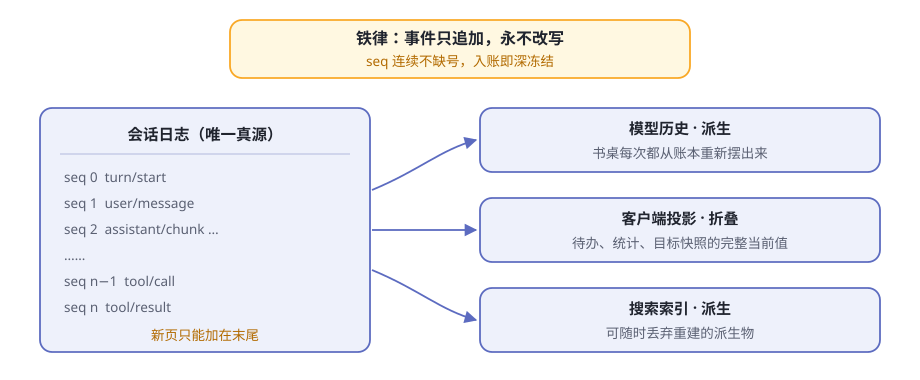
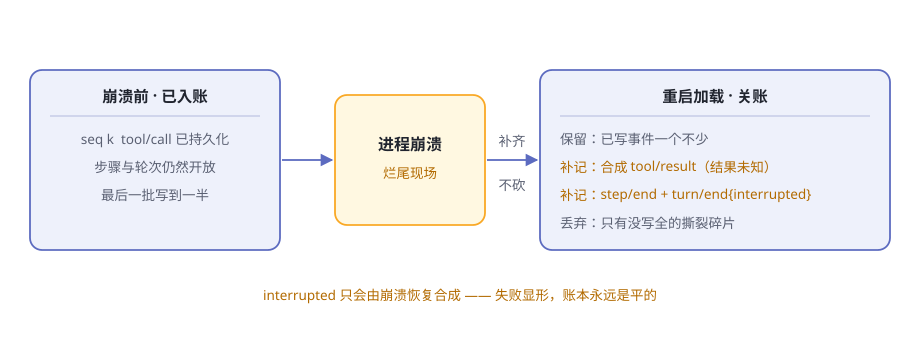
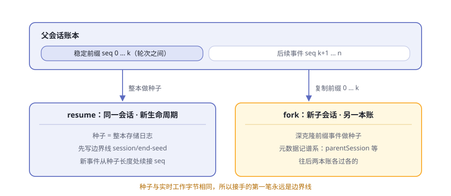

# 第13章 会话日志与续接

深夜，你交给 agent 一个大活儿。它连续干了两个小时：翻文件、跑命令、改代码，一切都记在一本账上。然后意外发生了——进程死了，可能是你误触了快捷键，也可能是机器重启。

两个问题立刻压过来。这两个小时的工作还能找回来吗？那几个干到一半的工具调用，重启之后要怎么向模型交代？

还有第三种遗憾：走到一半的某个岔路口，你当时选了左边，现在想回到路口走右边——又不想毁掉已经走出来的这条时间线。

三个答案都藏在同一个地方：第 5 章认识的那本会话日志。那一章说了"一本账就够了"；这一章往深处挖两层：这本账守着什么纪律，dsh 又围绕它造了哪些续接与检索的设备。

> **阅读提示**
> 账本的三条纪律：只追加不改写、崩溃时关账、视图全靠派生。三套设备：resume 与 fork、检查点关卡、跨会话检索。读完你能回答：为什么"回到过去改历史"不需要抹掉历史。

## 账本的铁律：只追加，永不改写

先把账本的形制说正式：[会话](https://github.com/deepseek-ai/deepseek-harness/blob/master/docs/subsystems/session.zh.md)是一条类型化的事件流，事件只能追加，`seq` 是每个事件的页码，恒等于当前日志长度——单调递增，连续不缺号。想从中间插一页、抽一页，校验环节直接拒绝。

还有两道封条。事件一旦入账就被深冻结，连普通代码都无法改写历史；载荷在追加的那一刻就接受"无损 JSON"校验，序列化不了的数据当场被拒，根本进不了账本。完整的追加规则见 [dsh-session 包说明](https://github.com/deepseek-ai/deepseek-harness/blob/master/packages/core/session/README.zh.md)。

账本里都记些什么？先混个脸熟（表13-1）：

**表13-1 事件词汇走马灯**

| 事件 | 记什么 |
|---|---|
| `turn/start`、`turn/end` | 一个轮次的开张与收账，连同结束原因 |
| `step/start`、`step/end` | 一次模型调用加它要求的工具执行 |
| `user/message` | 你的提示词、注入的背景资料，都带来源 |
| `assistant/chunk` | 原始流式分片，保住逐 token 的回放保真 |
| `assistant/message` | 组装好的模型回复，连带用量记账 |
| `tool/call`、`tool/result` | 模型发起一次调用、调用交回结果 |
| `request/header` | 请求信封本身：调用配置、系统提示词、工具清单 |
| `session/end-seed` | 种子历史与本生命周期的分界线 |
| 插件合并的类型 | 如压缩的 `compaction/*`，只记账不产生消息 |

这样一本"只追加"的账，到底买到了什么（表13-2）？

**表13-2 只追加买到的四样东西**

| 好处 | 长什么样 |
|---|---|
| 崩溃可修 | 账本永远是"平"的，任何一段前缀都能当恢复的起点 |
| 可审计 | 模型为什么看见、为什么忘记，逐条事件查得到；连请求信封本身都有账 |
| 视图可派生 | 模型历史、界面投影、搜索索引都是同一本账的派生物，改一处不怕别处漂移 |
| 续接变算术 | resume、fork 都成了"读账本、抄账本"，不需要任何特殊通道 |

**图13-2 一本账，三种派生**

补一句性能：追加热路径不阻塞磁盘写入，事件先进内存即算提交，持久化插件在后台缓冲分批落盘。"什么时候必须把这一笔记死在磁盘上"，是检查点策略的事，本章后半细讲。

## 崩溃时"关账"，不"截肢"

最棘手的时刻是进程死在轮次中间。账本尾巴上一片狼藉：工具调用记了账却没拿到结果，步骤开着，轮次也开着。

直觉的修法是"截肢"：把没写完的尾巴整段砍掉，假装什么都没发生。代价有两个：那些事件是花了钱写下的账页，砍了就永远没了；模型更不知道活干到了哪里，可能把做过的事重做一遍。

dsh 的选择是"关账"：[加载账本](https://github.com/deepseek-ai/deepseek-harness/blob/master/packages/session/session-persistence/README.zh.md)时，已持久化的事件原样保留，再为烂尾的尾巴补上一组合成的收尾事件（表13-3）。

**表13-3 三种崩溃现场与关账手法**

| 崩溃时的现场 | 怎么关账 |
|---|---|
| 最后一批写到一半（撕裂碎片） | 丢弃碎片，保留能完整解码的部分 |
| `tool/call` 在账、结果没拿到 | 补一条合成的 `tool/result`，写明"结果未知" |
| 开放的步骤与轮次 | 补 `step/end` 与 `turn/end`，结束原因是 `interrupted` |

`interrupted` 是个特殊的结束原因：运行循环永远不会发出它，只有崩溃恢复才能合成。所以你在账本里看到 `interrupted`，就等于看到一块"此处发生过崩溃"的铭牌。

这与第 8 章"施工牌"是同一种品格：压缩中途崩溃留下没闭合的 `start`/`end`，让失败显形；这里也不抹掉未完成的轮次，而是补上一页交代。模型随后收到的"结果未知"也有明确的行动指南：只读或幂等的操作可以重试，可能有副作用的操作要先验证现场或问你，不许盲目重试。

关账之后，账本依旧平整：旧账的 `seq` 连续，新生命周期从种子长度处续接编号，第一笔先写一条分界线——下面细说。

**图13-3 关账，不截肢**

## projection：从账本派生屏幕

账本是真源，可屏幕要的并不是一串原始事件：待办面板要当前清单，统计面板要计数，目标面板要快照。再存一份副本？两本账迟早打架。

[会话投影](https://github.com/deepseek-ai/deepseek-harness/blob/master/docs/subsystems/session-projection.zh.md)给出第三条路：视图从账本派生，每次现算，不存副本。每个领域登记一个"投影单元"：一个初始状态、一个纯函数折叠 `apply(状态, 事件)`，外加一个可选的客户端视图。

分工干净利落（表13-4）：

**表13-4 投影的三方分工**

| 角色 | 负责什么 | 不碰什么 |
|---|---|---|
| 框架（注册表） | 只订阅一次 `session/event`，把每个已提交事件喂给每个单元 | 不算任何业务状态 |
| 领域（投影单元） | 只做纯函数折叠 | 不持有任何订阅 |
| 客户端 | 只收经过 schema 校验的成品值 | 从不自己折叠事件 |

单元还有两条纪律。**全量值规则**：携带状态的事件必须携带变更后的完整状态，绝不发裸增量——每个值都自描述，消费方拿最新一份即可。**同引用闸门**：对不关心的事件原样返回原状态引用，引用没变，下游开销为零。

读取是一次同步的切片：`snapshot()` 返回 `{ asOfSeq, values }`，水位线 `asOfSeq` 声明"所有值都算到了这个 seq"，与同一时刻切出的页面切片严格一致。内置的例子如 [session-stats](https://github.com/deepseek-ai/deepseek-harness/blob/master/packages/session/session-stats/README.zh.md)：全日志计数与墙钟时间，就是一个登记进注册表的单元。

### 缓存：捷径，不是第二本账

冷读很疼：打开一个老会话、扫一眼列表页，都要把整本账从头折叠一遍。[投影缓存](https://github.com/deepseek-ai/deepseek-harness/blob/master/packages/session/session-projection-cache/README.zh.md)把每个单元的状态连同版本号、水位线一起记成检查点行，下次从检查点接着折叠。

它的纪律值得逐条看：

- **缓存行是"折叠捷径，绝不是权威"**。它可以过期——行上的 `seq` 精确地说出它有多旧——但永远不会错。
- **日志先行，缓存跟随**。写缓存行之前，先将会话缓冲的事件持久化落盘；崩溃最多让缓存落后于账本，绝不会跑到账本前面。
- **三个必写点**：会话创建、`turn/end`、会话销毁（由热转冷的瞬间）；之间再按事件数与时间间隔节流，两个节流字段都是必填的部署决策。
- **版本不符就丢弃重折**，不做迁移；写失败只记警告，下次写入自愈——缓存永远尽力而为。
- **列表页享受零 I/O 读取**：直接从存储域的内存表取值，最多旧到上次检查点，绝不错。

缓存从不触碰会话持久化层——它在自己的存储域里存自己的派生文档。真源永远只有账本一本（表13-5）。

**表13-5 账本、投影、缓存三层对照**

| | 事件日志 | 内存投影 | 投影缓存 |
|---|---|---|---|
| 身份 | 唯一真源 | 派生的视图 | 视图的持久化捷径 |
| 会过期吗 | 不会 | 不会 | 会，`seq` 说出有多旧 |
| 丢了怎么办 | 数据丢失 | 重算即回 | 重算即回 |

## 续接：resume 与 fork

铁律加关账，让"续接"变成了对账本本身的操作。

### resume：整本账做种子

续接就是[加载](https://github.com/deepseek-ai/deepseek-harness/blob/master/docs/subsystems/persistence.zh.md)加会话准备：读回的账本连同头部的谱系元数据原样归来，恢复的 agent 看到同样的历史与组合。构造函数种子就是整本存储日志，新生命周期的第一条事件从种子长度处续接 `seq`——页码不清零。

新生命周期写下的第一笔，是一条只记账的边界线：`session/end-seed`。为什么要这么讲究？因为种子历史与新工作在字节层面完全相同——没有边界线，你无法分辨一条没闭合的 `start` 记录是早已死去的生命周期留下的，还是此刻正在进行的。读存储历史的消费方以"最后一条 `end-seed`"定位边界；按真人活动给会话排序的消费方则会排除它——接手会话本身不算工作。

续接还有自己的信封快照：一条 `reason` 为 `resume` 的 `request/header`，把这次循环实例的边界也记进账本。

### fork：剪一段稳定前缀，抄一份

fork 就是"复制日志再改"，第 5 章一句话带过，这里展开。[ctx.sessions.fork](https://github.com/deepseek-ai/deepseek-harness/blob/master/docs/subsystems/session.zh.md) 干三件事：

1. **剪**：选取源事件直到 `boundary` 序号（含），缺省剪到最后一个事件。硬规矩是所选前缀不得结束在开放轮次里——只能在轮次之间的稳定位置下剪。
2. **抄**：深克隆选中的事件作为子会话的种子。从此两本账各过各的，子会话往后的写入不会流回父账本。
3. **记谱系**：子会话元数据写下 `parentSession`、`seedLength`，继承工作目录。谱系记在头部，不占事件。

子会话同样以 `end-seed` 为第一笔，区分种子与实时工作。fork 也有明确边界：存储内的 fork API 只对实时会话动手，不支持 fork 已持久化但未加载的会话；想从冷账本分叉，走远端的 `SessionController.fork`——它从"冷可读的已完成轮次前缀"开新会话。

**表13-6 resume 与 fork 对照**

| | resume | fork |
|---|---|---|
| 种子 | 整本存储日志 | 一段轮次间的稳定前缀 |
| 与源的关系 | 同一会话接着续 | 新子会话，谱系记进元数据 |
| `seq` | 从种子长度处续接 | 同样从种子长度处续接 |
| 边界线 | `session/end-seed` | `session/end-seed` |
| 硬要求 | 烂尾先关账 | 前缀不得结束在开放轮次 |

**图13-4 同一本账的两种续法**

### 先落笔再干活：检查点策略

续接还有个隐藏前提：崩溃那一刻，该入账的都入了吗？持久化是分批异步的，批写到一半崩了，账就还悬在内存里。

[checkpoint-policy](https://github.com/deepseek-ai/deepseek-harness/blob/master/packages/session/session-checkpoint-policy/README.zh.md) 就是管这件事的零配置插件：它不写事件，只决定"何时必须落笔"，并通过 `ctx.sessions.flush` 这道持久性屏障完成落盘。三道关卡（表13-7）：

**表13-7 先落笔再干活的三道关卡**

| 时机 | 先持久化，再放行 |
|---|---|
| 模型请求进入适配器之前 | 缓冲中的请求事件——崩溃后不会重放一笔没记过的请求 |
| 顶层工具本体执行之前 | 这条 `tool/call`——在产生外部副作用之前入账；嵌套调用复用外层检查点 |
| 每个步骤边界 | 上一步的回复与工具结果——再派生下一个请求 |

态度是失败即关：检查点失败，适配器和工具本体干脆不执行——宁可拒绝干活，也不干没记账的活。两条诚实的免责声明：流式分片没有逐片检查点，依赖有界的后台批次；"已持久化的调用没有结果"只能记为结果未知，不会自动重试——策略能证明"你派出过这趟差"，证明不了"外部效果已完成"。

## 跨会话翻账本：搜索、谱系与导出

一个会话一本书，机器上很快攒出几百本。[session-query 家族](https://github.com/deepseek-ai/deepseek-harness/blob/master/packages/session-query/README.zh.md) 专管翻书：统一服务 `ctx.sessionQuery` 覆盖列表、精确读取、关系追踪与全文搜索；有实时数据时实时优先，返回的每条记录都是脱离存储的克隆，描述同一个一致时刻。

**表13-8 翻账本的工具箱**

| 操作 | 你得到什么 |
|---|---|
| `listSessions` / `filterSessions` | 语料库列表与过滤（按 id、目录、创建时间、父会话、可用性） |
| `readSession` / `readSurface` | 完整原始日志（经回放校验）／当前模型表面 |
| `readEvent` | 一个事件，加前后有界的原始邻窗 |
| `traceEvent` | 一个事件的位置替换与被引用源关系 |
| `traceSession` | 会话谱系：已知祖先链加递归后代树 |
| `searchSessions` / `searchEvents` | 跨会话分组搜索／会话内搜索 |

`traceEvent` 是"事件社会关系"的显微镜：谁替换了它、它遮住了谁、它引用哪些先前事件做源、哪些后续事件引用它——压缩遮罩的痕迹能一路追到底。`traceSession` 顺着谱系爬：fork 留下的 `parentSession` 让祖先与后代都找得回来，祖先链是否完整也会明确告知。词汇细节见[会话查询子系统文档](https://github.com/deepseek-ai/deepseek-harness/blob/master/docs/subsystems/session-query.zh.md)。

### 全文搜索：一份可随时丢弃的派生索引

全文搜索由 [SQLite 提供方](https://github.com/deepseek-ai/deepseek-harness/blob/master/packages/session-query/session-query-sqlite/README.zh.md)供给，设计上有四句话：

- **派生索引，绝不动源存储。** 索引行存放在一个专用的可丢弃数据库里；实时会话从内存索引，持久会话从派生库索引，每次搜索先做一次对账，结果永远反映最新状态。
- **查询是数据，不是语法。** 引号、`OR`、`NEAR`、星号一律按普通文本对待；排序确定——匹配片段多者在前、文档短者在前；摘录按 Unicode 码点截断，没有提供方私有的分数。
- **游标带世代。** 语料库一变，旧游标宁可报错失败，也不返回错位的页。
- **按词匹配，不按子串。** 要字面子串扫描，用 `filterEvents` 的文本子句：字面、忽略大小写、空白灵活。

搜索是可选能力：已发布组合默认关闭，索引何时打开有启动时、首次搜索时、永不打开三档（配置项以本机实跑为准）。诸如 `/resume` 既往工作检索这样的功能，就是它的消费方。

### 把整棵会话树带回家：/export

[session-log-export](https://github.com/deepseek-ai/deepseek-harness/blob/master/packages/session-query/session-log-export/README.zh.md) 在 Web 端给了两个入口：会话头部的 `Session log` 按钮和 `/export` 命令。浏览器随即下载一个 ZIP，里面是整棵会话树——会话本身、它的子会话与附件。

两个细节值得品味。下载前宿主会先冲洗活跃的根会话，于是 ZIP 里连触发这次下载的那对命令生命周期事件都在——导出行为本身也记了账。导出要求后端保有逐会话的原始产物：随附的 JSONL 后端（明文或压缩）没问题，SQLite 后端不支持导出（以本机实跑为准）。

模型自己也能翻账本：[tool-session-query](https://github.com/deepseek-ai/deepseek-harness/blob/master/packages/session-query/tool-session-query/README.zh.md) 注册了五个工作区授权的会话查询工具，搜索、追踪、读取一应俱全。

## 🧪 本章实验

> **实验 13-1 ★｜亲眼看到续接的边界线**
> 目标：验证重启续接后 `seq` 连续不缺号，且新旧生命周期之间有边界线。
> 步骤：用 Web 形态聊上几轮，用 `/export`（或会话头部的 `Session log` 按钮）下载会话 ZIP；结束进程后重启，续接同一个会话再聊几轮，再次导出；解压两份账本对照（若压缩了先解压）。
> 验收：两份账本的 `seq` 页码连续；第二份账本里能多找到一条 `session/end-seed`，本轮新事件全排在它之后。

> **实验 13-2 ★★｜翻出陈年旧账**
> 目标：体验跨会话全文搜索与它的派生索引。
> 步骤：在某个会话里聊一个自造的冷门词（比如一种编造的植物名）；会话结束后，用部署提供的搜索入口（Web 搜索或 `/resume`）搜这个词。
> 验收：命中那个会话并给出摘录；索引数据库是独立于会话账本的另一个文件。若搜索不可用，说明该部署没挂载搜索后端（以本机实跑为准）。

## 🤔 思考题

1. ★ 只追加让账本"永远是平的"。假如允许改写历史，崩溃恢复要额外多做哪些事？
2. ★★ 崩溃时 dsh 选择"关账"而不是"把没干完的继续干完"，明确不提供部分轮次续跑。这个取舍买到了什么，放弃了什么？
3. ★★ 投影缓存只敢承诺"可以过期，永远不会错"。日志先行、缓存跟随的顺序，是如何支撑这句话的？
4. ★ fork 是"抄一份前缀"，不是"共享同一本账"。如果两个会话合写一本账，会撞出什么乱子？
5. ★★★ 搜索索引"可随时丢弃重建"，账本却"一字不删"。同一份数据，为什么待遇截然相反？

## 📝 小结

- **只追加，永不改写**——会话是仅追加的事件流，`seq` 连续不缺号，事件入账即深冻结，坏载荷在追加处被拒
- **关账不截肢**——崩溃后加载时补上合成收尾事件，`interrupted` 只由恢复合成；唯一被丢弃的是从未写全的撕裂碎片，失败显形
- **边界线**——resume 与 fork 都以旧事件为种子，新生命周期第一笔是 `session/end-seed`，页码从种子长度处续接
- **投影**——框架驱动、领域计算、客户端只收成品；全量值规则加同引用闸门，快照是一次同步的一致切片
- **缓存不是真源**——日志先行、缓存跟随；可以过期，永远不会错；版本不符就丢弃重折
- **检查点三道关卡**——请求前、工具本体前、步骤边界；失败即关，宁可拒绝干活也不干没记账的活
- **跨会话翻账本**——`ctx.sessionQuery` 统一读取、追踪与谱系；全文索引是可丢弃的派生物；`/export` 把整棵会话树带回家

机制深水区的第一站到此结束。下一章换个视角，看多段工作如何被编排成流水线。⬅️ [第12章 组装自己的 agent](ch12.md) ｜ ➡️ [第14章 编排：Workflow 与 Ralph](ch14.md)
