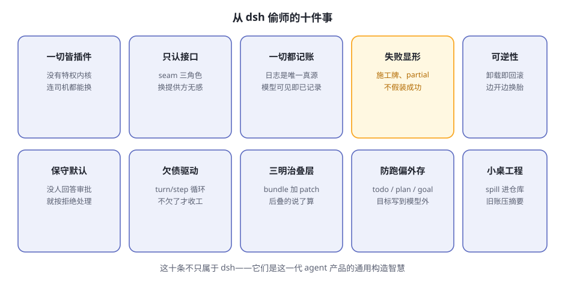

# 第13章 后记 能从 dsh 偷师什么

> **阅读提示**
> 全书收官。不谈新知识，盘点两件事：dsh 身上值得偷师的十条设计智慧，以及它诚实的局限。最后给你继续走的路标。

## 十条偷师清单

**图13-1 十条偷师清单**

**表13-1 十条速查**

| # | 智慧 | 书中出处 |
|---|---|---|
| 1 | 一切皆插件，没有特权内核 | 第4章 |
| 2 | 只认接口不认实现（seam） | 第4、9章 |
| 3 | 一切都记账：日志是唯一真源 | 第5章 |
| 4 | 失败显形：施工牌、partial，不假装成功 | 第8、9章 |
| 5 | 可逆性：卸载即回滚 | 第4章 |
| 6 | 保守默认：没人回答审批 = 拒绝 | 第6章 |
| 7 | 欠债驱动的循环：turn/step | 第5章 |
| 8 | 三明治叠层：后叠的说了算 | 第4、12章 |
| 9 | 防跑偏外存：todo/plan/goal | 第7章 |
| 10 | 小桌工程：spill 与 compaction | 第8章 |

这十条不只属于 dsh。不管你以后用哪家的 agent 产品、或者自己搭一个，拿这张清单当**评审表**：一个 agent 系统值不值得信任，基本就看这几条做到几条。

## 诚实的局限

偷师归偷师，dsh 的短板也要看清（表13-2）：

**表13-2 dsh 的局限**

| 局限 | 说明 |
|---|---|
| 开发者预览 | 官方明说会有破坏性变更，零件规格还在变 |
| 沙箱只管文件 | 网络和进程可见性不在沙箱词汇内 |
| 没有费用闸门 | 纯按量计费，花超之前没人拦你 |
| 生态还年轻 | 插件质量参差，装之前自己看一眼 |

## 继续走的路标

**官方材料**（都在 [deepseek-ai/deepseek-harness](https://github.com/deepseek-ai/deepseek-harness) 仓库里）：

- [架构文档](https://github.com/deepseek-ai/deepseek-harness/blob/master/docs/architecture.zh.md)——动手前的必读总览
- [cordis 七课](https://github.com/deepseek-ai/deepseek-harness/tree/master/docs/cordis-tutorial)——插件框架系统教程
- [cookbook](https://github.com/deepseek-ai/deepseek-harness/tree/master/docs/cookbook)——五张动手菜谱
- 20 多篇子系统文档——每个器官的权威说明书

**社区**：

- GitHub 话题 [`dsh-plugin`](https://github.com/topics/dsh-plugin)——发现别人写的插件
- 仓库的 Discussions——反馈与讨论的官方入口

## 最后一句话

回到第 1 章那个比喻：大模型是被关在黑屋子里的大脑，harness 是给它装上的身体。

这本书带你把这副身体从外到内拆了一遍。现在你知道了：所谓 AI agent 的魔法，拆开看全是朴素的工程——**记账、关卡、回滚、外存、叠层**。魔法不在模型里，在模型之外的一切里。

祝你拼出自己的那辆车。🚗

## 🤔 思考题（全书终章版）

1. ★★ 十条智慧里，哪一条最让你意外？为什么？
2. ★★ 如果让你给团队选一个 agent 产品，你会拿表13-1 当评审表吗？还缺哪一条？
3. ★★★ 你准备用 dsh（或任何 harness）干的第一件正事是什么？

## 📝 小结

- **十条偷师清单**——从插件化到小桌工程，是这一代 agent 的通用构造智慧
- **四条局限**——预览阶段、沙箱边界、费用闸门、生态年轻
- **路标**——官方架构文档、cordis 七课、cookbook、社区话题

全书完。⬅️ 回 [首页](index.md)
