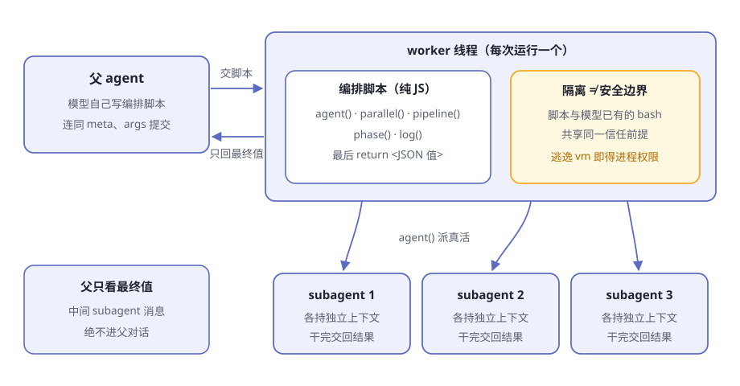
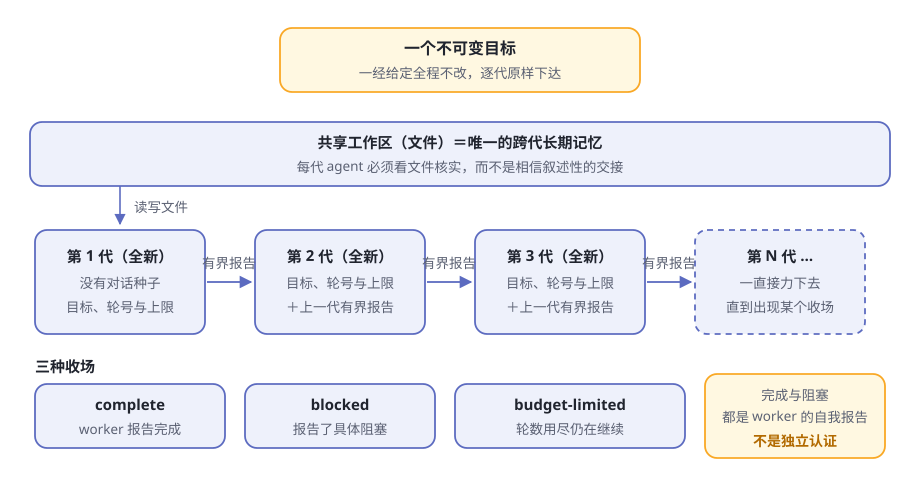

# 第14章 编排：Workflow 与 Ralph

中午的餐厅客满，厨房里只有一位主厨。炒菜、装盘、传菜、收钱全是他一个人，一口大锅前忙到脚不沾地。

最容易想到的办法是：换一口更大的锅。可厨房真正缺的不是大锅，是**菜谱**加**传菜调度**：先把做菜的顺序写成一张纸，再把每道菜分给各个档口，最后把成品收拢。锅再大，主厨还是一个人。

你在第 8 章见过同样的困境：书桌再大也有上限，大脑再强也一次只干一件事。dsh 的答案和厨房一样——**不造更大的单兵，而是教会它写菜谱、派人**。这一章讲这套编排能力：workflow 家族。

> **阅读提示**
> workflow 家族有两个面向模型的工具：`workflow` 让模型自己写"菜谱"，把活扇出给 subagent；`ralph` 用一份写死的脚本，把同一个目标交给一代又一代全新的 agent。读完你能回答：为什么隔离不等于安全边界，为什么 ralph 只在人类点名时才用。

## 厨房里的四个成员

workflow 家族四个包，各扮一个角色（表14-1）。又是第 4 章那套缝（seam）的阵型：一侧定义，中间实现，另一侧是面向模型的工具。

**表14-1 workflow 家族的四个成员**

| 成员 | 角色 | 干什么 |
|---|---|---|
| [workflow](https://github.com/deepseek-ai/deepseek-harness/blob/master/packages/workflow/workflow/README.zh.md) | Service Definition | 定义"运行与结果"的词汇：一次运行是什么、怎么收场、发哪些事件 |
| [workflow-worker-thread](https://github.com/deepseek-ai/deepseek-harness/blob/master/packages/workflow/workflow-worker-thread/README.zh.md) | Service Provider | 真正执行脚本的引擎，每次运行一个独立 worker 线程 |
| [tool-workflow](https://github.com/deepseek-ai/deepseek-harness/blob/master/packages/workflow/tool-workflow/README.zh.md) | Consumer | 把 `workflow` 工具交给模型，做脚本化扇出 |
| [tool-ralph](https://github.com/deepseek-ai/deepseek-harness/blob/master/packages/workflow/tool-ralph/README.zh.md) | Consumer | 把 `ralph` 工具交给模型，跑固定的迭代循环 |

完整的类型与事件词汇，[工作流子系统文档](https://github.com/deepseek-ai/deepseek-harness/blob/master/docs/subsystems/workflow.zh.md)有详尽记录。

注意两点：它是**可选能力**，不在 agent loop 主干上；真正干活的是第 10 章委派之门后面的 [subagent](https://github.com/deepseek-ai/deepseek-harness/blob/master/packages/subagent/README.zh.md)——workflow 自己一份真活都不干，只负责派活。

## workflow：模型自己写菜谱

模型调用 `workflow` 时，提交的是三样东西（表14-2）。

**表14-2 一次调用提交的三样东西**

| 参数 | 含义 |
|---|---|
| `meta` | 身份块：名字、描述必填；何时适用、阶段表可选 |
| `script` | 纯 JavaScript 编排脚本体，由模型当场写就 |
| `args` | 可选输入，作为全局变量原样暴露给脚本 |

三样里只有 `script` 是"代码"。`meta` 与 `args` 都以普通 JSON 数据传递，**绝不作为代码求值**——引擎开工前先校验身份块的形状，错了当场拒绝，交回一份违规清单让模型改。

脚本以顶层 await 运行，最后以 `return <JSON 值>` 收尾，执行期间能调用一小组钩子（表14-3）。

**表14-3 脚本里的五个钩子**

| 钩子 | 干什么 |
|---|---|
| `agent(prompt)` | 启动一个 subagent，等它的最终结果回来（给了 schema 时是结构化值） |
| `parallel()` | 把多份工作并行跑 |
| `pipeline()` | 把多份工作流水线跑 |
| `phase()` | 向观察者申报进度："现在进入某阶段" |
| `log()` | 叙述一行 |

脚本用钩子协调，真活由 `agent()` 启动的一个个 subagent 完成，每个子代理各持自己独立的上下文。整条链路见图14-1。

**图14-1 workflow 的扇出**

父 agent 最后拿到什么？工具调用会**阻塞父级的轮次**，直到整个工作流结算，桌上只落下一个规范包络 `{ runId, agentsStarted, result }`，外加一句 `workflow "xxx" completed (3 agents).`。中间的 subagent 消息，父级这辈子都看不到。

这是刻意的算盘：第 8 章的书桌很金贵，一百个子代理的细节不该搬上父级的桌子，只搬最终值。

失败怎么处理？dsh 把失败分成两种，纪律完全不同（表14-4）。

**表14-4 两种失败，两种纪律**

| 失败 | 处理 | 原因 |
|---|---|---|
| 钩子误用：参数错、选项不认识、超出上限 | 脚本当场响亮终止；`parallel()`/`pipeline()` 对这类致命错误直接重新抛出 | 一个拼错的选项，绝不能消融成"某一项恰好是 null" |
| 某个 subagent 没跑成 | `agent()` 返回 `null`，由脚本决定重试、兜底还是认亏 | 子运行失败是业务，不是基础设施事故 |

结算时，一次运行只有三种收场：完成（带返回值）、取消、错误。凡是异常收场，一律报告为错误——**部分输出永远不会被当作成功**。

## 跑在独立线程里，但记住：隔离不是安全

脚本由谁来跑？[worker-thread 引擎](https://github.com/deepseek-ai/deepseek-harness/blob/master/packages/workflow/workflow-worker-thread/README.zh.md)：**每次运行一个独立的 worker 线程**。它解决两个实际问题（表14-5）。

**表14-5 每次运行一个 worker，换来什么**

| 问题 | worker 怎么解 |
|---|---|
| 脚本同步打转，堵住宿主的事件循环 | 脚本的 CPU 工作全在 worker 里，宿主从容不迫 |
| 脚本赖着不理会取消 | worker 可以从外面直接终止：宽限期到，强制按取消结算，线程被杀 |

引擎还带着一串闸门：并发多少个、一次运行总共最多启动多少个（默认 1000，是失控循环的后备闸）、一次扇出最多接受多少条目。具体数值见配置目录，以本机实跑为准。

但有句话必须说清：

> **注意**
> 官方文档写得直白：**这种隔离只是 containment（看管），不是安全边界**。模型写的脚本，与模型本来就能执行的 bash 共享同一个信任前提；脚本跑在一个可以逃逸的 `node:vm` 上下文里，逃逸出去就能拿到 worker 的进程权限。真要运行不可信的代码，需要独立进程或容器引擎。

打个比方：worker 线程像一间用玻璃隔出来的厨房。它能防止面粉飞扬到主厅，也方便随时把这一间整个关掉——可玻璃间里的人手里有真菜刀，真要搞破坏，玻璃挡不住。

另有两处细节值得点头：worker 的环境变量经过清理才启动，凭据不会通过 `process.env` 跨越边界；脚本视野里默认也没有定时器、文件系统和 Node 全局变量——但官方明说，那是 API 可移植性措施，不是隔离措施。

## ralph：一场固定规则的接力赛

还有一类任务：它不需要把一百份活扇出去收回来，而是盯住一个目标一直啃，啃完为止。dsh 为此备了一个专用工具：`ralph`。

[设计笔记](https://github.com/deepseek-ai/deepseek-harness/blob/master/.agents/notes/implemented/feature/2026-07-19-fresh-agent-ralph-workflow-tool.zh.md)一句话点破这个模式：**把同一个目标反复交给全新的工作者，以共享工作区作为长期记忆，各轮之间只传递一份小型的显式交接，直到工作完成或触及上限**。

它和 `workflow` 的分野，一张表就够（表14-6）。

**表14-6 workflow 与 ralph 的分野**

| | workflow | ralph |
|---|---|---|
| 编排脚本谁写 | 模型自己写 | 部署方的固定脚本，模型一个字也改不了 |
| 模型能递什么 | 完整脚本＋身份块＋参数 | 只有目标，外加可选的轮数上限 |
| 子代理之间 | 并行或流水线的同事 | 一代接一代的接力手 |

### 每一代看到什么

调用只提交 `{ objective, maxRounds? }`，照样阻塞到整个运行结算。部署配置里的轮数上限既是默认值，也是调用时覆盖的天花板（默认 256，以本机实跑为准）。

随后，固定脚本一轮开一个全新的子 agent。每一代看到的只有四样：

1. 那个不可变的目标
2. 当前轮号与上限
3. 一句话："**共享工作区是权威状态**"
4. 上一代的**有界报告**

父级的对话呢？前几代的会话呢？**绝不作为种子**。工作区——那些文件本身——才是跨代的唯一长期记忆。

每一代必须看文件核实，而不是相信叙述性的交接；每一代 agent 结束时，它的对话也随之消散，不会留给下一代。连每一轮用哪个子代理提供方，都由部署配置递进去，固定脚本看不见也改不了。

整场接力见图14-2。

**图14-2 ralph 的接力**

### 一份有界的报告

交接是一份结构化报告，状态与字段互相咬合（表14-7），还必须带非空摘要，序列化后不得超过大小上限（默认 16384 字符，以本机实跑为准）。

**表14-7 轮次报告的三种状态**

| 状态 | 含义 | 要求 |
|---|---|---|
| continue | 还没完，继续下一轮 | 必须有后续步骤，不许有阻塞 |
| complete | 宣称完成 | 必须有证据，不许再留后续步骤 |
| blocked | 卡住了，且说得清卡在哪 | 必须有具体的阻塞描述 |

两条纪律特别值得记：

- **太大就失败，绝不悄悄截断。** 设计笔记讲得透彻：截断可能恰好切掉证据，而报告看起来仍然权威——看不见的损害最可怕。
- **校验过两道门。** 固定脚本内、工具边界处各校验一次，无效报告不会被误当成预算耗尽。

### 三种收场

运行结算时，收场只有三种，外加一种意外（表14-8）。

**表14-8 ralph 的收场**

| 收场 | 何时出现 |
|---|---|
| complete | worker 交了完成报告，立刻返回 |
| blocked | worker 报了具体阻塞，立刻返回 |
| budget-limited | 轮数封顶，最后一轮仍在说继续 |
| （报错） | 某一轮的子代理普通失败：错误里写明失败的轮号，附上最近一次成功交接；没有重试 |

### 完成是自我报告，不是独立认证

最要紧的提醒留到最后。这里的"完成"，是**那一轮 worker 的自我声明**——背后没有独立评估者来裁定目标是否真的达成，评估器策略明确列在暂缓清单上。界面措辞也很诚实：结果包络写明这是"worker 报告的"结果。

接力赛冲线时，是选手自己扯的线；场内除了这位选手，没有别的裁判。他到底跑完全程没有，部署方得自己核实。

## 四种编排方式，摆上同一张表

至此，dsh 里"让工作推进"的四种手段齐了：[goal](https://github.com/deepseek-ai/deepseek-harness/blob/master/packages/goal/goal/README.zh.md)（第 7 章）、subagent（第 10 章）、workflow、ralph。一张表对齐（表14-9）。

**表14-9 四种编排方式横向对比**

| 角度 | goal | subagent | workflow | ralph |
|---|---|---|---|---|
| 策略谁写 | dsh 保留的轮驱动提示词 | 父模型写一条委派 | 模型自己写脚本 | 部署方的固定脚本 |
| 谁干活 | 同一个 agent 逐轮推进 | 子代理 | 扇出的 subagent | 每轮一个全新 agent |
| 记忆 | 同会话，对话保留 | 子代理拿全新或派生的上下文 | 每个子代理独立，脚本协调 | 只继承一份有界报告；工作区是长期记忆 |
| 收场 | 完成、暂停、阻塞，或轮数上限 | 子代理交差返回 | 脚本返回最终值 | complete / blocked / budget-limited |
| 适合 | 普通的长期目标 | 一两项有界委派 | 用户明确要求的大型编排 | 人类点名的 Ralph 迭代 |

为什么偏偏拆成四种？官方的划界写得很直白。[goal 轮驱动器](https://github.com/deepseek-ai/deepseek-harness/blob/master/packages/goal/goal-round-driver/README.zh.md)把自己的边界写进已知限制："**只在同一会话执行**——此包有意不 spawn 新 agent、不 fork 会话前缀，也不实现 Ralph 风格的独立尝试；该工作流属于单独的插件层。"

Ralph 设计笔记从另一头呼应："同会话目标会保留对话，让一个 agent 持续完成持久目标；通用工作流工具则让模型编写扇出编排脚本。**两者都不是 Ralph 模式**。"结论一句话收拢："**Goal Round 与 Ralph Round 保持不同概念**：前者是一次同会话续行轮次，后者是前台工作流中的一个全新子 agent。"

## 边界与规矩：什么活走什么路

路由规则直接写在两个工具给模型看的使用指导里（表14-10）。

**表14-10 任务路由表**

| 你想干的事 | 走哪条路 |
|---|---|
| 普通的长期目标，想在同一会话里持续推进 | goal |
| 有界委派，一两项 | subagent |
| 任务拆成许多独立部分，且用户明确要工作流式编排 | workflow |
| 人类明确要求"Ralph 循环／全新 agent 迭代" | ralph |

三条纪律值得背下来：

1. **ralph 要人类点名。** 指导原文是：只有直接交互的人类明确要求时才用。模型自己觉得任务适合，不算数。
2. **workflow 也是"应约而至"。** 委派一两件小事，用普通 subagent 调用就好，别动不动开整个厨房。
3. **两者都是前台运行。** 父级轮次等整个运行结算，没有后台轮询接口；取消会丢弃局部输出，返回错误。

还有一句：别在自助餐厅里再开自助餐。指导文本明确要求模型不要递归调用 ralph；通用 workflow 脚本也拿不到用于递归编排的 `workflow()` 钩子——嵌套在暂缓清单上，今天还不是能用的特性。

## 🧪 本章实验

> **实验 14-1 ★｜亲眼看一次 workflow**
> 目标：确认"模型自己写菜谱，只有最终值上桌"。
> 步骤：启动 dsh（确认组合挂载了 workflow 引擎与工具，以本机实跑为准），给 agent 一个明确要求工作流的任务，比如"用 workflow 并行审计三个文件"，观察父对话。
> 验收：agent 调用 `workflow`，提交它自己写的脚本；结算后父对话里只有完成包络与返回值，翻不到任何中间 subagent 消息。

> **实验 14-2 ★★｜跑一次 ralph 接力**
> 目标：看到全新的子代理与有界交接。
> 步骤：明确告诉 agent"用 Ralph 循环完成××（一个小目标，例如写一个小脚本直到测试通过），轮数上限 3"，观察每一轮。
> 验收：每轮的新子代理只拿到目标、轮号与上一份报告，不继承对话；收场是 complete、blocked、budget-limited 之一；结果措辞承认这是"worker 报告的"，不是独立认证。

## 🤔 思考题

1. ★ ralph 每一代都是全新 agent，只带一份有界报告——比起"把全部对话传给下一代"，好处在哪？想想第 8 章的书桌。
2. ★ worker 线程的隔离为什么只是 containment，不是安全边界？真要运行别人不可信的脚本，你需要什么样的引擎？
3. ★★ ralph 的"完成"是 worker 的自我报告——dsh 为什么有意把独立认证缓一缓？加一个评估器要付出什么代价？
4. ★★ 交接报告太大时，为什么宁可失败也不悄悄截断？想想"证据恰好被切掉"会发生什么。
5. ★★★ goal round 与 Ralph round 都叫"轮"，却是两个不同的概念——各用一句话讲清它们的差别。

## 📝 小结

- **要的是菜谱和传菜调度，不是更大的锅**——编排不造更大的单兵，而是教它派活
- **workflow：模型自己写菜谱**——提交 meta/script/args，五个钩子协调 subagent，父级轮次阻塞到结算，只有最终 JSON 值上桌
- **引擎住在 worker 线程里**——每次运行一个线程，不阻塞、可终止；但隔离只是看管，不是安全边界
- **ralph：固定策略的接力**——一个不可变目标，每轮一个全新 agent，只继承一份有界报告，工作区是唯一长期记忆
- **三种收场**——complete / blocked / budget-limited；完成与阻塞都是 worker 的自我报告，不是独立认证
- **路由规则写在指导里**——普通长目标走 goal，有界委派走 subagent，大型编排走 workflow，Ralph 必须人类点名；四种方式各守其界

⬅️ [第13章 会话日志与续接](ch13.md) ｜ ➡️ [第15章 规则自进化实战](ch15.md)
