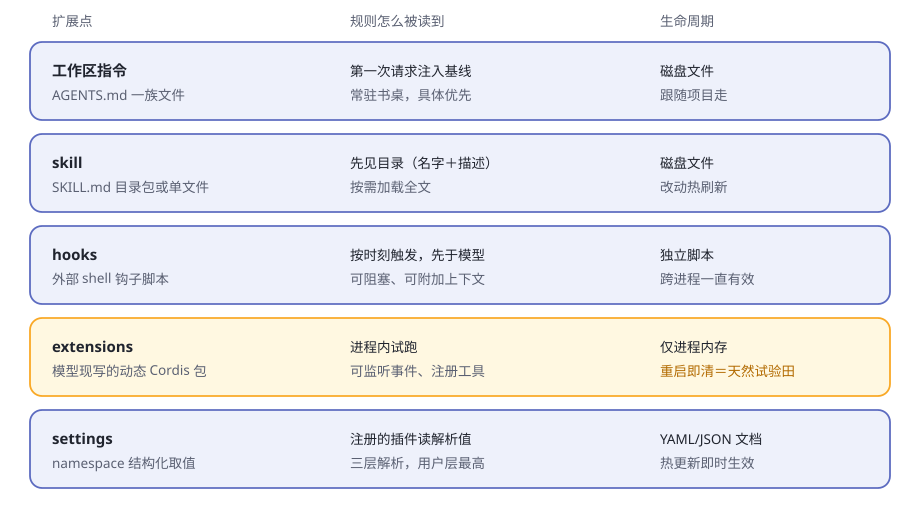
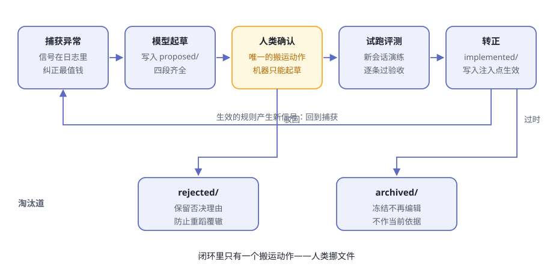

# 第15章 规则自进化实战

你的项目里有一座没人修剪的花园。

起初它只有三行：一个 `AGENTS.md`，写着两条约定、一条禁忌。一年后它长到八百行——有的规则是为一个早已忘却的 bug 写的，有的互相矛盾，还有的没人记得是否仍然有效。谁也不敢删：删掉一行，谁知道会不会弄坏什么？

规则就像花园，没人修剪就会疯长；疯长到最后，是谁都不想踏进去。这就是**规则腐烂**。

这一章我们来许一个愿：让 agent 的规则**可生成、可修改、可持久化、能进化**。许愿之前，先把丑话说在前面。

> **交底**
> dsh 里并没有现成的"规则自进化系统"。这一章交付的是**本书作者的拼装路线**：dsh 提供五个真实的扩展点，我们动手把它们串起来。机制是机制，拼装是拼装，文中分开标注。扩展点按 0.1.2-alpha.1 快照核对，dsh 仍在开发者预览，行为以本机实跑为准。

**表15-1 规则腐烂的三种病**

| 病症 | 你看到的样子 | 病根 |
|---|---|---|
| 只增不减 | `AGENTS.md` 从 3 行长到 800 行 | 加一条很容易，删一条没人敢 |
| 有结论没理由 | 只剩"记得做 X"，没了为什么 | 理由留在当天的对话里，没落字 |
| 写了不试 | 规则写完，没人知道管不管用 | 没有转正、淘汰的流程 |

三种病共用一个根：规则只有人**写**，没有人**治理**。治理之前，先看看规则可以住在哪儿。

## 五个插座，五种脾气

动手接线之前，先盘点 dsh 身上的插座。能放"规则"的地方有五个，脾气各不相同（表15-2）：

**表15-2 五个扩展点盘点**

| 扩展点 | 规则以什么形态存在 | 怎么到达模型 | 生命周期 | 适合放什么规则 |
|---|---|---|---|---|
| 工作区指令 | `AGENTS.md` 一族 Markdown | 第一次请求注入基线，常驻书桌 | 磁盘文件，跟随项目 | 常驻约定，少而精 |
| skill | `SKILL.md` 目录包或单文件 | 先见目录，按需加载全文 | 磁盘文件，改动热刷新 | 成块的"怎么做某事" |
| hooks | 外部 shell 钩子脚本 | 按时刻触发，先于模型 | 独立脚本，跨进程有效 | 硬门禁：拦、问、补上下文 |
| extensions | 模型现写的动态 Cordis 包 | 进程内运行，可监听可注册 | 进程内存，重启即清 | 临时试验逻辑 |
| settings | namespace 结构化取值 | 注册的插件读解析值 | YAML/JSON 文档，热更新 | 规则依赖的开关与阈值 |

**图15-1 五个插座，五种脾气**

逐个说两句。

**工作区指令是常驻席。** [agent-instructions](https://github.com/deepseek-ai/deepseek-harness/blob/master/packages/context/agent-instructions/README.zh.md) 在第一次请求端上一条持久基线消息：先用户全局 `AGENTS.md`，再项目链上从宽泛到具体的各级文件，并附上一句优先级声明——更具体的压过更宽泛的，但谁都压不过系统、开发者或你直接下的指令。预算必填：超了先整份丢掉宽泛的，再截断最具体的，并发一条模型可见的通知。还有一条后面要用：**发现跟随文件触碰**——成功的读、写、编辑碰到哪个目录，哪里的指令文件就上桌。

**skill 是按需书架。** [skill 家族](https://github.com/deepseek-ai/deepseek-harness/blob/master/packages/skill/README.zh.md)的本地提供方按 rank 扫几处目录：从项目的 `.dsh/skills`、`.agents/skills` 一路到用户目录，重名时 rank 低的赢。模型先看到的只是名字和一句描述，调用 `skill` 工具，全文才上桌；目录有 watcher 盯着，[文件一变，目录跟着刷新](https://github.com/deepseek-ai/deepseek-harness/blob/master/docs/subsystems/skills.zh.md)。

**hooks 是模型脑子外面的门卫。** [hooks 组](https://github.com/deepseek-ai/deepseek-harness/blob/master/packages/hooks/README.zh.md)的两个桥接兼容两种现成生态的 `hooks.json` shell 钩子，在会话开始、提示词提交、工具运行前后、运行即将停止这些时刻触发。钩子可以带一条模型可见的消息阻塞操作、附加上下文，其中一个方言还能在工具运行前请求确认。失败从不停车：除"退出码 2 即阻塞"外，其余一律只记录。每次决策都以 `hook/invoked`、`hook/result` [会话事件](https://github.com/deepseek-ai/deepseek-harness/blob/master/packages/hooks/hook-protocol/README.zh.md)入账。

**extensions 是试验田。** [extensions 组](https://github.com/deepseek-ai/deepseek-harness/blob/master/packages/extensions/README.zh.md)给模型[七个工具](https://github.com/deepseek-ai/deepseek-harness/blob/master/packages/extensions/tool-cordis/README.zh.md)：检视运行时、定义动态包、运行、停止、移除。包带版本且不可变，失败后可以追加修正版再更新过去。定义只存在于进程内存——**重启即清，不写仓库文件，不碰组合配置**。

**settings 是参数板。** [settings 家族](https://github.com/deepseek-ai/deepseek-harness/blob/master/packages/settings/README.zh.md)里，插件带着 schema 注册 namespace，用户在一份文档里覆盖取值：三层解析是 schema 默认 → 部署 base → 用户覆盖，变更实时生效。文件提供方热发布外部编辑，每次提交都发 `settings/updated` 事件——连"改参数"都有账（[子系统参考](https://github.com/deepseek-ai/deepseek-harness/blob/master/docs/subsystems/settings.zh.md)）。

一句话对齐：**桌面级（指令、skill）管"知道什么"，门禁级（hooks）管"什么不许过"，试验级（extensions）管"想法灵不灵"，参数级（settings）管"数值是多少"**。好规则住对地方，是治理的第一步。

## 搭规则引擎：一条最小可行路线

再次交底：以下路线是本书的拼装。每个零件都是 dsh 的真实机制，拼法不是官方功能。

**第一步：给规则一个家。** 在项目里开一个独立目录，一条规则一个文件。文件骨架直接抄 dsh 自己的作业——dsh 仓库根上有一份[总规矩 AGENTS.md](https://github.com/deepseek-ai/deepseek-harness/blob/master/AGENTS.md)，[`.agents/notes/`](https://github.com/deepseek-ai/deepseek-harness/blob/master/.agents/notes/README.md) 里则给每个非平凡决策存一篇笔记。骨架四段：**问题、规则正文、备选方案、验收标准**。为什么这么啰嗦？因为不写"它赢过哪些备选"的决策，迟早被人翻出来重新吵一遍——这是 dsh 决策笔记制度写进文档的初衷。

**第二步：会话开始时注入。** 两条真实路径（表15-3）：

**表15-3 两条注入路径**

| | 路径 A：常驻指针 | 路径 B：skill 化 |
|---|---|---|
| 写法 | `AGENTS.md` 里一行指针："动手前先读规则目录" | 每条规则一个 `SKILL.md`，放进 `.agents/skills/` |
| 读法 | 基线上桌，模型用读工具自取全文 | 模型见名字与描述，用 `skill` 工具加载 |
| 书桌开销 | 常驻一行 | 目录常驻，全文按需 |
| 适合 | 规则少、条条重要 | 规则多、按场景取用 |

路径 A 还有个顺水推舟的玩法：把规则文件直接命名为 `AGENTS.md` 放进子目录——模型的读写编辑一碰到那个目录，指令自动上桌，连"去读"这步都省了。

**第三步：运行时增删改。** 规则正文让模型用写文件、编辑文件的工具直接改——这是它的本能。工作区指令的发现跟随文件触碰：改动过的文件会收到更新通知，新冒出来的文件会追加进书桌。一次规则修改，就在一次会话里闭环。参数型规则交给 settings：前提是你写一个小插件注册 namespace，此后每次修改实时落盘并发事件。规则连"数值"都有账可查。

**第四步：试验田。** 一条新规则落盘之前，先让它在 extensions 里跑：把规则的逻辑写成动态包，在当前进程里注册监听器或工具，跑几轮试试。灵，就落盘成文件规则；不灵，移除定义，不留痕迹。**重启即清的内存生命周期，恰好是天然的试验田**。

**表15-4 最小路线清单：哪部分是 dsh 的，哪部分是本书的**

| 环节 | 用到的机制 | 谁提供的 |
|---|---|---|
| 规则的家 | 项目目录＋四段骨架 | 本书约定（骨架抄自 dsh 决策笔记） |
| 注入 | 工作区指令基线 / skill 目录 | dsh |
| 修改 | 模型文件工具＋触碰驱动发现 / settings | dsh |
| 试跑 | extensions 动态包 | dsh |
| 持久化 | 文件＋git 提交 | 本书约定 |

## 进化闭环：五站一圈

规则活过来了，还要让它进化。五个站连成闭环（图15-2）：捕获、起草、确认、试跑、转正——背面还有一条淘汰道。

**图15-2 进化闭环：机器起草与试跑，人类挪文件**

**站一：捕获异常——信号都在日志里。** 会话日志只增不删，模型见过的一切都在册（铁律见[第5章](ch05.md)、[第8章](ch08.md)）。值得盯的信号有四类（表15-5，事件名见[核心子系统生成目录](https://github.com/deepseek-ai/deepseek-harness/blob/master/docs/subsystems/core.zh.md)）：

**表15-5 四种进化信号**

| 信号 | 在哪看 | 它意味着什么 |
|---|---|---|
| 模型步骤失败 | `agent/request-error` | 路线级失败；监听者甚至可以决定重试 |
| 轮次被取消 | `turn/end`（终态 `kind: 'aborted'`） | 你喊停了——方向多半不对 |
| 工具报错 | `tool/result` | 事实层面的碰壁 |
| 人类纠正 | `user/message` | 最值钱："不对，你应该……" |

人类纠正不需要任何花哨机制——它本来就在对话里。

隔一阵请模型复盘最近的会话：我被纠正过什么？重复犯过什么错？答案就是规则的原料。

**站二：生成候选规则——模型起草，笔记体。** dsh 仓库自己就是范本：每个非平凡变更必须带一篇决策笔记，笔记按状态住在不同目录——`proposed/` 是已评审未实施的提案，`implemented/` 是落地的决定，`rejected/` 是被否决的提案，`archived/` 是封存归档。文件里的状态行必须与所在目录一致，**挪目录就要同步改状态**。

候选规则一律先进 `proposed/`，绝不直接改生效的 `AGENTS.md`。每篇写全四件事：问题、提案、备选方案（强制）、验收标准。转正那天，你才答得出"它赢过谁"。

**站三：试跑评测。** 开一个新会话，跑类似的任务，逐条核对笔记里的验收标准。这是演练，不是生产。dsh 自己的仓库也这么验证行为：把录制好的会话回放成快照测试，没有 API 密钥也能跑（见仓库根部 [AGENTS.md](https://github.com/deepseek-ai/deepseek-harness/blob/master/AGENTS.md)）。评测就是规则的彩排。

**站四：转正持久化——只有人动手。** 确认是一个动作：把文件从 `proposed/` 挪进 `implemented/`，改掉状态行，再把规则写进注入点——路径 A 的目录，或路径 B 的 `SKILL.md`。持久化靠文件加 git：一次转正就是一次提交，理由就写在笔记里。参数型的转正走 settings：写入用户层，`settings/updated` 事件一发，即时生效。

**站五：过时淘汰——三个出口**（表15-6）：

**表15-6 淘汰的三个出口**

| 出口 | 给谁 | 纪律 |
|---|---|---|
| `rejected/` | 被否决的候选 | 只在还能防同类错误时保留；理由失效就删 |
| 保持更新 | 生效的规则 | 依赖的事实变了，规则同步改——dsh 要求已实施笔记与代码同一步变更 |
| `archived/` | 完成且低价值的 | 冻结：不再编辑，也不作当前依据 |

淘汰不等于删除。否决记录留着，恰恰是为了拦住下一次有人提同样的坏主意。

## 划界：自进化不能干什么

闭环可以跑得快，但有几件事必须钉死。

**机器不得自行转正。** [第7章](ch07.md)说过：**恢复可以无感，开工必须有令**——目标续行在重启后一律清零，等人类授权。规则转正同理：机器可以捕获、可以起草、可以试跑，唯独"挪文件"必须是人。能自行转正的规则系统，很快就会进化出一条对自己最有利的规则。状态目录加人类挪文件，就是最朴素的一道闸。

**规则永远矮指令一头。** 工作区指令注入时就自带天花板声明：更具体的压过更宽泛的，但谁也不能压过系统、开发者或你的直接指令。自进化的规则进化到天上去，也只是建议。

**试验田不是保险箱。** extensions 官方警告：沙箱不是安全边界，动态包要当 bash 访问来对待；挂载这套工具本身，就要像交出 bash 工具一样慎重。带浏览器半的包还会停在"等待批准"，要人点头才激活。

**预算是硬约束。** 指令超预算，先丢宽泛的，再截具体的，还要发通知；skill 目录的每条描述也有长度上限。规则系统挤爆书桌的那天，机制会先让你疼——把疼当成淘汰的信号。

**表15-7 机器与人的分工**

| 动作 | 机器 | 人 |
|---|---|---|
| 收集信号、复盘会话 | ✅ | 可以吩咐 |
| 起草候选笔记 | ✅ | 审 |
| 试跑评测 | ✅ | 看结果 |
| 转正（proposed → implemented） | ❌ | ✅ |
| 否决、归档 | ❌ | ✅ |
| 修改转正条件 | ❌ | 慎重 |

花园里永远会长出新规则。你真正要维护的，不是规则本身，而是园丁的裁决权。

## 🧪 本章实验

> **实验 15-1 ★｜给规则一个家，看见它上桌**
> 目标：亲眼看到规则文件进入模型的上下文。
> 步骤：项目根放 `AGENTS.md`，写一行指针"动手前先读 rules/INDEX.md"；建 `rules/INDEX.md`，写一条规则（如"回答先列要点"）。开始会话提一个普通问题；然后改掉这条规则（如"改用表格回答"），让 agent 读或写一次 `rules/` 里的文件，再问同样的问题。
> 验收：第一次回答遵循规则一；改动并触碰后，第二次回答遵循规则二。dsh 处于开发者预览，注入通知的具体措辞以本机实跑为准。

> **实验 15-2 ★★｜走一次完整转正**
> 目标：从一次纠正出发，走完进化闭环。
> 步骤：在会话里故意纠正 agent（"以后做 Y 之前要先做 X"）；请它复盘这次纠正，起草一篇四段笔记放进 `rules/proposed/`；开新会话跑一个类似任务，逐条核对验收；由你亲手把文件挪进 `rules/implemented/` 并更新目录；再开新会话验证规则生效。
> 验收：笔记四段齐全；挪动前新会话不知道这条规则，挪动后知道；全程只有一次人类搬运动作。

## 🤔 思考题

1. ★ 候选规则为什么要住进 `proposed/`，而不是直接改 `AGENTS.md`？
2. ★ 常驻指针（路径 A）与 skill 化（路径 B），各适合什么数量和体量的规则？想想书桌预算。
3. ★★ dsh 强制决策笔记写"备选方案"。只记结论、不记备选的规则系统，会出什么事？
4. ★★ 如果允许机器自行转正，会形成什么循环？从"恢复可以无感，开工必须有令"说起。
5. ★★★ extensions 是内存级（重启即清），文件是磁盘级（git 管理）——怎么把两者拼成"试错不留痕、试对才落户"？

## 📝 小结

- **规则腐烂是因为只写不治理**——三种病：只增不减、有结论没理由、写了不试
- **五个插座**——指令常驻书桌、skill 按需、hooks 守门、extensions 试验田、settings 参数板；好规则住对地方
- **最小路线是本书的拼装**——规则即文件，开会话经指令或 skill 注入，运行时靠文件工具与 settings 改，先在 extensions 试跑，持久化靠 git；零件全是 dsh 的
- **进化闭环五站**——捕获（`agent/request-error`、取消的轮次、人类纠正）→ 模型起草进 `proposed/` → 人类确认 → 试跑评测 → 挪进 `implemented/` 生效 → 淘汰（否决／冻结）
- **抄 dsh 的作业**——决策笔记四段骨架、状态按目录流转、备选强制：不写"它赢过谁"的决策，只会被重新争论
- **边界钉死**——机器不得未经人确认转正；规则压不过直接指令；试验田不是保险箱；预算是硬约束；恢复可以无感，开工必须有令

编排把许多动作串成一出戏，规则让每个动作一次比一次好。这一章的闭环，是你留给未来会话的一笔利息。

⬅️ 上一章 [第14章 编排：Workflow 与 Ralph](ch14.md) ｜ ➡️ 下一章 [后记 能从 dsh 偷师什么](afterword.md)
